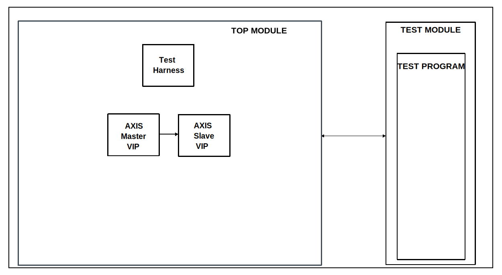

.. _axis_sequencers:

AXIS Sequencers
================================================================================

Overview
-------------------------------------------------------------------------------

The purpose of this testbench is to give engineers a sandbox testbench, where
they can test different configuration parameters for the AXI4 Stream VIPs and
sequencers.

Block design
-------------------------------------------------------------------------------

The block design is based on the test harness with the addition of two AXI4
Stream VIPs from AMD. This testbench does not require the presence of the test
harness, as it can work without it, but since it was created based on the base
design, this was inherited. One of the VIPs is configured as master, while the
other one is configured as slave. The TLAST and TREADY signals are set to be
enabled for the VIPs. TKEEP support for this testbench will be added later. If
your desire is to enable/disable other signals in this testbench, you'll have
to modify the block design. Dynamic configuration of these parameters will be
added later in the configuration file.

Block diagram
~~~~~~~~~~~~~~~~~~~~~~~~~~~~~~~~~~~~~~~~~~~~~~~~~~~~~~~~~~~~~~~~~~~~~~~~~~~~~~~

Configuration parameters and modes
~~~~~~~~~~~~~~~~~~~~~~~~~~~~~~~~~~~~~~~~~~~~~~~~~~~~~~~~~~~~~~~~~~~~~~~~~~~~~~~

The following parameters of this project that can be configured:

-  SRC_DESCRIPTORS: defines the data generation mode:
   Options: 1 - single packet, 2 - multiple packets, 3 - repeating packets
-  SRC_BEAT_DELAY: defines the valid delays between data beats:
   Integer value
-  SRC_DESCRIPTOR_DELAY: defines the valid delays between packets:
   Integer value
-  DEST_BACKPRESSURE: defines the backpressure type for the slave interface:
   Options: 1 - backpressure enabled, 2 - no backpressure
-  DEST_BEAT_DELAY_HIGH: defines the high time of the ready signal:
   Integer, non-0 value
-  DEST_BEAT_DELAY_LOW: defines the low time of the ready signal:
   Integer, non-0 value

Configuration files
^^^^^^^^^^^^^^^^^^^^^^^^^^^^^^^^^^^^^^^^^^^^^^^^^^^^^^^^^^^^^^^^^^^^^^^^^^^^^^^^

As this is a sandbox testbench, engineers are encouraged to change parameters
and see what happens in the simulation.

Tests
^^^^^^^^^^^^^^^^^^^^^^^^^^^^^^^^^^^^^^^^^^^^^^^^^^^^^^^^^^^^^^^^^^^^^^^^^^^^^^^^

The following test program file is available:

============ ==============================
Test program Usage
============ ==============================
test_program Creates a basic test stimulus.
============ ==============================

Available configurations & tests combinations
^^^^^^^^^^^^^^^^^^^^^^^^^^^^^^^^^^^^^^^^^^^^^^^^^^^^^^^^^^^^^^^^^^^^^^^^^^^^^^^^

The test program is compatible with the configuration.

CPU/Memory interconnects addresses
~~~~~~~~~~~~~~~~~~~~~~~~~~~~~~~~~~~~~~~~~~~~~~~~~~~~~~~~~~~~~~~~~~~~~~~~~~~~~~~

Irrelevant for this testbench.

Interrupts
~~~~~~~~~~~~~~~~~~~~~~~~~~~~~~~~~~~~~~~~~~~~~~~~~~~~~~~~~~~~~~~~~~~~~~~~~~~~~~~

Irrelevant for this testbench.

Test stimulus
-------------------------------------------------------------------------------

The test program is responsible for configuring and running the sequencers.

Environment Bringup
~~~~~~~~~~~~~~~~~~~~~~~~~~~~~~~~~~~~~~~~~~~~~~~~~~~~~~~~~~~~~~~~~~~~~~~~~~~~~~~

The steps of the environment bringup are:

* Create the environment
* Start the environment
* Start the clocks
* Assert the resets

Sequencer testing
~~~~~~~~~~~~~~~~~~~~~~~~~~~~~~~~~~~~~~~~~~~~~~~~~~~~~~~~~~~~~~~~~~~~~~~~~~~~~~~

* Configures the source and destination sequencers' ready and valid signals
  uptime and downtime with the parameters set in the configuration file
* Configures the data generation part, where the parameters are also read from
  the same file
* A watchdog is initialized, which ensures that the simulation doesn't run off
  into infinity
* Some of the parameters for the packet sizes are hardcoded, these can be
  changed to test some more specific use-cases
* The watchdog and the sequencers are started at the same time

Stop the environment
~~~~~~~~~~~~~~~~~~~~~~~~~~~~~~~~~~~~~~~~~~~~~~~~~~~~~~~~~~~~~~~~~~~~~~~~~~~~~~~

* Simulation waits for the stop condition, depending on the packet generation
  mode
* Stop the watchdog
* Stop the clocks

.. danger::

   Depending on the configuration parameters and/or changed hardcoded values,
   the watchdog may trigger prematurely!

Building the test bench
-------------------------------------------------------------------------------

The testbench is built upon ADI's generic HDL reference design framework.
ADI does not distribute compiled files of these projects so they must be built
from the sources available :git-hdl:`here </>` and :git-testbenches:`here </>`,
with the specified hierarchy described :ref:`build_tb set_up_tb_repo`.
To get the source you must
`clone <https://git-scm.com/book/en/v2/Git-Basics-Getting-a-Git-Repository>`__
the HDL repository, and then build the project as follows:

**Linux/Cygwin/WSL**

*Example 1*

Building and simulating the testbench using only the command line.

.. shell::
   :showuser:

   $cd testbenches/ip/axis_sequencers
   $make

*Example 2*

Building and simulating the testbench using the Vivado GUI. This command will
launch Vivado, will run the simulation and display the waveforms.

.. shell::
   :showuser:

   $cd testbenches/ip/axis_sequencers
   $make MODE=gui

*Example 3*

Build a particular combination of test and configuration, using the Vivado GUI.
This command will launch Vivado, will run the simulation and display the
waveforms.

.. shell::
   :showuser:

   $cd testbenches/ip/axis_sequencers
   $make MODE=gui CFG=cfg1 TST=test_program

The built project can be found in the ``runs`` folder, where each configuration
specific build has its own folder named after the configuration file's name.
Example: if the following command was run for a single configuration in the
clean folder (no runs folder available):

``make CFG=cfg1``

Then the subfolder under ``runs`` name will be:

``cfg1``

Resources
-------------------------------------------------------------------------------

Testbenches related dependencies
~~~~~~~~~~~~~~~~~~~~~~~~~~~~~~~~~~~~~~~~~~~~~~~~~~~~~~~~~~~~~~~~~~~~~~~~~~~~~~~

.. include:: ../../common/dependency_common.rst

Testbench specific dependencies:

.. list-table::
   :widths: 30 45 25
   :header-rows: 1

   * - SV dependency name
     - Source code link
     - Documentation link
   * - M_AXIS_SEQUENCER
     - :git-testbenches:`library/vip/amd/m_axis_sequencer.sv`
     - ---
   * - S_AXIS_SEQUENCER
     - :git-testbenches:`library/vip/amd/s_axis_sequencer.sv`
     - ---

.. include:: ../../../common/more_information.rst

.. include:: ../../../common/support.rst
