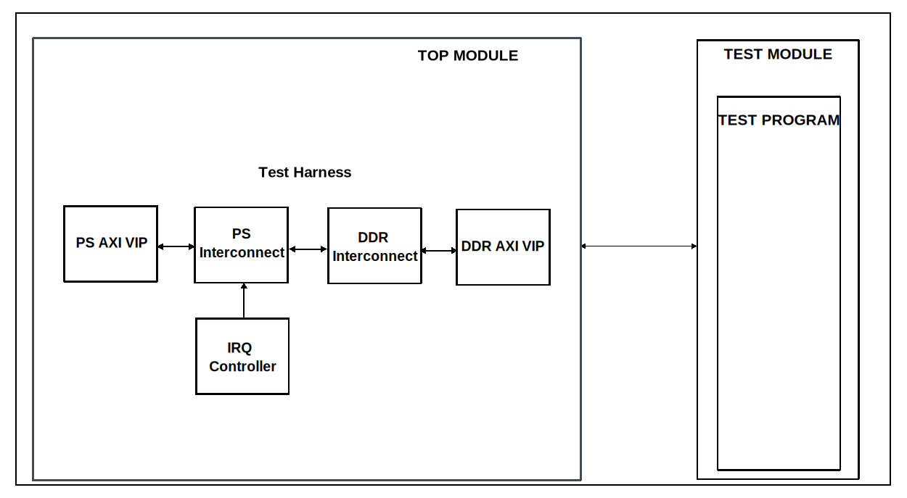

.. _base:

Base
================================================================================

Overview
-------------------------------------------------------------------------------

The purpose of this testbench is to be a reference design for the other
testbenches.

Block design
-------------------------------------------------------------------------------

The block design found in this testbench is in many instances referred to as
the test harness. It has a simulated Processing System that has an AXI4Lite
interface, a DDR memory, which is set to a size of 2GB, and auxiliary IPs and
VIPs, such as interconnects, clocks and resets.

Block diagram
~~~~~~~~~~~~~~~~~~~~~~~~~~~~~~~~~~~~~~~~~~~~~~~~~~~~~~~~~~~~~~~~~~~~~~~~~~~~~~~

Configuration parameters and modes
~~~~~~~~~~~~~~~~~~~~~~~~~~~~~~~~~~~~~~~~~~~~~~~~~~~~~~~~~~~~~~~~~~~~~~~~~~~~~~~

This project has no configuration parameters.

Configuration files
^^^^^^^^^^^^^^^^^^^^^^^^^^^^^^^^^^^^^^^^^^^^^^^^^^^^^^^^^^^^^^^^^^^^^^^^^^^^^^^^

The testbench has an empty configuration file included in the file structure
which allows the testbench to be built and run by default.

Tests
^^^^^^^^^^^^^^^^^^^^^^^^^^^^^^^^^^^^^^^^^^^^^^^^^^^^^^^^^^^^^^^^^^^^^^^^^^^^^^^^

The following test program file is available:

============ ==============================
Test program Usage
============ ==============================
test_program Creates a basic test stimulus.
============ ==============================

Available configurations & tests combinations
^^^^^^^^^^^^^^^^^^^^^^^^^^^^^^^^^^^^^^^^^^^^^^^^^^^^^^^^^^^^^^^^^^^^^^^^^^^^^^^^

The test program is compatible with the configuration.

CPU/Memory interconnects addresses
~~~~~~~~~~~~~~~~~~~~~~~~~~~~~~~~~~~~~~~~~~~~~~~~~~~~~~~~~~~~~~~~~~~~~~~~~~~~~~~

===========  ===========
Instance     Address
===========  ===========
axi_intc     0x4120_0000
ddr_axi_vip  0x8000_0000
===========  ===========

Interrupts
~~~~~~~~~~~~~~~~~~~~~~~~~~~~~~~~~~~~~~~~~~~~~~~~~~~~~~~~~~~~~~~~~~~~~~~~~~~~~~~

No interrupt signals are connected to the interrupt controller.

Test stimulus
-------------------------------------------------------------------------------

The test program is only responsible for the environment bringup:

Environment Bringup
~~~~~~~~~~~~~~~~~~~~~~~~~~~~~~~~~~~~~~~~~~~~~~~~~~~~~~~~~~~~~~~~~~~~~~~~~~~~~~~

The steps of the environment bringup are:

* Set logger verbosity
* Print the randomization state
* Create the environment
* Start the environment
* Start the clocks
* Assert the resets

Stop the environment
~~~~~~~~~~~~~~~~~~~~~~~~~~~~~~~~~~~~~~~~~~~~~~~~~~~~~~~~~~~~~~~~~~~~~~~~~~~~~~~

* Stop the clocks

Building the test bench
-------------------------------------------------------------------------------

The testbench is built upon ADI's generic HDL reference design framework.
ADI does not distribute compiled files of these projects so they must be built
from the sources available :git-hdl:`here </>` and :git-testbenches:`here </>`,
with the specified hierarchy described :ref:`build_tb set_up_tb_repo`.
To get the source you must
`clone <https://git-scm.com/book/en/v2/Git-Basics-Getting-a-Git-Repository>`__
the HDL repository, and then build the project as follows:

**Linux/Cygwin/WSL**

*Example 1*

Building and simulating the testbench using only the command line.

.. shell::
   :showuser:

   $cd testbenches/ip/base
   $make

*Example 2*

Building and simulating the testbench using the Vivado GUI. This command will
launch Vivado, will run the simulation and display the waveforms.

.. shell::
   :showuser:

   $cd testbenches/ip/base
   $make MODE=gui

The built project can be found in the ``runs`` folder, where each configuration
specific build has its own folder named after the configuration file's name.
Example: if the following command was run for a single configuration in the
clean folder (no runs folder available):

``make CFG=cfg1``

Then the subfolder under ``runs`` name will be:

``cfg1``

Resources
-------------------------------------------------------------------------------

Testbenches related dependencies
~~~~~~~~~~~~~~~~~~~~~~~~~~~~~~~~~~~~~~~~~~~~~~~~~~~~~~~~~~~~~~~~~~~~~~~~~~~~~~~

.. include:: ../../common/dependency_common.rst

.. include:: ../../../common/more_information.rst

.. include:: ../../../common/support.rst
