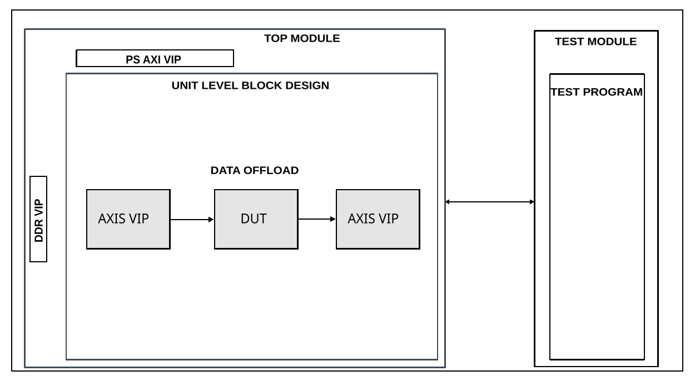

.. _data_offload_2:

Data Offload 2
================================================================================

Overview
-------------------------------------------------------------------------------

The purpose of these two testbenches is to validate the functionality of the
:git-hdl:`library/data_offload <library/data_offload>` IP core.

The entire HDL documentation can be found
:external+hdl:ref:`here <data_offload>`.

Block design
-------------------------------------------------------------------------------

The block design is based on the test harness with the DUT being one instance
of the Data Offload IP and two auxiliary modules - a manager and a subordinate
AXI4 Stream VIP. The AXIS VIP modules are used to generate, respectively
collect and verify the streamed data which is intermediately stored in the Data
Offload IP.

Block diagram
~~~~~~~~~~~~~~~~~~~~~~~~~~~~~~~~~~~~~~~~~~~~~~~~~~~~~~~~~~~~~~~~~~~~~~~~~~~~~~~

Configuration parameters and modes
~~~~~~~~~~~~~~~~~~~~~~~~~~~~~~~~~~~~~~~~~~~~~~~~~~~~~~~~~~~~~~~~~~~~~~~~~~~~~~~

The following parameters of this project that can be configured:

-  MEM_TYPE: used storage type:
   Options: 0 (BRAM), 1 (PL-DDR), 2 (HBM)
-  PATH_TYPE: used data path type:
   Options: 0 for RX or 1 for TX
-  OFFLOAD_SIZE: size of the storage element in bytes
-  OFFLOAD_TRANSFER_LENGTH: effective offload transfer length in bytes
-  OFFLOAD_SRC_DWIDTH: data width of the source interface
-  OFFLOAD_DST_DWIDTH: data width of the destination interface
-  OFFLOAD_ONESHOT: enable oneshot mode
-  PLDDR_OFFLOAD_DATA_WIDTH: data width of the external memory interface
-  SRC_CLOCK_FREQ: source clock frequency in Hz
-  DST_CLOCK_FREQ: destination clock frequency in Hz

Configuration files
^^^^^^^^^^^^^^^^^^^^^^^^^^^^^^^^^^^^^^^^^^^^^^^^^^^^^^^^^^^^^^^^^^^^^^^^^^^^^^^^

The following configuration files are available:

.. list-table::
   :header-rows: 1

   * - Parameter
     - cfg1
     - cfg2
     - cfg3
     - cfg4
     - cfg5
   * - MEM\_TYPE
     - 0
     - 0
     - 0
     - 2
     - 2
   * - PATH\_TYPE
     - 1
     - 1
     - 0
     - 1
     - 1
   * - OFFLOAD\_SIZE
     - 1024
     - 1024
     - 1024
     - 4*256*1024*1024
     - 4*256*1024*1024
   * - OFFLOAD\_TRANSFER\_LENGTH
     - ---
     - ---
     - 512
     - 4096
     - 4096
   * - OFFLOAD\_SRC\_DWIDTH
     - 128
     - 128
     - 128
     - 1024
     - 1024
   * - OFFLOAD\_DST\_DWIDTH
     - 128
     - 128
     - 128
     - 1024
     - 1024
   * - OFFLOAD\_ONESHOT
     - 1
     - 0
     - 1
     - 1
     - 0
   * - PLDDR\_OFFLOAD\_DATA\_WIDTH
     - 512
     - 512
     - 512
     - 256
     - 256
   * - SRC\_CLOCK\_FREQ
     - 250000000
     - 250000000
     - 250000000
     - 250000000
     - 250000000
   * - DST\_CLOCK\_FREQ
     - 300000000
     - 300000000
     - 300000000
     - 300000000
     - 300000000

Tests
^^^^^^^^^^^^^^^^^^^^^^^^^^^^^^^^^^^^^^^^^^^^^^^^^^^^^^^^^^^^^^^^^^^^^^^^^^^^^^^^

The following test program file is available:

================= ================================================
Test program      Usage
================= ================================================
test_program      Tests the Data Offload in auto (default) mode.
test_program_sync Tests the Data Offload in hardware trigger mode.
================= ================================================

Available configurations & tests combinations
^^^^^^^^^^^^^^^^^^^^^^^^^^^^^^^^^^^^^^^^^^^^^^^^^^^^^^^^^^^^^^^^^^^^^^^^^^^^^^^^

The test program is compatible with all the above-mentioned configurations.

CPU/Memory interconnects addresses
~~~~~~~~~~~~~~~~~~~~~~~~~~~~~~~~~~~~~~~~~~~~~~~~~~~~~~~~~~~~~~~~~~~~~~~~~~~~~~~

===========  ===========
Instance     Address
===========  ===========
axi_intc     0x4120_0000
ddr_axi_vip  0x8000_0000
DUT          0x44A0_0000
===========  ===========

Test stimulus
~~~~~~~~~~~~~~~~~~~~~~~~~~~~~~~~~~~~~~~~~~~~~~~~~~~~~~~~~~~~~~~~~~~~~~~~~~~~~~~

The test program is responsible for verifying the Data Offload in different
configurations.

Environment Bringup
~~~~~~~~~~~~~~~~~~~~~~~~~~~~~~~~~~~~~~~~~~~~~~~~~~~~~~~~~~~~~~~~~~~~~~~~~~~~~~~

The steps of the environment bringup are:

* Create the environment
* Configure the sequencers and the scoreboard
* Start the environment
* Start the clocks
* Assert the resets

Data Offload testing
~~~~~~~~~~~~~~~~~~~~~~~~~~~~~~~~~~~~~~~~~~~~~~~~~~~~~~~~~~~~~~~~~~~~~~~~~~~~~~~

* Configure the Data Offload
* Start the sequencers and scoreboard
* Send incremental data and verify all
* Wait for scoreboard to complete checking

Stop the environment
~~~~~~~~~~~~~~~~~~~~~~~~~~~~~~~~~~~~~~~~~~~~~~~~~~~~~~~~~~~~~~~~~~~~~~~~~~~~~~~

* Stop the scoreboard
* Stop the environment
* Stop the clocks

Building the testbench
-------------------------------------------------------------------------------

The testbench is built upon ADI's generic HDL reference design framework.
ADI does not distribute compiled files of these projects so they must be built
from the sources available :git-hdl:`here </>` and :git-testbenches:`here </>`,
with the specified hierarchy described :ref:`build_tb set_up_tb_repo`.
To get the source you must
`clone <https://git-scm.com/book/en/v2/Git-Basics-Getting-a-Git-Repository>`__
the HDL repository, and then build the project as follows:

**Linux/Cygwin/WSL**

*Example 1*

Building and simulating the testbench using only the command line.

.. shell::
   :showuser:

   $cd testbenches/ip/data_offload_2
   $make

*Example 2*

Building and simulating the testbench using the Vivado GUI. This command will
launch Vivado, will run the simulation and display the waveforms.

.. shell::
   :showuser:

   $cd testbenches/ip/data_offload_2
   $make MODE=gui

*Example 3*

Build a particular combination of test and configuration, using the Vivado GUI.
This command will launch Vivado, will run the simulation and display the
waveforms.

.. shell::
   :showuser:

   $cd testbenches/ip/data_offload_2
   $make MODE=gui CFG=cfg1 TST=test_program

The built project can be found in the ``runs`` folder, where each configuration
specific build has its own folder named after the configuration file's name.
Example: if the following command was run for a single configuration in the
clean folder (no runs folder available):

``make CFG=cfg1``

Then the subfolder under ``runs`` name will be:

``cfg1``

Resources
-------------------------------------------------------------------------------

HDL related dependencies forming the DUT
~~~~~~~~~~~~~~~~~~~~~~~~~~~~~~~~~~~~~~~~~~~~~~~~~~~~~~~~~~~~~~~~~~~~~~~~~~~~~~~

.. list-table::
   :widths: 30 45 25
   :header-rows: 1

   * - IP name
     - Source code link
     - Documentation link
   * - DATA_OFFLOAD
     - :git-hdl:`library/data_offload <library/data_offload>`
     - :external+hdl:ref:`here <data_offload>`

Testbenches related dependencies
~~~~~~~~~~~~~~~~~~~~~~~~~~~~~~~~~~~~~~~~~~~~~~~~~~~~~~~~~~~~~~~~~~~~~~~~~~~~~~~

.. include:: ../../common/dependency_common.rst

Testbench specific dependencies:

.. list-table::
   :widths: 30 45 25
   :header-rows: 1

   * - SV dependency name
     - Source code link
     - Documentation link
   * - DATA_OFFLOAD_API
     - :git-testbenches:`library/drivers/data_offload/data_offload_api.sv`
     - ---
   * - M_AXIS_SEQUENCER
     - :git-testbenches:`library/vip/amd/axis/m_axis_sequencer.sv`
     - ---
   * - S_AXIS_SEQUENCER
     - :git-testbenches:`library/vip/amd/axis/s_axis_sequencer.sv`
     - ---
   * - SCOREBOARD
     - :git-testbenches:`library/drivers/common/scoreboard.sv`
     - ---

.. include:: ../../../common/more_information.rst

.. include:: ../../../common/support.rst
