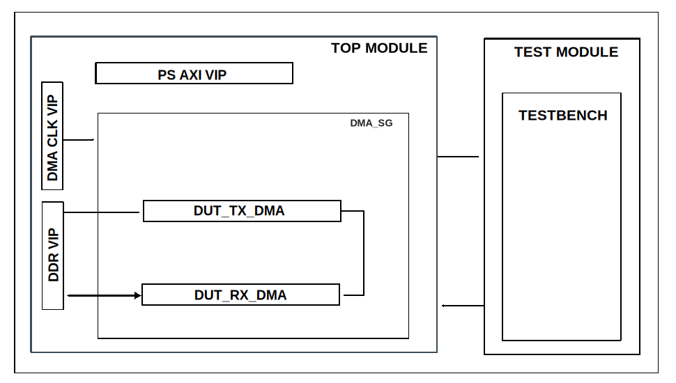

.. _dma_sg:

DMA Scatter-Gather
================================================================================

Overview
-------------------------------------------------------------------------------

The purpose of this testbench is to test the scatter-gather interface of the
:git-hdl:`library/axi_dmac`.

The scatter-gather feature allows the DMA to access noncontiguous areas of
memory within a single transfer. This is achieved using a list of vectors
called *descriptors*, which are received through a dedicated AXI3/4 memory
mapped interface.

The entire HDL documentation can be found at :external+hdl:ref:`axi_dmac`.

Block design
-------------------------------------------------------------------------------

The block design is based on the test harness and two axi_dmac instances, one
for the RX side and one for the TX side, both configured to use the
scatter-gather interface to fetch the descriptor information.

Block diagram
~~~~~~~~~~~~~~~~~~~~~~~~~~~~~~~~~~~~~~~~~~~~~~~~~~~~~~~~~~~~~~~~~~~~~~~~~~~~~~~

Configuration parameters and modes
~~~~~~~~~~~~~~~~~~~~~~~~~~~~~~~~~~~~~~~~~~~~~~~~~~~~~~~~~~~~~~~~~~~~~~~~~~~~~~~

The following parameters of this project can be configured for the RX DMA and
TX DMA:

-  DMA_TYPE_SRC: interface type for the source interface;
   Options: 0 - AXI-MM, 1 - AXI-Streaming, 2 - ADI-FIFO
-  DMA_TYPE_DEST: Interface type for the destination interface;
   Options: 0 - AXI-MM, 1 - AXI-Streaming, 2 - ADI-FIFO
-  ID: instance identification number;
-  AXI_SLICE_SRC: whether to insert an extra register slice on the destination
   data path;
   Options: 0 - No, 1 - Yes
-  AXI_SLICE_DEST: whether to insert an extra register slice on the source data
   path;
   Options: 0 - No, 1 - Yes
-  SYNC_TRANSFER_START: enable the transfer start synchronization feature;
   Options: 0 - No, 1 - Yes
-  DMA_LENGTH_WIDTH: width of transfer length control register in bits;
   Options: from 8 to 32.
-  DMA_2D_TRANSFER: enable support for 2D transfers;
   Options: 0 - No, 1 - Yes
-  DMA_SG_TRANSFER: enable support for scatter-gather transfers;
   Options: 0 - No, 1 - Yes
-  MAX_BYTES_PER_BURST: maximum size of bursts in bytes;
   Options: must be power of 2 in a range of 2 beats to 4096 bytes
-  CYCLIC: enable support for Cyclic transfers;
   Options: 0 - No, 1 - Yes
-  DMA_DATA_WIDTH_SRC: data path width of the source interface in bits;
   Options: 16, 32, 64, 128, 256, 512, 1024, 2048
-  DMA_DATA_WIDTH_DEST: data path width of the destination interface in bits;
   Options: 16, 32, 64, 128, 256, 512, 1024, 2048
-  DMA_DATA_WIDTH_SG: data path width of the scatter-gather interface in bits;
   Options: 64

.. tip::

  For other DMA parameter configurations, take a look at the
  :external+hdl:ref:`axi_dmac`.

Configuration files
^^^^^^^^^^^^^^^^^^^^^^^^^^^^^^^^^^^^^^^^^^^^^^^^^^^^^^^^^^^^^^^^^^^^^^^^^^^^^^^^

The following configuration files are available:

+---------------------+--------------------------+--------------------------+
| Configuration mode  | cfg1                     | cfg2                     |
+---------------------+--------------------------+--------------------------+
| Parameters          | Instances                | Instances                |
|                     +--------+-----------------+--------+-----------------+
|                     | RX_DMA | TX_DMA          | RX_DMA | TX_DMA          |
+=====================+========+=================+========+=================+
| DMA_TYPE_SRC        | 1      | 0               | 1      | 0               |
+---------------------+--------+-----------------+--------+-----------------+
| DMA_TYPE_DEST       | 0      | 1               | 0      | 1               |
+---------------------+--------+-----------------+--------+-----------------+
| ID                  | 0      | 0               | 0      | 0               |
+---------------------+--------+-----------------+--------+-----------------+
| AXI_SLICE_SRC       | 1      | 1               | 1      | 1               |
+---------------------+--------+-----------------+--------+-----------------+
| AXI_SLICE_DEST      | 1      | 1               | 1      | 1               |
+---------------------+--------+-----------------+--------+-----------------+
| SYNC_TRANSFER_START | 0      | 0               | 0      | 0               |
+---------------------+--------+-----------------+--------+-----------------+
| DMA_LENGTH_WIDTH    | 24     | 24              | 24     | 24              |
+---------------------+--------+-----------------+--------+-----------------+
| DMA_2D_TRANSFER     | 0      | 0               | 1      | 1               |
+---------------------+--------+-----------------+--------+-----------------+
| DMA_SG_TRANSFER     | 1      | 1               | 1      | 1               |
+---------------------+--------+-----------------+--------+-----------------+
| MAX_BYTES_PER_BURST | 4096   | <default> (128) | 4096   | <default> (128) |
+---------------------+--------+-----------------+--------+-----------------+
| CYCLIC              | 0      | 1               | 0      | 1               |
+---------------------+--------+-----------------+--------+-----------------+
| DMA_DATA_WIDTH_SRC  | 64     | 64              | 64     | 64              |
+---------------------+--------+-----------------+--------+-----------------+
| DMA_DATA_WIDTH_DEST | 64     | 64              | 64     | 64              |
+---------------------+--------+-----------------+--------+-----------------+
| DMA_DATA_WIDTH_SG   | 64     | 64              | 64     | 64              |
+---------------------+--------+-----------------+--------+-----------------+

Tests
^^^^^^^^^^^^^^^^^^^^^^^^^^^^^^^^^^^^^^^^^^^^^^^^^^^^^^^^^^^^^^^^^^^^^^^^^^^^^^^^

The following test program file is available:

====================== ==========================================================
Test program           Usage
====================== ==========================================================
test_program_1d        Test DMA simple scatter-gather transfers in loopback mode.
---------------------- ----------------------------------------------------------
test_program_2d        Test DMA 2D scatter-gather transfers in loopback mode.
---------------------- ----------------------------------------------------------
test_program_tr_queue  Test DMA queueing of consecutive scatter-gather transfers.
====================== ==========================================================

Available configurations & tests combinations
^^^^^^^^^^^^^^^^^^^^^^^^^^^^^^^^^^^^^^^^^^^^^^^^^^^^^^^^^^^^^^^^^^^^^^^^^^^^^^^^

The configuration files are compatible with the following test programs:

.. list-table::
   :header-rows: 1

   * - Test program
     - cfg1
     - cfg2
   * - test_program_1d
     - ✓
     - ✓
   * - test_program_2d
     - ✗
     - ✓
   * - test_program_tr_queue
     - ✓
     - ✓

CPU/Memory interconnects addresses
~~~~~~~~~~~~~~~~~~~~~~~~~~~~~~~~~~~~~~~~~~~~~~~~~~~~~~~~~~~~~~~~~~~~~~~~~~~~~~~

===================== ===========
Instance              Address
===================== ===========
axi_intc              0x4120_0000
rx_dma                0x7C42_0000
tx_dma                0x7C43_0000
ddr_axi_vip           0x8000_0000
===================== ===========

Test stimulus
-------------------------------------------------------------------------------

The test program is structured into several tests as follows:

Environment bringup
~~~~~~~~~~~~~~~~~~~~~~~~~~~~~~~~~~~~~~~~~~~~~~~~~~~~~~~~~~~~~~~~~~~~~~~~~~~~~~~

The steps of the environment bringup are:

* Create the environment
* Start the environment
* Start the clocks
* Assert the resets
* Create a TX_DMA object
* Probe the TX_DMA
* Create a RX_DMA object
* Probe the RX_DMA

Test TX DMA and RX DMA scatter-gather in loopback
~~~~~~~~~~~~~~~~~~~~~~~~~~~~~~~~~~~~~~~~~~~~~~~~~~~~~~~~~~~~~~~~~~~~~~~~~~~~~~~

The steps of the scatter-gather tests are:

* Initialize the DDR with some data
* Store the descriptors in memory
* Perform the data transfer
   * Enable DMA & set flags for ``m_dmac_api`` and ``s_dmac_api``
   * Define initial descriptor addresses
   * Submit transfers for ``m_dmac_api`` and ``s_dmac_api``
   * Wait until the transfer is done
* Check the captured data from DDR
   * Read and compare the captured word and the reference word

Stop the environment
~~~~~~~~~~~~~~~~~~~~~~~~~~~~~~~~~~~~~~~~~~~~~~~~~~~~~~~~~~~~~~~~~~~~~~~~~~~~~~~

* Stop the clocks
* Finish the simulation

Building the testbench
-------------------------------------------------------------------------------

The testbench is built upon ADI's generic HDL reference design framework.
ADI does not distribute compiled files of these projects so they must be built
from the sources available :git-hdl:`here </>` and :git-testbenches:`here </>`,
with the specified hierarchy described :ref:`build_tb set_up_tb_repo`.
To get the source you must
`clone <https://git-scm.com/book/en/v2/Git-Basics-Getting-a-Git-Repository>`__
the HDL repository, and then build the project as follows:

**Linux/Cygwin/WSL**

*Example 1*

Building and simulating the testbench using only the command line.

.. shell::
   :showuser:

   $cd testbenches/ip/dma_sg
   $make

*Example 2*

Building and simulating the testbench using the Vivado GUI. This command will
launch Vivado, will run the simulation and display the waveforms.

.. shell::
   :showuser:

   $cd testbenches/ip/dma_sg
   $make MODE=gui

*Example 3*

Build a particular combination of test and configuration, using the Vivado GUI.
This command will launch Vivado, will run the simulation and display the
waveforms.

.. shell::
   :showuser:

   $cd testbenches/ip/dma_sg
   $make MODE=gui CFG=cfg1 TST=test_program_1d

The built project can be found in the ``runs`` folder, where each configuration
specific build has its own folder named after the configuration file's name.
Example: if the following command was run for a single configuration in the
clean folder (no runs folder available):

``make CFG=cfg2``

Then the subfolder under ``runs`` name will be:

``cfg2``

Resources
-------------------------------------------------------------------------------

HDL related dependencies
~~~~~~~~~~~~~~~~~~~~~~~~~~~~~~~~~~~~~~~~~~~~~~~~~~~~~~~~~~~~~~~~~~~~~~~~~~~~~~~

.. list-table::
   :widths: 30 45 25
   :header-rows: 1

   * - IP name
     - Source code link
     - Documentation link
   * - AXI_DMAC
     - :git-hdl:`library/axi_dmac`
     - :external+hdl:ref:`axi_dmac`

Testbenches related dependencies
~~~~~~~~~~~~~~~~~~~~~~~~~~~~~~~~~~~~~~~~~~~~~~~~~~~~~~~~~~~~~~~~~~~~~~~~~~~~~~~

.. include:: ../../common/dependency_common.rst

Testbench specific dependencies:

.. list-table::
   :widths: 30 45 25
   :header-rows: 1

   * - SV dependency name
     - Source code link
     - Documentation link
   * - ADI_REGMAP_PKG
     - :git-testbenches:`library/regmaps/adi_regmap_pkg.sv`
     - ---
   * - ADI_REGMAP_DMAC_PKG
     - :git-testbenches:`library/regmaps/adi_regmap_dmac_pkg.sv`
     - ---
   * - DMAC_API_PKG
     - :git-testbenches:`library/drivers/dmac/dmac_api.sv`
     - ---
   * - DMA_TRANS_PKG
     - :git-testbenches:`library/drivers/dmac/dma_trans.sv`
     - ---
         
.. include:: ../../../common/more_information.rst

.. include:: ../../../common/support.rst
