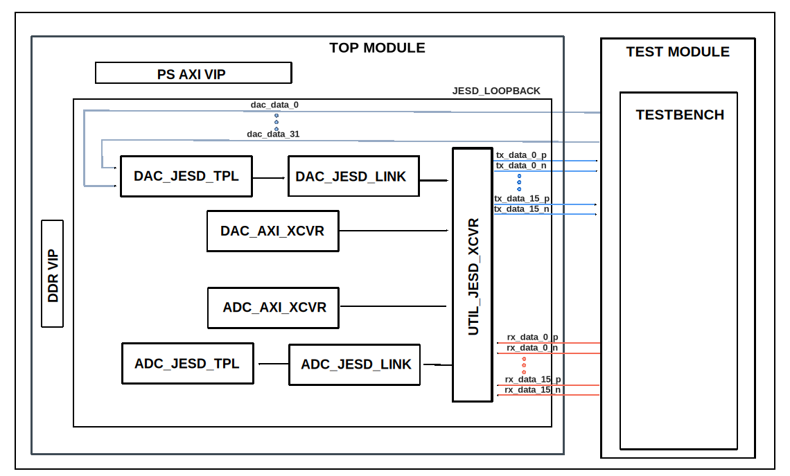

.. _jesd_loopback:

JESD Loopback
================================================================================

Overview
-------------------------------------------------------------------------------

The purpose of this testbench is to test the JESD framework in loopback mode.

The entire HDL documentation can be found at :external+hdl:ref:`jesd204`.

Block design
-------------------------------------------------------------------------------

The block design is based on the test harness with the addition of the RX & TX
JESD IPs.

Block diagram
~~~~~~~~~~~~~~~~~~~~~~~~~~~~~~~~~~~~~~~~~~~~~~~~~~~~~~~~~~~~~~~~~~~~~~~~~~~~~~~

Configuration parameters and modes
~~~~~~~~~~~~~~~~~~~~~~~~~~~~~~~~~~~~~~~~~~~~~~~~~~~~~~~~~~~~~~~~~~~~~~~~~~~~~~~

The following common parameters are used as constants across the configuration
files:

-  JESD_8B10B: defines the usage of 8b10b link layer defined in JESD204B, uses
   ADI IP as Physical Layer; constant value: 1
-  JESD_64B66B: defines the usage of 8b10b link layer defined in JESD204B, uses
   ADI IP as Physical Layer; constant value: 2
-  CPLL: defines the usage of CPLL; constant value: 0
-  QPLL0: defines the usage of QPLL0; constant value: 3
-  QPLL1: defines the usage of QPLL1; constant value: 2
-  OUTCLKPCS: defines the usage of OUTCLKPCS; constant value: 1
-  OUTCLKPMA: defines the usage of OUTCLKPMA; constant value: 2
-  PLLREFCLK_DIV1: defines the usage of PLLREFCLK_DIV1; constant value: 3
-  PLLREFCLK_DIV2: defines the usage of PLLREFCLK_DIV2; constant value: 4
-  PROGDIVCLK: defines the usage of PROGDIVCLK; constant value: 5

The following parameters of this project can be configured:

-  LINK_MODE: used link layer encoder mode;
   Options: 1 - JESD_8B10B, 2 - JESD_64B66B
-  JESD_M: number of converters per link;
   Options: 1/2/3/8/16
-  JESD_L: number of lanes per link;
   Options: 1/2/4/8/12
-  JESD_F: number of octets per frame per lane;
   Options: 1/2/3/4/6/8/64
-  JESD_K: number of samples stored in internal buffers in kilosamples per
   converter (M);
   Options: 32/256
-  JESD_S: number of samples per frame;
   Options: 1/2/4
-  JESD_NP: number of bits per sample;
   Options: 12/16
-  REF_CLK_RATE: the rate of the reference clock;
   Options: 250/500
-  LANE_RATE: lane rate of the RX/TX links;
   Options: 5/8.25/10

.. tip::

  For other JESD parameter configurations, take a look at the :external+hdl:ref:`jesd204`.

Configuration files
^^^^^^^^^^^^^^^^^^^^^^^^^^^^^^^^^^^^^^^^^^^^^^^^^^^^^^^^^^^^^^^^^^^^^^^^^^^^^^^^

The following configuration files are available:

+--------------------+------------------------------------------------------------------------------------------------+
| Configuration mode | Parameters                                                                                     |
|                    +--------------+--------+--------+--------+--------+--------+---------+--------------+-----------+
|                    | LINK_MODE    | JESD_M | JESD_L | JESD_F | JESD_K | JESD_S | JESD_NP | REF_CLK_RATE | LANE_RATE |
+====================+==============+========+========+========+========+========+=========+==============+===========+
| cfg1               | $JESD_8B10B  | 1      | 1      | 2      | 32     | 1      | 16      | 250          | 5         |
+--------------------+--------------+--------+--------+--------+--------+--------+---------+--------------+-----------+
| cfg2               | $JESD_8B10B  | 16     | 8      | 4      | 32     | 1      | 16      | 250          | 10        |
+--------------------+--------------+--------+--------+--------+--------+--------+---------+--------------+-----------+
| cfg2_np12          | $JESD_8B10B  | 4      | 2      | 3      | 32     | 1      | 12      | 250          | 10        |
+--------------------+--------------+--------+--------+--------+--------+--------+---------+--------------+-----------+
| cfg3_np12_L2M8     | $JESD_8B10B  | 8      | 2      | 6      | 32     | 1      | 12      | 250          | 10        |
+--------------------+--------------+--------+--------+--------+--------+--------+---------+--------------+-----------+
| cfg4_F8            | $JESD_8B10B  | 16     | 4      | 8      | 32     | 1      | 16      | 250          | 10        |
+--------------------+--------------+--------+--------+--------+--------+--------+---------+--------------+-----------+
| cfg5_64b66b        | $JESD_64B66B | 1      | 4      | 1      | 256    | 2      | 16      | 500          | 8.25      |
+--------------------+--------------+--------+--------+--------+--------+--------+---------+--------------+-----------+
| cfg6_F64           | $JESD_8B10B  | 32     | 1      | 64     | 32     | 1      | 16      | 250          | 10        |
+--------------------+--------------+--------+--------+--------+--------+--------+---------+--------------+-----------+
| cfg7_np12_L12M2    | $JESD_8B10B  | 2      | 12     | 1      | 32     | 4      | 12      | 250          | 10        |
+--------------------+--------------+--------+--------+--------+--------+--------+---------+--------------+-----------+

Tests
^^^^^^^^^^^^^^^^^^^^^^^^^^^^^^^^^^^^^^^^^^^^^^^^^^^^^^^^^^^^^^^^^^^^^^^^^^^^^^^^

The following test program file is available:

============= ===============================
Test program  Usage
============= ===============================
test_program  Test the JESD in loopback mode.
============= ===============================

Available configurations & tests combinations
^^^^^^^^^^^^^^^^^^^^^^^^^^^^^^^^^^^^^^^^^^^^^^^^^^^^^^^^^^^^^^^^^^^^^^^^^^^^^^^^

The test program is compatible with the above mentioned configurations.

CPU/Memory interconnects addresses
~~~~~~~~~~~~~~~~~~~~~~~~~~~~~~~~~~~~~~~~~~~~~~~~~~~~~~~~~~~~~~~~~~~~~~~~~~~~~~~

===================== ===========
Instance              Address
===================== ===========
axi_intc              0x4120_0000
adc_jesd204_transport 0x44A1_0000
adc_jesd204_xcvr      0x44A6_0000
adc_jesd204_link      0x44A9_0000
dac_jesd204_transport 0x44B1_0000
dac_jesd204_xcvr      0x44B6_0000
dac_jesd204_link      0x44B9_0000
ddr_axi_vip           0x8000_0000
===================== ===========

Test stimulus
-------------------------------------------------------------------------------

The test program is structured into several tests as follows:

Environment bringup
~~~~~~~~~~~~~~~~~~~~~~~~~~~~~~~~~~~~~~~~~~~~~~~~~~~~~~~~~~~~~~~~~~~~~~~~~~~~~~~

The steps of the environment bringup are:

* Create the environment
* Start the environment
* Start the clocks
* Assert the resets
* Set JESD link parameters
* Probe the link layers for RX/TX
* Probe the XCVR for RX/TX
* Set the reference clock, device clock and sysref clock
* Set XCVR clocks

PRBS test
~~~~~~~~~~~~~~~~~~~~~~~~~~~~~~~~~~~~~~~~~~~~~~~~~~~~~~~~~~~~~~~~~~~~~~~~~~~~~~~

The steps of the PRBS test are:

* Disable gearbox path for 64b66b mode (PRBS is on the buffer path)
    * Set TXGEARBOX_EN to 0 and TXBUF_EN to 1
    * Set RXGEARBOX_EN to 0 and RXBUF_EN to 1
* Configure DAC XCVRL control - select TXOUTCLKPMA as TXOUTCLKSEL
* Configure ADC XCVRL control - select RXOUTCLKPMA as RTXOUTCLKSEL
* Bring XCVRs out of reset

JESD link test
~~~~~~~~~~~~~~~~~~~~~~~~~~~~~~~~~~~~~~~~~~~~~~~~~~~~~~~~~~~~~~~~~~~~~~~~~~~~~~~

The steps of the JESD link test are:

* Initialize TX PHY
    * Configure DAC TPL
        * If DDS is used:
            * Select DDS as source
            * Configure tone amplitude and frequency
            * Sync DDS cores
        * If DMA is used:
           * Set DMA as source for DAC TPL
* Get TX link up
* Initialize RX PHY
* Configure ADC TPL
* Get RX link up
* Wait for the TX & RX links to be up
* Arm external sync
* Check if armed
* Trigger external sync
* Check if trigger captured
* Test SYSREF alignment
    * Drift SYSREF with one device clock
    * Check SYSREF alignment ERROR
    * Invert SYSREF
    * Check SYSREF alignment ERROR
* Get RX & TX XCVRs down

Check link restart counter
~~~~~~~~~~~~~~~~~~~~~~~~~~~~~~~~~~~~~~~~~~~~~~~~~~~~~~~~~~~~~~~~~~~~~~~~~~~~~~~

TPL SYNC control test
~~~~~~~~~~~~~~~~~~~~~~~~~~~~~~~~~~~~~~~~~~~~~~~~~~~~~~~~~~~~~~~~~~~~~~~~~~~~~~~

The steps of TPL SYNC control are:

* Arm external sync
* Check if armed
* Disarm external sync
* Check if disarmed

Stop the environment
~~~~~~~~~~~~~~~~~~~~~~~~~~~~~~~~~~~~~~~~~~~~~~~~~~~~~~~~~~~~~~~~~~~~~~~~~~~~~~~

* Simulation waits for the stop condition, depending on the packet generation
  mode
* Stop the watchdog
* Stop the clocks
* Finish the simulation

Building the testbench
-------------------------------------------------------------------------------

The testbench is built upon ADI's generic HDL reference design framework.
ADI does not distribute compiled files of these projects so they must be built
from the sources available :git-hdl:`here </>` and :git-testbenches:`here </>`,
with the specified hierarchy described :ref:`build_tb set_up_tb_repo`.
To get the source you must
`clone <https://git-scm.com/book/en/v2/Git-Basics-Getting-a-Git-Repository>`__
the HDL repository, and then build the project as follows:

**Linux/Cygwin/WSL**

*Example 1*

Building and simulating the testbench using only the command line.

.. shell::
   :showuser:

   $cd testbenches/ip/jesd_loopback
   $make

*Example 2*

Building and simulating the testbench using the Vivado GUI. This command will
launch Vivado, will run the simulation and display the waveforms.

.. shell::
   :showuser:

   $cd testbenches/ip/jesd_loopback
   $make MODE=gui

*Example 3*

Build a particular combination of test and configuration, using the Vivado GUI.
This command will launch Vivado, will run the simulation and display the
waveforms.

.. shell::
   :showuser:

   $cd testbenches/ip/dma_flock
   $make MODE=gui CFG=cfg1 TST=test_program

The built project can be found in the ``runs`` folder, where each configuration
specific build has its own folder named after the configuration file's name.
Example: if the following command was run for a single configuration in the
clean folder (no runs folder available):

``make CFG=cfg1``

Then the subfolder under ``runs`` name will be:

``cfg1``

Resources
-------------------------------------------------------------------------------

HDL related dependencies forming the DUT
~~~~~~~~~~~~~~~~~~~~~~~~~~~~~~~~~~~~~~~~~~~~~~~~~~~~~~~~~~~~~~~~~~~~~~~~~~~~~~~

.. list-table::
   :widths: 30 45 25
   :header-rows: 1

   * - IP name
     - Source code link
     - Documentation link
   * - AXI_JESD204_RX
     - :git-hdl:`library/jesd204/axi_jesd204_rx`
     - :external+hdl:ref:`axi_jesd204_rx`
   * - AXI_JESD204_TX
     - :git-hdl:`library/jesd204/axi_jesd204_tx`
     - :external+hdl:ref:`axi_jesd204_tx`
   * - AXI_ADXCVR
     - :git-hdl:`library/xilinx/axi_adxcvr`
     - :external+hdl:ref:`axi_adxcvr`
   * - JESD204_RX
     - :git-hdl:`library/jesd204/jesd204_rx`
     - :external+hdl:ref:`axi_jesd204_rx`
   * - JESD204_TX
     - :git-hdl:`library/jesd204/jesd204_tx`
     - :external+hdl:ref:`axi_jesd204_tx`
   * - JESD204_TPL_ADC
     - :git-hdl:`library/jesd204/ad_ip_jesd204_tpl_adc`
     - :external+hdl:ref:`ad_ip_jesd204_tpl_dac`
   * - JESD204_TPL_DAC
     - :git-hdl:`library/jesd204/ad_ip_jesd204_tpl_adc`
     - :external+hdl:ref:`ad_ip_jesd204_tpl_dac`
   * - UTIL_ADXCVR
     - :git-hdl:`library/xilinx/util_adxcvr`
     - :external+hdl:ref:`util_adxcvr`

Testbenches related dependencies
~~~~~~~~~~~~~~~~~~~~~~~~~~~~~~~~~~~~~~~~~~~~~~~~~~~~~~~~~~~~~~~~~~~~~~~~~~~~~~~

.. include:: ../../common/dependency_common.rst

Testbench specific dependencies:

.. list-table::
   :widths: 30 45 25
   :header-rows: 1

   * - SV dependency name
     - Source code link
     - Documentation link
   * - ADI_REGMAP_PKG
     - :git-testbenches:`library/regmaps/adi_regmap_pkg.sv`
     - ---
   * - ADI_REGMAP_ADC_PKG
     - :git-testbenches:`library/regmaps/adi_regmap_adc_pkg.sv`
     - ---
   * - ADI_REGMAP_COMMON_PKG
     - :git-testbenches:`library/regmaps/adi_regmap_common_pkg.sv`
     - ---
   * - ADI_REGMAP_DAC_PKG
     - :git-testbenches:`library/regmaps/adi_regmap_dac_pkg.sv`
     - ---
   * - ADI_REGMAP_JESD_RX_PKG
     - :git-testbenches:`library/regmaps/adi_regmap_jesd_rx_pkg.sv`
     - ---
   * - ADI_REGMAP_JESD_TX_PKG
     - :git-testbenches:`library/regmaps/adi_regmap_jesd_tx_pkg.sv`
     - ---
   * - ADI_REGMAP_XCVR_PKG
     - :git-testbenches:`library/regmaps/adi_regmap_xcvr_pkg.sv`
     - ---
   * - ADI_JESD204_PKG
     - :git-testbenches:`library/drivers/jesd/adi_jesd204_pkg.sv`
     - ---
   * - ADI_XCVR_PKG
     - :git-testbenches:`library/drivers/xcvr/adi_xcvr_pkg.sv`
     - ---

.. include:: ../../../common/more_information.rst

.. include:: ../../../common/support.rst
