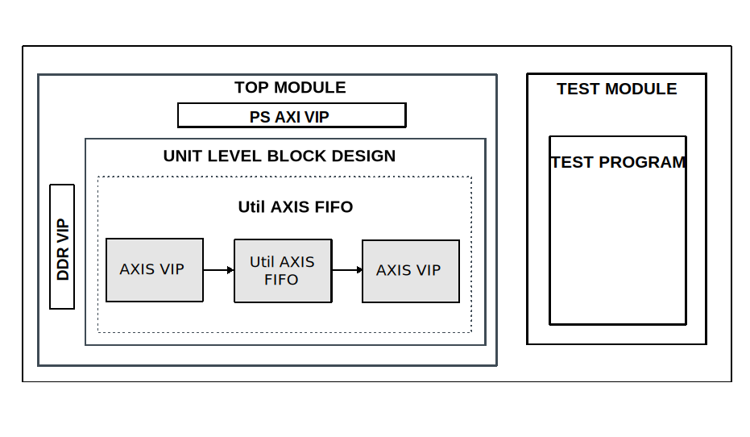

.. _util_axis_fifo:

Util AXIS FIFO
================================================================================

Overview
-------------------------------------------------------------------------------

The purpose of this testbench is to validate the FIFO functionality of the
:git-hdl:`library/util_axis_fifo <library/util_axis_fifo>` IP core.

The entire HDL documentation can be found
:external+hdl:ref:`here <util_axis_fifo>`.

Block design
-------------------------------------------------------------------------------

The block design is based on the test harness with the Util AXIS FIFO IP and
other auxiliary modules. For the ``util_axis_fifo`` IP testing, the auxiliary
modules are a master and a slave AXI4 Stream VIP. The AXIS VIP is used to
generate data for the DUT IP. The util_axis_fifo IP stores the data and then
sends it to the slave AXIS VIP for verification.

Block diagram
~~~~~~~~~~~~~~~~~~~~~~~~~~~~~~~~~~~~~~~~~~~~~~~~~~~~~~~~~~~~~~~~~~~~~~~~~~~~~~~

Configuration parameters and modes
~~~~~~~~~~~~~~~~~~~~~~~~~~~~~~~~~~~~~~~~~~~~~~~~~~~~~~~~~~~~~~~~~~~~~~~~~~~~~~~

The following parameters of this project that can be configured:

-  ASYNC_CLK: defines the input and output clock relationship
   Options: 0 for Synchronous or 1 for Asynchronous
-  TKEEP_EN: enable tkeep signals
-  TLAST_EN: enable tlast signal
-  DATA_WIDTH: data width
   Options: Power of 2, min 8, max 1024
-  ADDRESS_WIDTH: address width
   Options: 0 to 4
-  INPUT_CLK: input clock period in ns
   Options: 1 to 9
-  OUTPUT_CLK: output clock period in ns
   Options: 1 to 9

Build parameters
^^^^^^^^^^^^^^^^^^^^^^^^^^^^^^^^^^^^^^^^^^^^^^^^^^^^^^^^^^^^^^^^^^^^^^^^^^^^^^^^

The parameters mentioned above can be configured when starting the build, like
in the following example:

.. shell::
   :showuser:

   $make ASYNC_CLK=1 TKEEP_EN=1 TLAST_EN=1 DATA_WIDTH=16 ADDRESS_WIDTH=3 INPUT_CLK=1 OUTPUT_CLK=3

Configuration files
^^^^^^^^^^^^^^^^^^^^^^^^^^^^^^^^^^^^^^^^^^^^^^^^^^^^^^^^^^^^^^^^^^^^^^^^^^^^^^^^

The following configuration files are available:

.. list-table::
   :header-rows: 1

   * - Parameter
     - cfg_rand
   * - ASYNC_CLK
     - random
   * - TKEEP_EN
     - random
   * - TLAST_EN
     - random
   * - DATA_WIDTH
     - random
   * - ADDRESS_WIDTH
     - random
   * - INPUT_CLK
     - random
   * - OUTPUT_CLK
     - random

Tests
^^^^^^^^^^^^^^^^^^^^^^^^^^^^^^^^^^^^^^^^^^^^^^^^^^^^^^^^^^^^^^^^^^^^^^^^^^^^^^^^

The following test program file is available:

============ ======================
Test program Usage
============ ======================
test_program Tests the FIFO module.
============ ======================

Available configurations & tests combinations
^^^^^^^^^^^^^^^^^^^^^^^^^^^^^^^^^^^^^^^^^^^^^^^^^^^^^^^^^^^^^^^^^^^^^^^^^^^^^^^^

The test program is compatible with the above-mentioned configuration.

Test stimulus
-------------------------------------------------------------------------------

The test program is responsible for verifying the FIFO in different
configurations.

Environment Bringup
~~~~~~~~~~~~~~~~~~~~~~~~~~~~~~~~~~~~~~~~~~~~~~~~~~~~~~~~~~~~~~~~~~~~~~~~~~~~~~~

The steps of the environment bringup are:

* Create the environment
* Start the environment
* Start the clocks
* Assert the resets

FIFO testing
~~~~~~~~~~~~~~~~~~~~~~~~~~~~~~~~~~~~~~~~~~~~~~~~~~~~~~~~~~~~~~~~~~~~~~~~~~~~~~~

* Configure and start the sequencers
* Configure and start the watchdog
* Sends some randomized data and verify all
* Wait for scoreboard to complete checking

Stop the environment
~~~~~~~~~~~~~~~~~~~~~~~~~~~~~~~~~~~~~~~~~~~~~~~~~~~~~~~~~~~~~~~~~~~~~~~~~~~~~~~

* Stop the watchdog
* Stop the clocks

Building the test bench
-------------------------------------------------------------------------------

The testbench is built upon ADI's generic HDL reference design framework.
ADI does not distribute compiled files of these projects so they must be built
from the sources available :git-hdl:`here </>` and :git-testbenches:`here </>`,
with the specified hierarchy described :ref:`build_tb set_up_tb_repo`.
To get the source you must
`clone <https://git-scm.com/book/en/v2/Git-Basics-Getting-a-Git-Repository>`__
the HDL repository, and then build the project as follows:

**Linux/Cygwin/WSL**

*Example 1*

Building and simulating the testbench using only the command line.

.. shell::
   :showuser:

   $cd testbenches/ip/util_axis_fifo
   $make

*Example 2*

Building and simulating the testbench using the Vivado GUI. This command will
launch Vivado, will run the simulation and display the waveforms.

.. shell::
   :showuser:

   $cd testbenches/ip/util_axis_fifo
   $make MODE=gui

*Example 3*

Build a particular combination of test and configuration, using the Vivado GUI.
This command will launch Vivado, will run the simulation and display the
waveforms.

.. shell::
   :showuser:

   $cd testbenches/ip/util_axis_fifo
   $make MODE=gui CFG=cfg_rand TST=test_program

The built project can be found in the ``runs`` folder, where each configuration
specific build has its own folder named after the configuration file's name.
Example: if the following command was run for a single configuration in the
clean folder (no runs folder available):

``make CFG=cfg_rand``

Then the subfolder under ``runs`` name will be:

``cfg_rand``

Resources
-------------------------------------------------------------------------------

HDL related dependencies forming the DUT
~~~~~~~~~~~~~~~~~~~~~~~~~~~~~~~~~~~~~~~~~~~~~~~~~~~~~~~~~~~~~~~~~~~~~~~~~~~~~~~

.. list-table::
   :widths: 30 45 25
   :header-rows: 1

   * - IP name
     - Source code link
     - Documentation link
   * - UTIL_AXIS_FIFO
     - :git-hdl:`library/util_axis_fifo <library/util_axis_fifo>`
     - :external+hdl:ref:`here <util_axis_fifo>`

Testbenches related dependencies
~~~~~~~~~~~~~~~~~~~~~~~~~~~~~~~~~~~~~~~~~~~~~~~~~~~~~~~~~~~~~~~~~~~~~~~~~~~~~~~

.. include:: ../../common/dependency_common.rst

Testbench specific dependencies:

.. list-table::
   :widths: 30 45 25
   :header-rows: 1

   * - SV dependency name
     - Source code link
     - Documentation link
   * - M_AXIS_SEQUENCER
     - :git-testbenches:`library/vip/amd/m_axis_sequencer.sv`
     - ---
   * - S_AXIS_SEQUENCER
     - :git-testbenches:`library/vip/amd/s_axis_sequencer.sv`
     - ---
   * - SCOREBOARD
     - :git-testbenches:`library/drivers/common/scoreboard.sv`
     - ---

.. include:: ../../../common/more_information.rst

.. include:: ../../../common/support.rst
