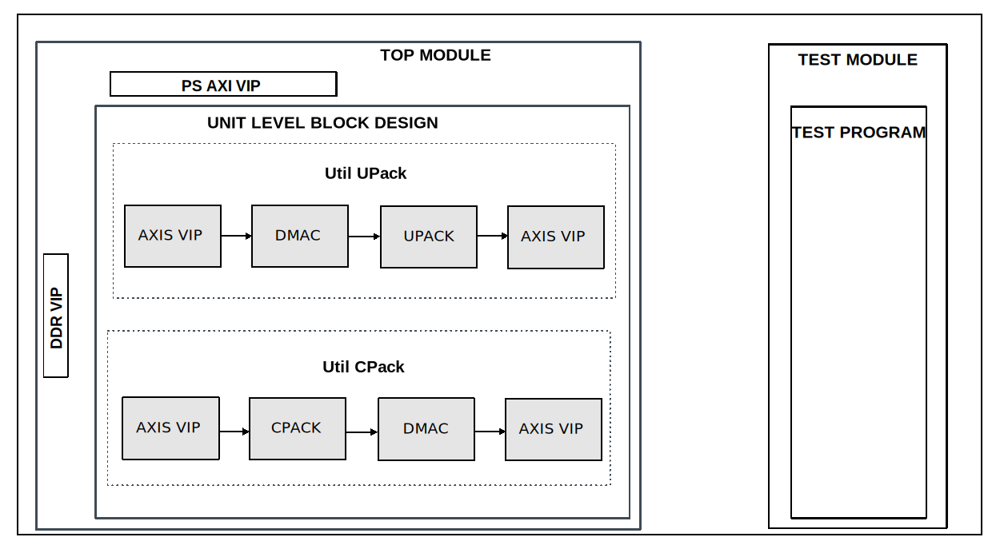

.. _util_pack:

Util Pack
================================================================================

Overview
-------------------------------------------------------------------------------

The purpose of this testbench is to validate the packaging functionality of the
:git-hdl:`library/util_pack/util_cpack2 <library/util_pack/util_cpack2>` and
:git-hdl:`library/util_pack/util_upack2 <library/util_pack/util_upack2>` IP
cores.

The entire HDL documentation can be found
:external+hdl:ref:`here <util_cpack2>` and
:external+hdl:ref:`here <util_upack2>`.

Block design
-------------------------------------------------------------------------------

The block design is based on the test harness with the DUT being the 2 packer
IPs and other auxiliary modules. For the ``util_upack`` IP testing, the
auxiliary modules are a DMAC, a master and a slave AXI4 Stream VIP. The AXIS
VIP is used to generate data for the DMAC IP. The DMAC IP then passed the input
data to the output AXIS interface, which is used by the util_upack IP. The
util_upack IP unpacks the data on the respective lanes. The data is
concatenated and fed into the slave AXIS VIP for verification. The
``util_cpack`` IP testing uses the same IPs, but in reversed order and
different configuration to match the required interfacing.

Block diagram
~~~~~~~~~~~~~~~~~~~~~~~~~~~~~~~~~~~~~~~~~~~~~~~~~~~~~~~~~~~~~~~~~~~~~~~~~~~~~~~

Configuration parameters and modes
~~~~~~~~~~~~~~~~~~~~~~~~~~~~~~~~~~~~~~~~~~~~~~~~~~~~~~~~~~~~~~~~~~~~~~~~~~~~~~~

The following parameters of this project that can be configured:

-  CHANNELS: defines the data generation mode:
   Integer value between 2 and 16
-  SAMPLES: defines the valid delays between data beats:
   Options: 2, 4, 8, 16
-  WIDTH: defines the valid delays between packets:
   Options: 8, 16, 32, 64

.. hint::

   The max width is calculated with: CHANNELS*SAMPLES*WIDTH and it cannot
   exceed 2048.

Build parameters
^^^^^^^^^^^^^^^^^^^^^^^^^^^^^^^^^^^^^^^^^^^^^^^^^^^^^^^^^^^^^^^^^^^^^^^^^^^^^^^^

The parameters mentioned above can be configured when starting the build, like
in the following example:

.. shell::
   :showuser:

   $make CHANNELS=3 SAMPLES=2 WIDTH=16

Configuration files
^^^^^^^^^^^^^^^^^^^^^^^^^^^^^^^^^^^^^^^^^^^^^^^^^^^^^^^^^^^^^^^^^^^^^^^^^^^^^^^^

The following configuration files are available:

   +-----------------------+-----------------------------+
   | Configuration mode    | Parameters                  |
   |                       +----------+---------+--------+
   |                       | CHANNELS | SAMPLES | WIDTH  |
   +=======================+==========+=========+========+
   | cfg1                  | 3        | 2       | 16     |
   +-----------------------+----------+---------+--------+
   | cfg_rand              | random   | random  | random |
   +-----------------------+----------+---------+--------+

Tests
^^^^^^^^^^^^^^^^^^^^^^^^^^^^^^^^^^^^^^^^^^^^^^^^^^^^^^^^^^^^^^^^^^^^^^^^^^^^^^^^

The following test program file is available:

============ =========================
Test program Usage
============ =========================
test_program Tests the packer modules.
============ =========================

Available configurations & tests combinations
^^^^^^^^^^^^^^^^^^^^^^^^^^^^^^^^^^^^^^^^^^^^^^^^^^^^^^^^^^^^^^^^^^^^^^^^^^^^^^^^

The test program is compatible with all the above-mentioned configurations.

CPU/Memory interconnects addresses
~~~~~~~~~~~~~~~~~~~~~~~~~~~~~~~~~~~~~~~~~~~~~~~~~~~~~~~~~~~~~~~~~~~~~~~~~~~~~~~

===========  ===========
Instance     Address
===========  ===========
axi_intc     0x4120_0000
ddr_axi_vip  0x8000_0000
dmac_rx      0x5000_0000
dmac_tx      0x5001_0000
===========  ===========

Interrupts
~~~~~~~~~~~~~~~~~~~~~~~~~~~~~~~~~~~~~~~~~~~~~~~~~~~~~~~~~~~~~~~~~~~~~~~~~~~~~~~

Nothing connected.

Test stimulus
-------------------------------------------------------------------------------

The test program is running in parallel for both TX and RX testing in the same
code space.

Environment Bringup
~~~~~~~~~~~~~~~~~~~~~~~~~~~~~~~~~~~~~~~~~~~~~~~~~~~~~~~~~~~~~~~~~~~~~~~~~~~~~~~

The steps of the environment bringup are:

* Create the environment
* Start the environment
* Start the clocks
* Assert the resets

Packer testing
~~~~~~~~~~~~~~~~~~~~~~~~~~~~~~~~~~~~~~~~~~~~~~~~~~~~~~~~~~~~~~~~~~~~~~~~~~~~~~~

* Configure the data_length
* Enable RX and TX DMA
* Initializes the sequencers, monitors and scoreboards
* Configures the DMA
* Configures the watchdog
* Starts the data transmission and the watchdog
* Waits for scoreboard to check all the data

.. caution::

   Increasing the hardcoded value for the data length might cause the watchdog
   timer to trigger prematurely!

Stop the environment
~~~~~~~~~~~~~~~~~~~~~~~~~~~~~~~~~~~~~~~~~~~~~~~~~~~~~~~~~~~~~~~~~~~~~~~~~~~~~~~

* Stop the watchdog
* Stop the clocks

Building the test bench
-------------------------------------------------------------------------------

The testbench is built upon ADI's generic HDL reference design framework.
ADI does not distribute compiled files of these projects so they must be built
from the sources available :git-hdl:`here </>` and :git-testbenches:`here </>`,
with the specified hierarchy described :ref:`build_tb set_up_tb_repo`.
To get the source you must
`clone <https://git-scm.com/book/en/v2/Git-Basics-Getting-a-Git-Repository>`__
the HDL repository, and then build the project as follows:

**Linux/Cygwin/WSL**

*Example 1*

Building and simulating the testbench using only the command line.

.. shell::
   :showuser:

   $cd testbenches/ip/util_pack
   $make

*Example 2*

Building and simulating the testbench using the Vivado GUI. This command will
launch Vivado, will run the simulation and display the waveforms.

.. shell::
   :showuser:

   $cd testbenches/ip/util_pack
   $make MODE=gui

*Example 3*

Build a particular combination of test and configuration, using the Vivado GUI.
This command will launch Vivado, will run the simulation and display the
waveforms.

.. shell::
   :showuser:

   $cd testbenches/ip/util_pack
   $make MODE=gui CFG=cfg1 TST=test_program

The built project can be found in the ``runs`` folder, where each configuration
specific build has its own folder named after the configuration file's name.
Example: if the following command was run for a single configuration in the
clean folder (no runs folder available):

``make CFG=cfg1``

Then the subfolder under ``runs`` name will be:

``cfg1``

Resources
-------------------------------------------------------------------------------

HDL related dependencies forming the DUT
~~~~~~~~~~~~~~~~~~~~~~~~~~~~~~~~~~~~~~~~~~~~~~~~~~~~~~~~~~~~~~~~~~~~~~~~~~~~~~~

.. list-table::
   :widths: 30 45 25
   :header-rows: 1

   * - IP name
     - Source code link
     - Documentation link
   * - AXI_DMAC
     - :git-hdl:`library/axi_dmac`
     - :external+hdl:ref:`here <axi_dmac>`
   * - UTIL_CPACK2
     - :git-hdl:`library/util_pack/util_cpack2 <library/util_pack/util_cpack2>`
     - :external+hdl:ref:`here <util_cpack2>`
   * - UTIL_UPACK2
     - :git-hdl:`library/util_pack/util_upack2 <library/util_pack/util_upack2>`
     - :external+hdl:ref:`here <util_upack2>`

Testbenches related dependencies
~~~~~~~~~~~~~~~~~~~~~~~~~~~~~~~~~~~~~~~~~~~~~~~~~~~~~~~~~~~~~~~~~~~~~~~~~~~~~~~

.. include:: ../../common/dependency_common.rst

Testbench specific dependencies:

.. list-table::
   :widths: 30 45 25
   :header-rows: 1

   * - SV dependency name
     - Source code link
     - Documentation link
   * - ADI_REGMAP_DMAC_PKG
     - :git-testbenches:`library/regmaps/adi_regmap_dmac_pkg.`
     - ---
   * - ADI_REGMAP_PKG
     - :git-testbenches:`library/regmaps/adi_regmap_pkg.sv`
     - ---
   * - DMA_TRANS
     - :git-testbenches:`library/drivers/dmac/dma_trans.sv`
     - ---
   * - DMAC_API
     - :git-testbenches:`library/drivers/dmac/dmac_api.sv`
     - ---
   * - M_AXIS_SEQUENCER
     - :git-testbenches:`library/vip/amd/m_axis_sequencer.sv`
     - ---
   * - S_AXIS_SEQUENCER
     - :git-testbenches:`library/vip/amd/s_axis_sequencer.sv`
     - ---

.. include:: ../../../common/more_information.rst

.. include:: ../../../common/support.rst
