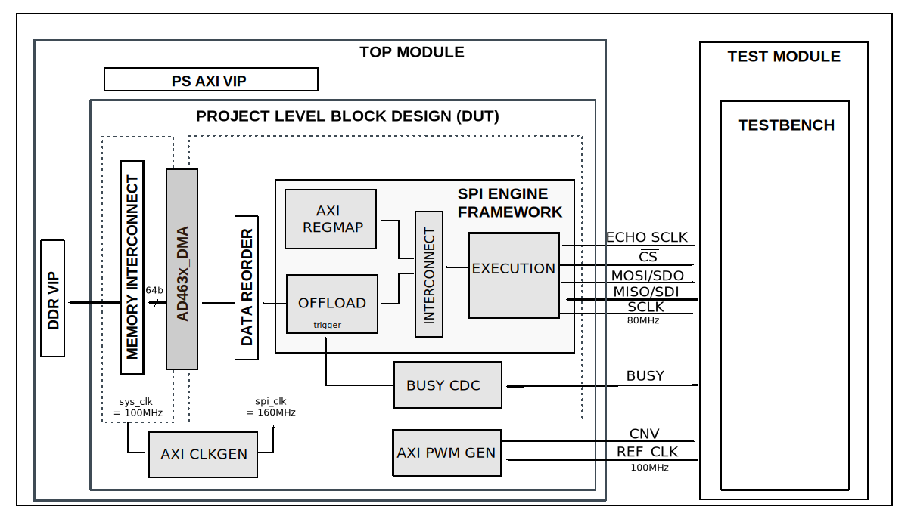

.. _ad463x:

AD463x
================================================================================

Overview
-------------------------------------------------------------------------------

The purpose of this testbench is to validate the serial interface functionality
of the :git-hdl:`projects/ad4630_fmc` reference design.

The entire HDL documentation can be found here
:external+hdl:ref:`AD4630-FMC HDL project <ad4630_fmc>`.

Block design
-------------------------------------------------------------------------------

The testbench block design includes part of the AD4630-FMC HDL reference design,
along with VIPs used for clocking, reset, PS and DDR simulations.

Block diagram
~~~~~~~~~~~~~~~~~~~~~~~~~~~~~~~~~~~~~~~~~~~~~~~~~~~~~~~~~~~~~~~~~~~~~~~~~~~~~~~

The data path and clock domains are depicted in the below diagram:

Configuration parameters and modes
~~~~~~~~~~~~~~~~~~~~~~~~~~~~~~~~~~~~~~~~~~~~~~~~~~~~~~~~~~~~~~~~~~~~~~~~~~~~~~~

The following parameters of this project that can be configured:

-  CLK_MODE: defines clocking mode of the device's digital interface:
   Options: 0 - SPI mode, 1 - Echo-clock or Master clock mode
-  NUM_OF_SDIO: defines the number of MOSI lines of the SPI interface:
   Options: 1 - Interleaved mode, 2 - 1 lane per channel,
   4 - 2 lanes per channel, 8 - 4 lanes per channel
-  CAPTURE_ZONE: defines the capture zone of the next sample.
   There are two capture zones: 1 - from negative edge of the BUSY line
   until the next CNV positive edge -20ns, 2 - from the next consecutive CNV
   positive edge +20ns until the second next consecutive CNV positive edge -20ns
-  DDR_EN: defines the type of data transfer. In echo and master clock mode
   the SDI lines can have Single or Double Data Rates.
   Options: 0 - MISO runs on SDR, 1 - MISO runs on DDR.

Configuration files
^^^^^^^^^^^^^^^^^^^^^^^^^^^^^^^^^^^^^^^^^^^^^^^^^^^^^^^^^^^^^^^^^^^^^^^^^^^^^^^^

The following configuration files are available:

   +-----------------------+-----------------------------------------------+
   | Configuration mode    | Parameters                                    |
   |                       +----------+------------+--------------+--------+
   |                       | CLK_MODE | NUM_OF_SDIO | CAPTURE_ZONE | DDR_EN |
   +=======================+==========+=============+==============+========+
   | cfg_cm0_sdi2_cz1_ddr0 | 0        | 2           | 1            | 0      |
   +-----------------------+----------+-------------+--------------+--------+
   | cfg_cm0_sdi2_cz2_ddr0 | 0        | 2           | 2            | 0      |
   +-----------------------+----------+-------------+--------------+--------+
   | cfg_cm0_sdi4_cz2_ddr0 | 0        | 4           | 2            | 0      |
   +-----------------------+----------+-------------+--------------+--------+
   | cfg_cm0_sdi8_cz2_ddr0 | 0        | 8           | 2            | 0      |
   +-----------------------+----------+-------------+--------------+--------+
   | cfg_cm1_sdi1_cz2_ddr0 | 1        | 1           | 2            | 0      |
   +-----------------------+----------+-------------+--------------+--------+
   | cfg_cm1_sdi2_cz2_ddr0 | 1        | 2           | 2            | 0      |
   +-----------------------+----------+-------------+--------------+--------+
   | cfg_cm1_sdi2_cz2_ddr1 | 1        | 2           | 2            | 1      |
   +-----------------------+----------+-------------+--------------+--------+
   | cfg_cm1_sdi4_cz2_ddr0 | 1        | 4           | 2            | 0      |
   +-----------------------+----------+-------------+--------------+--------+
   | cfg_cm1_sdi4_cz2_ddr1 | 1        | 4           | 2            | 1      |
   +-----------------------+----------+-------------+--------------+--------+
   | cfg_cm1_sdi8_cz2_ddr0 | 1        | 8           | 2            | 0      |
   +-----------------------+----------+-------------+--------------+--------+
   | cfg_cm1_sdi8_cz2_ddr1 | 1        | 8           | 2            | 1      |
   +-----------------------+----------+-------------+--------------+--------+

Tests
^^^^^^^^^^^^^^^^^^^^^^^^^^^^^^^^^^^^^^^^^^^^^^^^^^^^^^^^^^^^^^^^^^^^^^^^^^^^^^^^

The following test program file is available:

============ ========================================
Test program Usage
============ ========================================
test_program Tests the serial interface capabilities.
============ ========================================

Available configurations & tests combinations
^^^^^^^^^^^^^^^^^^^^^^^^^^^^^^^^^^^^^^^^^^^^^^^^^^^^^^^^^^^^^^^^^^^^^^^^^^^^^^^^

The test program is compatible with all of the above mentioned configurations.

Clock scheme
~~~~~~~~~~~~~~~~~~~~~~~~~~~~~~~~~~~~~~~~~~~~~~~~~~~~~~~~~~~~~~~~~~~~~~~~~~~~~~~

The design supports the following interface and clock modes both in SDR and DDR:

=============== ================== ================== ==================
Mode            1 Lane per channel 2 Lane per channel 4 lane per channel
=============== ================== ================== ==================
SPI mode        yes                yes                yes
Echo Clock mode yes                yes                yes
=============== ================== ================== ==================

CPU/Memory interconnect addresses
~~~~~~~~~~~~~~~~~~~~~~~~~~~~~~~~~~~~~~~~~~~~~~~~~~~~~~~~~~~~~~~~~~~~~~~~~~~~~~~

Below are the CPU/Memory interconnect addresses used in this project:

=====================  ===========
Instance               Address
=====================  ===========
spi_ad463x_axi_regmap  0x44A0_0000
axi_ad463x_dma         0x44A3_0000
spi_clkgen             0x44A7_0000
cnv_generator          0x44B0_0000
sync_generator         0x44C0_0000
=====================  ===========

Interrupts
~~~~~~~~~~~~~~~~~~~~~~~~~~~~~~~~~~~~~~~~~~~~~~~~~~~~~~~~~~~~~~~~~~~~~~~~~~~~~~~

Below are the Programmable Logic interrupts used in this project:

===============  ===
Instance name    HDL
===============  ===
axi_ad463x_dma   13
spi_ad463x       12
===============  ===

Test stimulus
-------------------------------------------------------------------------------

The test program is structured into several tests as follows:

Environment bringup
~~~~~~~~~~~~~~~~~~~~~~~~~~~~~~~~~~~~~~~~~~~~~~~~~~~~~~~~~~~~~~~~~~~~~~~~~~~~~~~

The steps of the environment bringup are:

* Create the environment
* Start the environment
* Start the clocks
* Assert the resets

Sanity test
~~~~~~~~~~~~~~~~~~~~~~~~~~~~~~~~~~~~~~~~~~~~~~~~~~~~~~~~~~~~~~~~~~~~~~~~~~~~~~~

This test is used to check the communication with the AXI REGMAP module of the
AD463X SPI Engine interface, by reading the core VERSION register, along with
writing and reading the SCRATCH register.

FIFO SPI test
~~~~~~~~~~~~~~~~~~~~~~~~~~~~~~~~~~~~~~~~~~~~~~~~~~~~~~~~~~~~~~~~~~~~~~~~~~~~~~~

The FIFO SPI test verifies the simple serial transfers, made through the
Execution module.

The steps of this test are:

* Start the SPI clock generator (axi_clkgen)
* Configure the conversion signal generator (axi_pwmgen)
* Enable SPI Engine & configure the Execution module
* Set up the interrupts
* Generate a FIFO transaction
* Capture and compare the results, using the PEEK register of the AXI SPI Engine

Offload SPI test
~~~~~~~~~~~~~~~~~~~~~~~~~~~~~~~~~~~~~~~~~~~~~~~~~~~~~~~~~~~~~~~~~~~~~~~~~~~~~~~

The Offload SPI test verifies the Offload module functionality.

The steps of this test are:

* Configure the DMA
* Configure the Offload module
* Start the Offload module
* Capture and compare the Offload SDI data

Stop the environment
~~~~~~~~~~~~~~~~~~~~~~~~~~~~~~~~~~~~~~~~~~~~~~~~~~~~~~~~~~~~~~~~~~~~~~~~~~~~~~~

* Stop the clocks

Building the testbench
-------------------------------------------------------------------------------

The testbench is built upon ADI's generic HDL reference design framework.
ADI does not distribute compiled files of these projects so they must be built
from the sources available :git-hdl:`here </>` and :git-testbenches:`here </>`,
with the specified hierarchy described :ref:`build_tb set_up_tb_repo`.
To get the source you must
`clone <https://git-scm.com/book/en/v2/Git-Basics-Getting-a-Git-Repository>`__
the HDL repository, and then build the project as follows:.

**Linux/Cygwin/WSL**

*Example 1*

Build all the possible combinations of tests and configurations, using only the
command line.

.. shell::
   :showuser:

   $cd testbenches/project/ad463x
   $make

*Example 2*

Build all the possible combinations of tests and configurations, using the
Vivado GUI. This command will launch Vivado, will run the simulation and display
the waveforms.

.. shell::
   :showuser:

   $cd testbenches/project/ad463x
   $make MODE=gui

*Example 3*

Build a particular combination of test and configuration, using the Vivado GUI.
This command will launch Vivado, will run the simulation and display the
waveforms.

.. shell::
   :showuser:

   $cd testbenches/project/ad463x
   $make MODE=gui CFG=cfg_cm0_sdi2_cz1_ddr0 TST=test_program

The built projects can be found in the ``runs`` folder, where each configuration
specific build has it's own folder named after the configuration file's name.
Example: if the following command was run for a single configuration in the
clean folder (no runs folder available):

``make CFG=cfg_cm0_sdi2_cz1_ddr0``

Then the subfolder under ``runs`` name will be:

``cfg_cm0_sdi2_cz1_ddr0``

Resources
-------------------------------------------------------------------------------

HDL related dependencies forming the DUT
~~~~~~~~~~~~~~~~~~~~~~~~~~~~~~~~~~~~~~~~~~~~~~~~~~~~~~~~~~~~~~~~~~~~~~~~~~~~~~~

.. list-table::
   :widths: 30 45 25
   :header-rows: 1

   * - IP name
     - Source code link
     - Documentation link
   * - AD463X_DATA_CAPTURE
     - :git-hdl:`library/ad463x_data_capture`
     - ---
   * - AXI_CLKGEN
     - :git-hdl:`library/axi_clkgen`
     - :external+hdl:ref:`axi_clkgen`
   * - AXI_DMAC
     - :git-hdl:`library/axi_dmac`
     - :external+hdl:ref:`axi_dmac`
   * - AXI_HDMI_TX
     - :git-hdl:`library/axi_hdmi_tx`
     - :external+hdl:ref:`axi_hdmi_tx`
   * - AXI_I2S_ADI
     - :git-hdl:`library/axi_i2s_adi`
     - ---
   * - AXI_PWM_GEN
     - :git-hdl:`library/axi_pwm_gen`
     - :external+hdl:ref:`axi_pwm_gen`
   * - AXI_SPDIF_TX
     - :git-hdl:`library/axi_spdif_tx`
     - ---
   * - AXI_SPI_ENGINE
     - :git-hdl:`library/spi_engine/axi_spi_engine`
     - :external+hdl:ref:`spi_engine axi`
   * - SPI_AXIS_REORDER
     - :git-hdl:`library/spi_engine/spi_axis_reorder`
     - ---
   * - SPI_ENGINE_EXECUTION
     - :git-hdl:`library/spi_engine/spi_engine_execution`
     - :external+hdl:ref:`spi_engine execution`
   * - SPI_ENGINE_INTERCONNECT
     - :git-hdl:`library/spi_engine/spi_engine_interconnect`
     - :external+hdl:ref:`spi_engine interconnect`
   * - SPI_ENGINE_OFFLOAD
     - :git-hdl:`library/spi_engine/spi_engine_offload`
     - :external+hdl:ref:`spi_engine offload`
   * - SYSID_ROM
     - :git-hdl:`library/sysid_rom`
     - :external+hdl:ref:`axi_sysid`
   * - UTIL_I2C_MIXER
     - :git-hdl:`library/util_i2c_mixer <library/util_i2c_mixer>`
     - ---

Testbenches related dependencies
~~~~~~~~~~~~~~~~~~~~~~~~~~~~~~~~~~~~~~~~~~~~~~~~~~~~~~~~~~~~~~~~~~~~~~~~~~~~~~~

.. include:: ../../common/dependency_common.rst

Testbench specific dependencies:

.. list-table::
   :widths: 30 45 25
   :header-rows: 1

   * - SV dependency name
     - Source code link
     - Documentation link
   * - ADI_REGMAP_CLKGEN_PKG
     - :git-testbenches:`library/regmaps/adi_regmap_clkgen_pkg.sv`
     - ---
   * - ADI_REGMAP_DMAC_PKG
     - :git-testbenches:`library/regmaps/adi_regmap_dmac_pkg.sv`
     - ---
   * - ADI_REGMAP_PKG
     - :git-testbenches:`library/regmaps/adi_regmap_pkg.sv`
     - ---
   * - ADI_REGMAP_PWM_GEN_PKG
     - :git-testbenches:`library/regmaps/adi_regmap_pwm_gen_pkg.sv`
     - ---
   * - ADI_REGMAP_SPI_ENGINE_PKG
     - :git-testbenches:`library/regmaps/adi_regmap_spi_engine_pkg.sv`
     - ---
   * - DMA_TRANS
     - :git-testbenches:`library/drivers/dmac/dma_trans.sv`
     - ---
   * - DMAC_API
     - :git-testbenches:`library/drivers/dmac/dmac_api.sv`
     - ---
   * - M_AXIS_SEQUENCER
     - :git-testbenches:`library/vip/amd/m_axis_sequencer.sv`
     - ---
   * - S_AXIS_SEQUENCER
     - :git-testbenches:`library/vip/amd/s_axis_sequencer.sv`
     - ---

.. include:: ../../../common/more_information.rst

.. include:: ../../../common/support.rst
