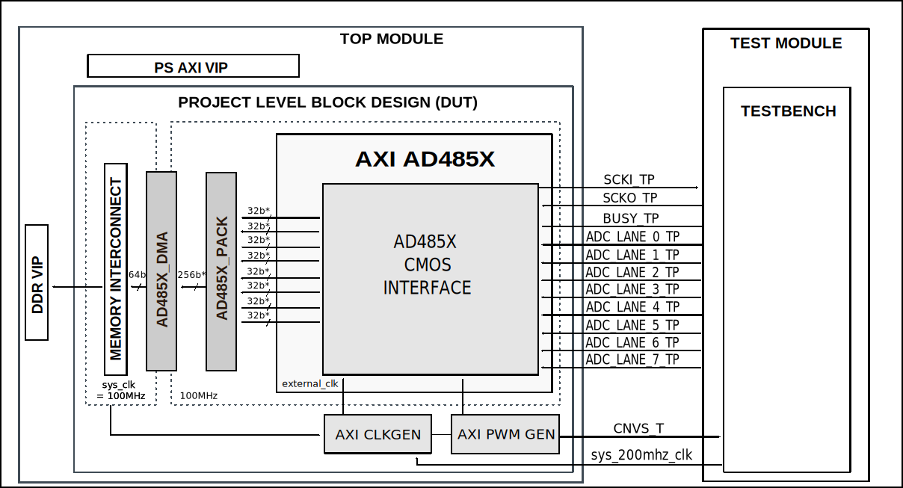
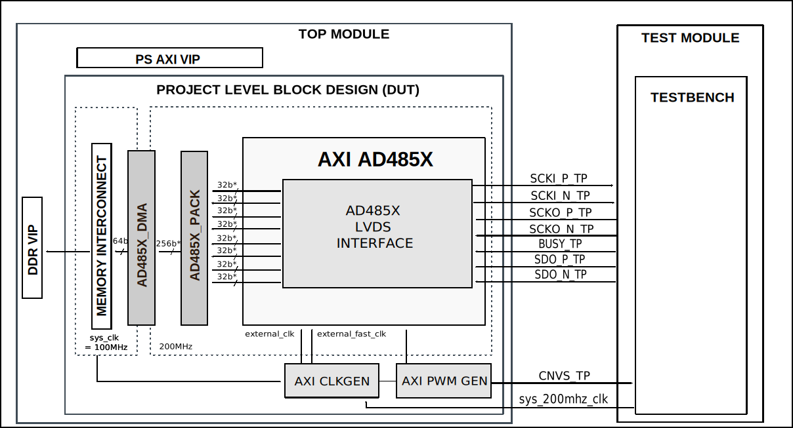

.. _ad485x:

AD485X
================================================================================

Overview
-------------------------------------------------------------------------------

The purpose of this testbench is to validate the data interfaces functionality
of the :git-hdl:`projects/ad485x_fmcz` reference design.

The testbench supports both CMOS and LVDS interface modes and covers all
devices in the AD485X family (AD4851 to AD4858), including both 16-bit and
20-bit resolution variants.

The entire HDL documentation can be found here
:external+hdl:ref:`AD485X_FMCZ HDL project <ad485x_fmc>`.

Block design
-------------------------------------------------------------------------------

The testbench block design includes part of the AD485X_FMCZ HDL reference
design, along with VIPs used for clocking, reset, PS and DDR simulations.

Block diagram
~~~~~~~~~~~~~~~~~~~~~~~~~~~~~~~~~~~~~~~~~~~~~~~~~~~~~~~~~~~~~~~~~~~~~~~~~~~~~~~

The data path and clock domains are depicted in the below diagrams:

AD485x_FMCZ CMOS interface
^^^^^^^^^^^^^^^^^^^^^^^^^^^^^^^^^^^^^^^^^^^^^^^^^^^^^^^^^^^^^^^^^^^^^^^^^^^^^^^

.. admonition:: Legend
   :class: note

   - For CMOS only, SCKI (and its echo SCKO, max 100 MHz) is derived from
     ext_ref_clk (max 200 MHz).
   - ``*`` Configurable width (16/32-bit, 128/256-bit), depending on device
     resolution

AD485x_FMCZ LVDS interface
^^^^^^^^^^^^^^^^^^^^^^^^^^^^^^^^^^^^^^^^^^^^^^^^^^^^^^^^^^^^^^^^^^^^^^^^^^^^^^^

.. admonition:: Legend
   :class: note

   - ``*`` Configurable width (16/32‑bit, 128/256‑bit), depending on device
     resolution

Configuration parameters and modes
~~~~~~~~~~~~~~~~~~~~~~~~~~~~~~~~~~~~~~~~~~~~~~~~~~~~~~~~~~~~~~~~~~~~~~~~~~~~~~~

The following parameters of this project can be configured:

-  DEVICE: Defines the target device from the AD485x family.
   Options: AD4851, AD4852, AD4853, AD4854, AD4855, AD4856, AD4857, AD4858

-  LVDS_CMOS_N: Defines the physical interface type.
   Options: 0 - CMOS, 1 - LVDS

The device parameter also determines:

-  Number of channels: 4 channels for AD4851-AD4854, 8 channels for AD4855-AD4858
-  Resolution: 16-bit for AD4851/AD4853/AD4855/AD4857, 20-bit for AD4852/AD4854/AD4856/AD4858

Configuration files
^^^^^^^^^^^^^^^^^^^^^^^^^^^^^^^^^^^^^^^^^^^^^^^^^^^^^^^^^^^^^^^^^^^^^^^^^^^^^^^^

The following configuration files are available:

+---------------+---------------------------+
| Configuration | Parameters                |
| mode          +----------+----------------+
|               | DEVICE   | LVDS_CMOS_N    |
+===============+==========+================+
| cfg1_cmos     | AD4851   | 0 (CMOS)       |
+---------------+----------+----------------+
| cfg1_lvds     | AD4851   | 1 (LVDS)       |
+---------------+----------+----------------+
| cfg2_cmos     | AD4852   | 0 (CMOS)       |
+---------------+----------+----------------+
| cfg2_lvds     | AD4852   | 1 (LVDS)       |
+---------------+----------+----------------+
| cfg3_cmos     | AD4853   | 0 (CMOS)       |
+---------------+----------+----------------+
| cfg3_lvds     | AD4853   | 1 (LVDS)       |
+---------------+----------+----------------+
| cfg4_cmos     | AD4854   | 0 (CMOS)       |
+---------------+----------+----------------+
| cfg4_lvds     | AD4854   | 1 (LVDS)       |
+---------------+----------+----------------+
| cfg5_cmos     | AD4855   | 0 (CMOS)       |
+---------------+----------+----------------+
| cfg5_lvds     | AD4855   | 1 (LVDS)       |
+---------------+----------+----------------+
| cfg6_cmos     | AD4856   | 0 (CMOS)       |
+---------------+----------+----------------+
| cfg6_lvds     | AD4856   | 1 (LVDS)       |
+---------------+----------+----------------+
| cfg7_cmos     | AD4857   | 0 (CMOS)       |
+---------------+----------+----------------+
| cfg7_lvds     | AD4857   | 1 (LVDS)       |
+---------------+----------+----------------+
| cfg8_cmos     | AD4858   | 0 (CMOS)       |
+---------------+----------+----------------+
| cfg8_lvds     | AD4858   | 1 (LVDS)       |
+---------------+----------+----------------+

Tests
^^^^^^^^^^^^^^^^^^^^^^^^^^^^^^^^^^^^^^^^^^^^^^^^^^^^^^^^^^^^^^^^^^^^^^^^^^^^^^^^

The following test program files are available:

================== =============================================
Test program       Usage
================== =============================================
test_program_cmos  Tests the CMOS parallel interface.
test_program_lvds  Tests the LVDS serial interface.
================== =============================================

Available configurations & tests combinations
^^^^^^^^^^^^^^^^^^^^^^^^^^^^^^^^^^^^^^^^^^^^^^^^^^^^^^^^^^^^^^^^^^^^^^^^^^^^^^^^

The test programs must match the interface type of the configuration:

=============== ================== ==========================================
Configuration   Test               Build command
=============== ================== ==========================================
cfg*_cmos       test_program_cmos  make CFG=cfg1_cmos TST=test_program_cmos
cfg*_lvds       test_program_lvds  make CFG=cfg1_lvds TST=test_program_lvds
=============== ================== ==========================================

.. error::

    Mixing a wrong pair of CFG and TST (e.g., CMOS config with LVDS test) will
    result in a simulation error. Please use the matching interface type.

CPU/Memory interconnect addresses
~~~~~~~~~~~~~~~~~~~~~~~~~~~~~~~~~~~~~~~~~~~~~~~~~~~~~~~~~~~~~~~~~~~~~~~~~~~~~~~

Below are the CPU/Memory interconnect addresses used in this project:

=========================  ===========
Instance                   Address
=========================  ===========
axi_ad485x                 0x43C0_0000
axi_pwm_gen                0x43D0_0000
ad485x_dma                 0x43E0_0000
adc_clkgen                 0x4400_0000
=========================  ===========

Interrupts
~~~~~~~~~~~~~~~~~~~~~~~~~~~~~~~~~~~~~~~~~~~~~~~~~~~~~~~~~~~~~~~~~~~~~~~~~~~~~~~

Below are the Programmable Logic interrupts used in this project:

===============  ===
Instance name    HDL
===============  ===
ad485x_dma       10
===============  ===

Test stimulus
-------------------------------------------------------------------------------

Test parameters
~~~~~~~~~~~~~~~~~~~~~~~~~~~~~~~~~~~~~~~~~~~~~~~~~~~~~~~~~~~~~~~~~~~~~~~~~~~~~~~

The following runtime parameters can be configured at the beginning of each
test program:

-  packet_format: Defines the packet format mode.
   Options: 0, 1, 2, 3 (default: 0)

   +---------------+-------------------+-------------------+
   | packet_format | AD4851/3/5/7      | AD4852/4/6/8      |
   |               | (16-bit)          | (20-bit)          |
   +===============+===================+===================+
   | 0             | 16 bits           | 20 bits           |
   +---------------+-------------------+-------------------+
   | 1             | 24 bits           | 24 bits           |
   +---------------+-------------------+-------------------+
   | 2/3           | ---               | 32 bits           |
   +---------------+-------------------+-------------------+

-  crc_en: Enables CRC checking.
   Options: 0 - Disabled, 1 - Enabled (default: 0)

-  oversampling_en: Enables oversampling mode.
   Options: 0 - Disabled, 1 - Enabled (default: 0)

.. warning::

   **CMOS interface limitation:** The CRC check might break the captured data when
   using max sample rate with scki = 100MHz and packet format >= 20 bit.
   The data transaction doesn't meet the minimum timing requirement between
   the last SCKI edge and the CNV signal according to the datasheet.

   Solutions:

   * Use lower sampling rates
   * Increase the core clock (100MHz in the reference design)

.. warning::

   **LVDS interface limitation:** Enabling the oversampling breaks the captured
   data when using max sample rate with CRC enabled and packet format = 32 bit.
   The data transaction doesn't meet the minimum timing requirement between
   the last SCKI edge and the CNV signal according to the datasheet.

Test programs
~~~~~~~~~~~~~~~~~~~~~~~~~~~~~~~~~~~~~~~~~~~~~~~~~~~~~~~~~~~~~~~~~~~~~~~~~~~~~~~

Both CMOS and LVDS test programs share the same structure, consisting of the
following tests:

Environment bringup
^^^^^^^^^^^^^^^^^^^^^^^^^^^^^^^^^^^^^^^^^^^^^^^^^^^^^^^^^^^^^^^^^^^^^^^^^^^^^^^

The steps of the environment bringup are:

* Create the environment
* Start the environment
* Start the clocks
* Assert the resets

Sanity test
^^^^^^^^^^^^^^^^^^^^^^^^^^^^^^^^^^^^^^^^^^^^^^^^^^^^^^^^^^^^^^^^^^^^^^^^^^^^^^^

This test is used to check the communication with the AXI interfaces by:

* Testing the DMA sanity (read/write SCRATCH register)
* Testing the PWM generator sanity
* Testing the ADC core sanity (read/write SCRATCH register)

Data acquisition test
^^^^^^^^^^^^^^^^^^^^^^^^^^^^^^^^^^^^^^^^^^^^^^^^^^^^^^^^^^^^^^^^^^^^^^^^^^^^^^^

* Reset and enable the ADC core
* Configure the packet format and oversampling mode
* Enable CRC checking
* Configure the number of active lanes
* Enable ADC channels
* Configure the clock generator (axi_clkgen)
* Configure the DMA for data reception
* Configure and start the PWM generator for conversion triggering
* Wait for data capture
* Verify captured data against expected values
* Perform CRC verification on each channel

Stop the environment
^^^^^^^^^^^^^^^^^^^^^^^^^^^^^^^^^^^^^^^^^^^^^^^^^^^^^^^^^^^^^^^^^^^^^^^^^^^^^^^

* Stop the environment

Building the testbench
-------------------------------------------------------------------------------

The testbench is built upon ADI's generic HDL reference design framework.
ADI does not distribute compiled files of these projects so they must be built
from the sources available :git-hdl:`here </>` and :git-testbenches:`here </>`,
with the specified hierarchy described :ref:`build_tb set_up_tb_repo`.
To get the source you must
`clone <https://git-scm.com/book/en/v2/Git-Basics-Getting-a-Git-Repository>`__
the HDL repository, and then build the project as follows:.

**Linux/Cygwin/WSL**

*Example 1*

Build all the possible combinations of tests and configurations, using only the
command line.

.. shell::
   :showuser:

   $cd testbenches/project/ad485x
   $make

*Example 2*

Build all the possible combinations of tests and configurations, using the
Vivado GUI. This command will launch Vivado, will run the simulation and display
the waveforms.

.. shell::
   :showuser:

   $cd testbenches/project/ad485x
   $make MODE=gui

*Example 3*

Build a particular combination of test and configuration, using the Vivado GUI.
This command will launch Vivado, will run the simulation and display the
waveforms.

.. shell::
   :showuser:

   $cd testbenches/project/ad485x
   $make CFG=cfg8_cmos TST=test_program_cmos MODE=gui

*Example 4*

Build the LVDS interface test for AD4858:

.. shell::
   :showuser:

   $cd testbenches/project/ad485x
   $make CFG=cfg8_lvds TST=test_program_lvds MODE=gui

The built projects can be found in the ``runs`` folder, where each configuration
specific build has it's own folder named after the configuration file's name.
Example: if the following command was run for a single configuration in the
clean folder (no runs folder available):

``make CFG=cfg8_cmos``

Then the subfolder under ``runs`` name will be:

``cfg8_cmos``

Resources
-------------------------------------------------------------------------------

HDL related dependencies forming the DUT
~~~~~~~~~~~~~~~~~~~~~~~~~~~~~~~~~~~~~~~~~~~~~~~~~~~~~~~~~~~~~~~~~~~~~~~~~~~~~~~

.. list-table::
   :widths: 30 45 25
   :header-rows: 1

   * - IP name
     - Source code link
     - Documentation link
   * - AXI_AD485X
     - :git-hdl:`library/axi_ad485x`
     - :external+hdl:ref:`axi_ad485x`
   * - AXI_CLKGEN
     - :git-hdl:`library/axi_clkgen`
     - :external+hdl:ref:`axi_clkgen`
   * - AXI_DMAC
     - :git-hdl:`library/axi_dmac`
     - :external+hdl:ref:`axi_dmac`
   * - AXI_PWM_GEN
     - :git-hdl:`library/axi_pwm_gen`
     - :external+hdl:ref:`axi_pwm_gen`
   * - UTIL_CPACK2
     - :git-hdl:`library/util_pack/util_cpack2`
     - :external+hdl:ref:`util_cpack2`

Testbenches related dependencies
~~~~~~~~~~~~~~~~~~~~~~~~~~~~~~~~~~~~~~~~~~~~~~~~~~~~~~~~~~~~~~~~~~~~~~~~~~~~~~~

.. include:: ../../common/dependency_common.rst

Testbench specific dependencies:

.. list-table::
   :widths: 30 45 25
   :header-rows: 1

   * - SV dependency name
     - Source code link
     - Documentation link
   * - ADI_REGMAP_ADC_PKG
     - :git-testbenches:`library/regmaps/adi_regmap_adc_pkg.sv`
     - ---
   * - ADI_REGMAP_CLKGEN_PKG
     - :git-testbenches:`library/regmaps/adi_regmap_clkgen_pkg.sv`
     - ---
   * - ADI_REGMAP_COMMON_PKG
     - :git-testbenches:`library/regmaps/adi_regmap_common_pkg.sv`
     - ---
   * - ADI_REGMAP_DMAC_PKG
     - :git-testbenches:`library/regmaps/adi_regmap_dmac_pkg.sv`
     - ---
   * - ADI_REGMAP_PKG
     - :git-testbenches:`library/regmaps/adi_regmap_pkg.sv`
     - ---
   * - ADI_REGMAP_PWM_GEN_PKG
     - :git-testbenches:`library/regmaps/adi_regmap_pwm_gen_pkg.sv`
     - ---
   * - AXI_VIP_PKG
     - ---
     - :xilinx:`AXI Verification IP (VIP) <products/intellectual-property/axi-vip.html>`
   * - AXI4STREAM_VIP_PKG
     - ---
     - :xilinx:`AXI Stream Verification IP (VIP) <products/intellectual-property/axi-stream-vip.html>`
   * - CLK_GEN_API
     - :git-testbenches:`library/drivers/clk_gen_api_pkg.sv`
     - ---
   * - DMA_TRANS
     - :git-testbenches:`library/drivers/dmac/dma_trans.sv`
     - ---
   * - DMAC_API
     - :git-testbenches:`library/drivers/dmac/dmac_api.sv`
     - ---
   * - PWM_GEN_API
     - :git-testbenches:`library/drivers/pwm_gen_api_pkg.sv`
     - ---

.. include:: ../../../common/more_information.rst

.. include:: ../../../common/support.rst
