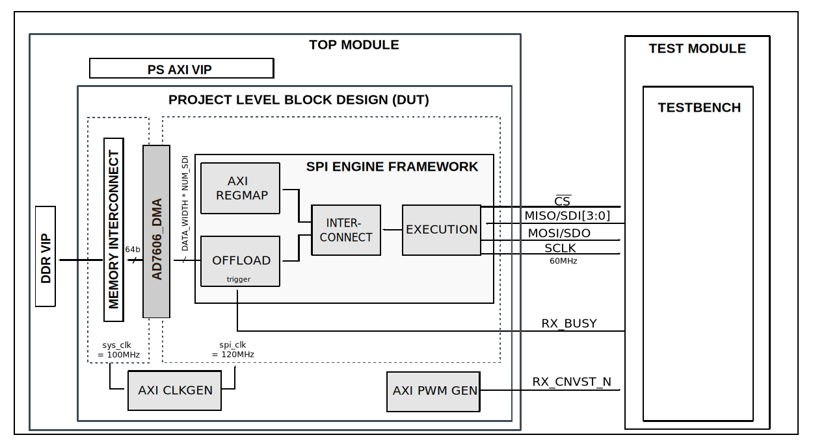

.. _ad7606:

AD7606
================================================================================

Overview
-------------------------------------------------------------------------------

The purpose of this testbench is to validate the serial interface functionality
of the :git-hdl:`projects/ad7606x_fmc` reference design.

The entire HDL documentation can be found here
:external+hdl:ref:`AD7606x-FMC HDL project <ad7606x_fmc>`.

Block design
-------------------------------------------------------------------------------

The testbench block design includes part of the AD7606x-FMC HDL reference design,
along with VIPs used for clocking, reset, PS and DDR simulations.

Block diagram
~~~~~~~~~~~~~~~~~~~~~~~~~~~~~~~~~~~~~~~~~~~~~~~~~~~~~~~~~~~~~~~~~~~~~~~~~~~~~~~

The data path and clock domains are depicted in the below diagram:

Configuration parameters and modes
~~~~~~~~~~~~~~~~~~~~~~~~~~~~~~~~~~~~~~~~~~~~~~~~~~~~~~~~~~~~~~~~~~~~~~~~~~~~~~~

The following parameters of this project that can be configured:

-  DEV_CONFIG: defines the device:
   Options: 0 - AD7606B, 1 - AD7606C-16, 2 - AD7606C-18
-  EXT_CLK: defines the usage of an external clock:
   Options: 0 - without external clock, 1 - with external clock
-  INTF: defines the interface type:
   Options: 0 - Parallel, 1 - Serial
-  NUM_OF_SDI: defines the number of MOSI lines of the SPI interface:
   Options: 1 - Interleaved mode, 2 - 1 lane per channel,
   4 - 2 lanes per channel, 8 - 4 lanes per channel

Build parameters
^^^^^^^^^^^^^^^^^^^^^^^^^^^^^^^^^^^^^^^^^^^^^^^^^^^^^^^^^^^^^^^^^^^^^^^^^^^^^^^^

The parameters mentioned above can be configured when starting the build, like in
the following example:

.. shell::
   :showuser:

   $make DEV_CONFIG=0 EXT_CLK=0 INTF=0 NUM_OF_SDI=2

but we recommend using the already tested build configuration modes, that can be
found in the ``cfg`` section.

Configuration files
^^^^^^^^^^^^^^^^^^^^^^^^^^^^^^^^^^^^^^^^^^^^^^^^^^^^^^^^^^^^^^^^^^^^^^^^^^^^^^^^

The following configuration files are available:

   +-----------------------+------------------------------------------+
   | Configuration mode    | Parameters                               |
   |                       +------------+---------+------+------------+
   |                       | DEV_CONFIG | EXT_CLK | INTF | NUM_OF_SDI |
   +=======================+============+=========+======+============+
   | cfg1                  | 0          | 0       | 0    | 1          |
   +-----------------------+------------+---------+------+------------+
   | cfg2                  | 1          | 0       | 0    | 1          |
   +-----------------------+------------+---------+------+------------+
   | cfg3                  | 2          | 0       | 0    | 1          |
   +-----------------------+------------+---------+------+------------+

Tests
^^^^^^^^^^^^^^^^^^^^^^^^^^^^^^^^^^^^^^^^^^^^^^^^^^^^^^^^^^^^^^^^^^^^^^^^^^^^^^^^

The following test program file is available:

============ ========================================
Test program Usage
============ ========================================
test_program Tests the serial interface capabilities.
============ ========================================

Available configurations & tests combinations
^^^^^^^^^^^^^^^^^^^^^^^^^^^^^^^^^^^^^^^^^^^^^^^^^^^^^^^^^^^^^^^^^^^^^^^^^^^^^^^^

The test program is compatible with all of the above mentioned configurations.

CPU/Memory interconnect addresses
~~~~~~~~~~~~~~~~~~~~~~~~~~~~~~~~~~~~~~~~~~~~~~~~~~~~~~~~~~~~~~~~~~~~~~~~~~~~~~~

Below are the CPU/Memory interconnect addresses used in this project:

=====================  ===========
Instance               Address
=====================  ===========
spi_ad7616_axi_regmap  0x44A0_0000
axi_ad7606x_dma        0x44A3_0000
spi_clkgen             0x44A7_0000
ad7606_pwm_gen         0x44B0_0000
=====================  ===========

Interrupts
~~~~~~~~~~~~~~~~~~~~~~~~~~~~~~~~~~~~~~~~~~~~~~~~~~~~~~~~~~~~~~~~~~~~~~~~~~~~~~~

Below are the Programmable Logic interrupts used in this project:

===============  ===
Instance name    HDL
===============  ===
axi_ad7606_dma   13
spi_ad7606       12
===============  ===

Test stimulus
-------------------------------------------------------------------------------

The test program is structured into several tests as follows:

Environment bringup
~~~~~~~~~~~~~~~~~~~~~~~~~~~~~~~~~~~~~~~~~~~~~~~~~~~~~~~~~~~~~~~~~~~~~~~~~~~~~~~

The steps of the environment bringup are:

* Create the environment
* Start the environment
* Start the clocks
* Assert the resets

Sanity test
~~~~~~~~~~~~~~~~~~~~~~~~~~~~~~~~~~~~~~~~~~~~~~~~~~~~~~~~~~~~~~~~~~~~~~~~~~~~~~~

This test is used to check the communication with the AXI REGMAP module of the
AD7606 SPI Engine interface, by reading the core VERSION register, along with
writing and reading the SCRATCH register.

Simple configuration test
~~~~~~~~~~~~~~~~~~~~~~~~~~~~~~~~~~~~~~~~~~~~~~~~~~~~~~~~~~~~~~~~~~~~~~~~~~~~~~~

The adc_config_SIMPLE_test is used for verifying the mode 0 of the ADC.

The steps of this test are:

* Get the ADC common core out of reset
* Set & read the ADC_CONFIG WR & CTRL registers of the ADC_COMMON
* Read data on the rx_db_o port
* Set HDL config mode 0

CRC configuration test
~~~~~~~~~~~~~~~~~~~~~~~~~~~~~~~~~~~~~~~~~~~~~~~~~~~~~~~~~~~~~~~~~~~~~~~~~~~~~~~

The adc_config_CRC_test is used for verifying the mode 1 of the ADC.

The steps of this test are:

* Get the ADC common core out of reset
* Set CRC and static data setup
* Set & read the ADC_CONFIG WR & CTRL registers of the ADC_COMMON
* Read data on the rx_db_o port
* Set HDL config mode 1

Status configuration test
~~~~~~~~~~~~~~~~~~~~~~~~~~~~~~~~~~~~~~~~~~~~~~~~~~~~~~~~~~~~~~~~~~~~~~~~~~~~~~~

The adc_config_STATUS_test is used for verifying the mode 2 of the ADC.

The steps of this test are:

* Get the ADC common core out of reset
* Set STATUS and static data setup
* Set & read the ADC_CONFIG WR & CTRL registers of the ADC_COMMON
* Read data on the rx_db_o port
* Set HDL config mode 2

Status CRC configuration test
~~~~~~~~~~~~~~~~~~~~~~~~~~~~~~~~~~~~~~~~~~~~~~~~~~~~~~~~~~~~~~~~~~~~~~~~~~~~~~~

The adc_config_STATUS_CRC_test is used for verifying the mode 3 of the ADC.

The steps of this test are:

* Get the ADC common core out of reset
* Set CRC and static data setup
* Set STATUS and static data setup
* Set & read the ADC_CONFIG WR & CTRL registers of the ADC_COMMON
* Read data on the rx_db_o port
* Set HDL config mode 3

Stop the environment
~~~~~~~~~~~~~~~~~~~~~~~~~~~~~~~~~~~~~~~~~~~~~~~~~~~~~~~~~~~~~~~~~~~~~~~~~~~~~~~

* Stop the clocks

Building the testbench
-------------------------------------------------------------------------------

The testbench is built upon ADI's generic HDL reference design framework.
ADI does not distribute compiled files of these projects so they must be built
from the sources available :git-hdl:`here </>` and :git-testbenches:`here </>`,
with the specified hierarchy described :ref:`build_tb set_up_tb_repo`.
To get the source you must
`clone <https://git-scm.com/book/en/v2/Git-Basics-Getting-a-Git-Repository>`__
the HDL repository, and then build the project as follows:.

**Linux/Cygwin/WSL**

*Example 1*

Build all the possible combinations of tests and configurations, using only the
command line.

.. shell::
   :showuser:

   $cd testbenches/project/ad7606x
   $make

*Example 2*

Build all the possible combinations of tests and configurations, using the
Vivado GUI. This command will launch Vivado, will run the simulation and display
the waveforms.

.. shell::
   :showuser:

   $cd testbenches/project/ad7606x
   $make MODE=gui

*Example 3*

Build a particular combination of test and configuration, using the Vivado GUI.
This command will launch Vivado, will run the simulation and display the
waveforms.

.. shell::
   :showuser:

   $cd testbenches/project/ad7606x
   $make MODE=gui CFG=cfg1 TST=test_program

The built projects can be found in the ``runs`` folder, where each configuration
specific build has it's own folder named after the configuration file's name.
Example: if the following command was run for a single configuration in the
clean folder (no runs folder available):

``make CFG=cfg1``

Then the subfolder under ``runs`` name will be:

``cfg1``

Resources
-------------------------------------------------------------------------------

HDL related dependencies forming the DUT
~~~~~~~~~~~~~~~~~~~~~~~~~~~~~~~~~~~~~~~~~~~~~~~~~~~~~~~~~~~~~~~~~~~~~~~~~~~~~~~

.. list-table::
   :widths: 30 45 25
   :header-rows: 1

   * - IP name
     - Source code link
     - Documentation link
   * - SYNC_BITS
     - :git-hdl:`library/util_cdc/sync_bits.v <library/util_cdc/sync_bits.v>` **
     - ---
   * - AD_EDGE_DETECT
     - :git-hdl:`library/common/ad_edge_detect.v <library/common/ad_edge_detect.v>`
     - ---
   * - AXI_AD7606x
     - :git-hdl:`library/axi_ad7606x <library/axi_ad7606x>` *
     - :dokuwiki:`[Wiki] <resources/fpga/docs/axi_ad7606x>`
   * - AXI_CLKGEN
     - :git-hdl:`library/axi_clkgen <library/axi_clkgen>`
     - :external+hdl:ref:`axi_clkgen`
   * - AXI_DMAC
     - :git-hdl:`library/axi_dmac <library/axi_dmac>`
     - :external+hdl:ref:`axi_dmac`
   * - AXI_HDMI_TX
     - :git-hdl:`library/axi_hdmi_tx <library/axi_hdmi_tx>`
     - :external+hdl:ref:`axi_hdmi_tx`
   * - AXI_I2S_ADI
     - :git-hdl:`library/axi_i2s_adi <library/axi_i2s_adi>`
     - ---
   * - AXI_PWM_GEN
     - :git-hdl:`library/axi_pwm_gen <library/axi_pwm_gen>`
     - :external+hdl:ref:`axi_pwm_gen`
   * - AXI_SPDIF_TX
     - :git-hdl:`library/axi_spdif_tx <library/axi_spdif_tx>`
     - ---
   * - AXI_SYSID
     - :git-hdl:`library/axi_sysid <library/axi_sysid>`
     - :external+hdl:ref:`axi_sysid`
   * - AXI_SPI_ENGINE
     - :git-hdl:`library/spi_engine/axi_spi_engine <library/spi_engine/axi_spi_engine>`  **
     - :external+hdl:ref:`spi_engine axi`
   * - SPI_ENGINE_EXECUTION
     - :git-hdl:`library/spi_engine/spi_engine_execution <library/spi_engine/spi_engine_execution>` **
     - :external+hdl:ref:`spi_engine execution`
   * - SPI_ENGINE_INTERCONNECT
     - :git-hdl:`library/spi_engine/spi_engine_interconnect <library/spi_engine/spi_engine_interconnect>` **
     - :external+hdl:ref:`spi_engine interconnect`
   * - SPI_ENGINE_OFFLOAD
     - :git-hdl:`library/spi_engine/spi_engine_offload <library/spi_engine/spi_engine_offload>` **
     - :external+hdl:ref:`spi_engine offload`
   * - SYSID_ROM
     - :git-hdl:`library/sysid_rom <library/sysid_rom>`
     - :external+hdl:ref:`axi_sysid`
   * - UTIL_I2C_MIXER
     - :git-hdl:`library/util_i2c_mixer <library/util_i2c_mixer>`
     - ---
   * - UTIL_CPACK2
     - :git-hdl:`library/util_pack/util_cpack2 <library/util_pack/util_cpack2>` *
     - :external+hdl:ref:`here <util_cpack2>`

.. admonition:: Legend
   :class: note

   -   ``*`` instantiated only for INTF=0 (parallel interface)
   -   ``**`` instantiated only for INTF=1 (serial interface)

Testbenches related dependencies
~~~~~~~~~~~~~~~~~~~~~~~~~~~~~~~~~~~~~~~~~~~~~~~~~~~~~~~~~~~~~~~~~~~~~~~~~~~~~~~

.. include:: ../../common/dependency_common.rst

Testbench specific dependencies:

.. list-table::
   :widths: 30 45 25
   :header-rows: 1

   * - SV dependency name
     - Source code link
     - Documentation link
   * - ADI_REGMAP_ADC_PKG
     - :git-testbenches:`library/regmaps/adi_regmap_adc_pkg.sv`
     - ---
   * - ADI_REGMAP_COMMON_PKG
     - :git-testbenches:`library/regmaps/adi_regmap_common_pkg.sv`
     - ---
   * - ADI_REGMAP_DMAC_PKG
     - :git-testbenches:`library/regmaps/adi_regmap_dmac_pkg.`
     - ---
   * - ADI_REGMAP_PKG
     - :git-testbenches:`library/regmaps/adi_regmap_pkg.sv`
     - ---
   * - ADI_REGMAP_PWM_GEN_PKG
     - :git-testbenches:`library/regmaps/adi_regmap_pwm_gen_pkg.sv`
     - ---
   * - DMA_TRANS
     - :git-testbenches:`library/drivers/dmac/dma_trans.sv`
     - ---
   * - DMAC_API
     - :git-testbenches:`library/drivers/dmac/dmac_api.sv`
     - ---
   * - M_AXIS_SEQUENCER
     - :git-testbenches:`library/vip/amd/m_axis_sequencer.sv`
     - ---
   * - S_AXIS_SEQUENCER
     - :git-testbenches:`library/vip/amd/s_axis_sequencer.sv`
     - ---

.. include:: ../../../common/more_information.rst

.. include:: ../../../common/support.rst
