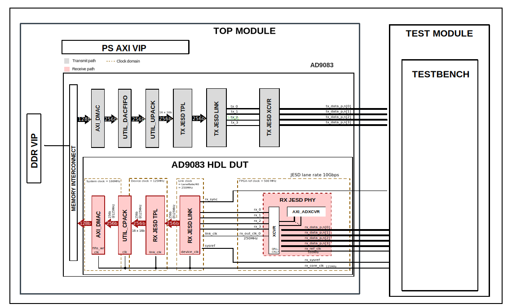

.. _ad9083:

AD9083
================================================================================

Overview
-------------------------------------------------------------------------------

The purpose of this testbench is to validate the ADC data path of the
:git-hdl:`projects/ad9083_evb` reference design.

The entire HDL documentation can be found here
:external+hdl:ref:`AD9083_EVB HDL project <ad9083_evb>`.

Block design
-------------------------------------------------------------------------------

The testbench block design includes part of the AD9083_EVB HDL reference design,
along with auxiliary IPs that help out with testing (JESD204B TX instances) and
VIPs used for clocking, reset, PS and DDR simulations.

Block diagram
~~~~~~~~~~~~~~~~~~~~~~~~~~~~~~~~~~~~~~~~~~~~~~~~~~~~~~~~~~~~~~~~~~~~~~~~~~~~~~~

The data path and clock domains are depicted in the below diagram:

Configuration parameters and modes
~~~~~~~~~~~~~~~~~~~~~~~~~~~~~~~~~~~~~~~~~~~~~~~~~~~~~~~~~~~~~~~~~~~~~~~~~~~~~~~

The following parameters of this testbench that can be configured:

- JESD_MODE: used link layer encoder mode
  - 64B66B - 64b66b link layer defined in JESD204C, uses AMD IP as Physical
    Layer
  - 8B10B - 8b10b link layer defined in JESD204B, uses ADI IP as Physical
    Layer
- REF_CLK_RATE: the rate of the reference clock
- RX_RATE: lane rate of the Rx link (to FPGA)
- TX_RATE: lane rate of the Tx link (from FPGA)
- [RX/TX]_NUM_LINKS: number of links
- [RX/TX]_JESD_M: number of converters per link
- [RX/TX]_JESD_L: number of lanes per link
- [RX/TX]_JESD_S: number of samples per frame
- [RX/TX]_JESD_NP: number of bits per sample

Other JESD204B output configuration modes can be found in the :adi:`AD9083`
data sheet, at Table 24.

Build parameters
^^^^^^^^^^^^^^^^^^^^^^^^^^^^^^^^^^^^^^^^^^^^^^^^^^^^^^^^^^^^^^^^^^^^^^^^^^^^^^^^

There are no build parameters for this testbench.

Configuration files
^^^^^^^^^^^^^^^^^^^^^^^^^^^^^^^^^^^^^^^^^^^^^^^^^^^^^^^^^^^^^^^^^^^^^^^^^^^^^^^^

The following configuration file is available:

.. list-table::
   :widths: 30 45 25
   :header-rows: 1

   * - Configuration file
     - Parameter
     - Value
   * - cfg1
     - JESD_MODE
     - 8B10B
   * - 
     - REF_CLK_RATE
     - 500
   * - 
     - RX_RATE
     - 10
   * - 
     - TX_RATE
     - 10
   * - 
     - RX_NUM_LINKS
     - 1
   * - 
     - RX_JESD_M
     - 16                  
   * - 
     - RX_JESD_L
     - 4
   * - 
     - RX_JESD_S
     - 1
   * - 
     - RX_JESD_NP
     - 16                  
   * - 
     - RX_JESD_F
     - 8
   * - 
     - RX_JESD_K
     - 32
   * - 
     - TX_NUM_LINKS
     - 1
   * - 
     - TX_JESD_M
     - 16                  
   * - 
     - TX_JESD_L
     - 4
   * - 
     - TX_JESD_S
     - 1
   * - 
     - TX_JESD_NP
     - 16                  
   * - 
     - TX_JESD_F
     - 8
   * - 
     - TX_JESD_K
     - 32                   
   
Tests
^^^^^^^^^^^^^^^^^^^^^^^^^^^^^^^^^^^^^^^^^^^^^^^^^^^^^^^^^^^^^^^^^^^^^^^^^^^^^^^^

The following test program file is available:

============ ========================================
Test program Usage
============ ========================================
test_program Tests the ad9083 project capabilities.
============ ========================================

Available configurations & tests combinations
^^^^^^^^^^^^^^^^^^^^^^^^^^^^^^^^^^^^^^^^^^^^^^^^^^^^^^^^^^^^^^^^^^^^^^^^^^^^^^^^

The test program is compatible with the above mentioned configuration.

CPU/Memory interconnect addresses
~~~~~~~~~~~~~~~~~~~~~~~~~~~~~~~~~~~~~~~~~~~~~~~~~~~~~~~~~~~~~~~~~~~~~~~~~~~~~~~

Below are the CPU/Memory interconnect addresses used in this project:

=========================  ===========
Instance                   Address
=========================  ===========
axi_intc                   0x4120_0000
rx_ad9083_tpl_core         0x44A0_0000
axi_ad9083_rx_xcvr         0x44A6_0000
axi_ad9083_rx_jesd         0x44AA_0000
dac_jesd204_transport      0x44B1_0000
dac_jesd204_xcvr           0x44B6_0000
dac_jesd204_link           0x44B9_0000
axi_ad9083_rx_dma          0x7C40_0000
axi_ad9083_tx_dma          0x7C43_0000
=========================  ===========

Interrupts
~~~~~~~~~~~~~~~~~~~~~~~~~~~~~~~~~~~~~~~~~~~~~~~~~~~~~~~~~~~~~~~~~~~~~~~~~~~~~~~

Below are the Programmable Logic interrupts used in this project:

==================  ===
Instance name       HDL
==================  ===
axi_ad9083_rx_jesd  13
axi_ad9083_rx_dma   12
==================  ===

Test stimulus
-------------------------------------------------------------------------------

The test program is structured into several tests as follows:

Environment bringup
~~~~~~~~~~~~~~~~~~~~~~~~~~~~~~~~~~~~~~~~~~~~~~~~~~~~~~~~~~~~~~~~~~~~~~~~~~~~~~~

The steps of the environment bringup are:

* Create the environment
* Start the environment
* Set required parameters and JESD clocks
* Start the clocks
* Assert the resets

Test DDS path
~~~~~~~~~~~~~~~~~~~~~~~~~~~~~~~~~~~~~~~~~~~~~~~~~~~~~~~~~~~~~~~~~~~~~~~~~~~~~~~

The DDS test verifies the DDS path.

The steps of this test are:

* Configure Transport Layer for DDS
    * Enable RX channel
    * Select DDS as source
    * Configure tone amplitude and frequency
    * Pull TPL cores out of reset
    * Sync DDS cores
* Configure TX Link Layer
    * Link disable
    * Enable ``SYSREF`` handling
    * Configure the ``octets-per-frame`` and ``frames-per-multi-frame`` settings
      of the link
    * Enable ``scrambler``
    * Link enable
* Configure RX Link Layer
    * Link disable
    * Enable ``SYSREF`` handling
    * Configure the ``octets-per-frame`` and ``frames-per-multi-frame`` settings
      of the link
    * Enable ``scrambler``
    * Link enable
* XCVR initialization
    * Configure XCVR control (RXOUTCLK uses DIV2, TXOUTCLK uses DIV2)
    * Give time for the PLLs to lock
    * Read status back
        * Check ``SYSREF_STATUS``
        * Check if the link is in ``DATA`` state and ``SYNC`` is 1
    * Link disable    

Test DAC FIFO path and RX DMA capture
~~~~~~~~~~~~~~~~~~~~~~~~~~~~~~~~~~~~~~~~~~~~~~~~~~~~~~~~~~~~~~~~~~~~~~~~~~~~~~~

The DAC FIFO path and RX DMA capture verifies the data path for DAC FIFO and
RX DMA.

The steps of this test are:

* Reset TPL cores
* Pull TPL cores out of reset
* Configure Transport Layer for DMA
* Configure TX DMA & RX DMA
* Link enable
* Read status back
    * Check ``SYSREF_STATUS``
    * Check if the link is in ``DATA`` state and ``SYNC`` is 1
* Link disable
* Configure TX DMA & RX DMA
* Link enable
* Check captured data
* Check captured data against incremental pattern based on first sample

Stop the environment
~~~~~~~~~~~~~~~~~~~~~~~~~~~~~~~~~~~~~~~~~~~~~~~~~~~~~~~~~~~~~~~~~~~~~~~~~~~~~~~

Building the testbench
-------------------------------------------------------------------------------

The testbench is built upon ADI's generic HDL reference design framework.
ADI does not distribute compiled files of these projects so they must be built
from the sources available :git-hdl:`here </>` and :git-testbenches:`here </>`,
with the specified hierarchy described :ref:`build_tb set_up_tb_repo`.
To get the source you must
`clone <https://git-scm.com/book/en/v2/Git-Basics-Getting-a-Git-Repository>`__
the HDL repository, and then build the project as follows:.

**Linux/Cygwin/WSL**

*Example 1*

Build all the possible combinations of tests and configurations, using only the
command line.

.. shell::
   :showuser:

   $cd testbenches/project/ad9083
   $make

*Example 2*

Build all the possible combinations of tests and configurations, using the
Vivado GUI. This command will launch Vivado, will run the simulation and display
the waveforms.

.. shell::
   :showuser:

   $cd testbenches/project/ad9083
   $make MODE=gui

*Example 3*

Build a particular combination of test and configuration, using the Vivado GUI.
This command will launch Vivado, will run the simulation and display the
waveforms.

.. shell::
   :showuser:

   $cd testbenches/project/ad9083
   $make MODE=gui CFG=cfg1 TST=test_program

The built projects can be found in the ``runs`` folder, where each configuration
specific build has it's own folder named after the configuration file's name.
Example: if the following command was run for a single configuration in the
clean folder (no runs folder available):

``make CFG=cfg1``

Then the subfolder under ``runs`` name will be:

``cfg1``

Resources
-------------------------------------------------------------------------------

HDL related dependencies
~~~~~~~~~~~~~~~~~~~~~~~~~~~~~~~~~~~~~~~~~~~~~~~~~~~~~~~~~~~~~~~~~~~~~~~~~~~~~~~

.. list-table::
   :widths: 30 45 25
   :header-rows: 1

   * - IP name
     - Source code link
     - Documentation link
   * - AXI_DMAC
     - :git-hdl:`library/axi_dmac`
     - :external+hdl:ref:`axi_dmac`
   * - UTIL_CPACK2
     - :git-hdl:`library/util_pack/util_cpack2`
     - :external+hdl:ref:`util_cpack2`
   * - UTIL_ADXCVR
     - :git-hdl:`library/xilinx/util_adxcvr`
     - :external+hdl:ref:`util_adxcvr`
   * - AXI_ADXCVR
     - :git-hdl:`library/xilinx/axi_adxcvr`
     - :external+hdl:ref:`axi_adxcvr amd`
   * - AXI_JESD204_RX
     - :git-hdl:`library/jesd204/axi_jesd204_rx`
     - :external+hdl:ref:`axi_jesd204_rx`
   * - JESD204_TPL_ADC
     - :git-hdl:`library/jesd204/ad_ip_jesd204_tpl_adc`
     - :external+hdl:ref:`ad_ip_jesd204_tpl_adc`
          
Auxiliary HDL dependencies instantiated only in the testbench
~~~~~~~~~~~~~~~~~~~~~~~~~~~~~~~~~~~~~~~~~~~~~~~~~~~~~~~~~~~~~~~~~~~~~~~~~~~~~~~

.. list-table::
   :widths: 30 45 25
   :header-rows: 1

   * - IP name
     - Source code link
     - Documentation link
   * - AXI_JESD204_TX
     - :git-hdl:`library/jesd204/axi_jesd204_tx`
     - :external+hdl:ref:`axi_jesd204_tx`
   * - JESD204_TPL_DAC
     - :git-hdl:`library/jesd204/ad_ip_jesd204_tpl_dac`
     - :external+hdl:ref:`ad_ip_jesd204_tpl_dac`
   * - UTIL_ADCFIFO
     - :git-hdl:`library/util_adcfifo`
     - ---
    * - UTIL_DACFIFO
     - :git-hdl:`library/util_dacfifo`
     - ---    
          
Testbenches related dependencies
~~~~~~~~~~~~~~~~~~~~~~~~~~~~~~~~~~~~~~~~~~~~~~~~~~~~~~~~~~~~~~~~~~~~~~~~~~~~~~~

.. include:: ../../common/dependency_common.rst

Testbench specific dependencies:

.. list-table::
   :widths: 30 45 25
   :header-rows: 1

   * - SV dependency name
     - Source code link
     - Documentation link
   * - ADI_REGMAP_DMAC_PKG
     - :git-testbenches:`library/regmaps/adi_regmap_dmac_pkg.sv`
     - ---
   * - ADI_REGMAP_PKG
     - :git-testbenches:`library/regmaps/adi_regmap_pkg.sv`
     - ---
   * - ADI_REGMAP_ADC_PKG
     - :git-testbenches:`library/regmaps/adi_regmap_adc_pkg.sv`
     - ---
   * - ADI_REGMAP_COMMON_PKG
     - :git-testbenches:`library/regmaps/adi_regmap_common_pkg.sv`
     - ---
   * - ADI_REGMAP_DAC_PKG
     - :git-testbenches:`library/regmaps/adi_regmap_dac_pkg.sv`
     - ---
   * - ADI_REGMAP_JESD_RX_PKG
     - :git-testbenches:`library/regmaps/adi_regmap_jesd_rx_pkg.sv`
     - ---     
   * - ADI_REGMAP_JESD_TX_PKG
     - :git-testbenches:`library/regmaps/adi_regmap_jesd_tx_pkg.sv`
     - ---
   * - ADI_REGMAP_XCVR_PKG
     - :git-testbenches:`library/regmaps/adi_regmap_xcvr_pkg.sv`
     - ---
   * - ADI_JESD204_PKG
     - :git-testbenches:`library/drivers/jesd/adi_jesd204_pkg.sv`
     - ---
   * - ADI_XCVR_PKG
     - :git-testbenches:`library/drivers/xcvr/adi_xcvr_pkg.sv`
     - ---        
   * - DMA_TRANS
     - :git-testbenches:`library/drivers/dmac/dma_trans.sv`
     - ---
   * - DMAC_API
     - :git-testbenches:`library/drivers/dmac/dmac_api.sv`
     - ---

.. include:: ../../../common/more_information.rst

.. include:: ../../../common/support.rst
