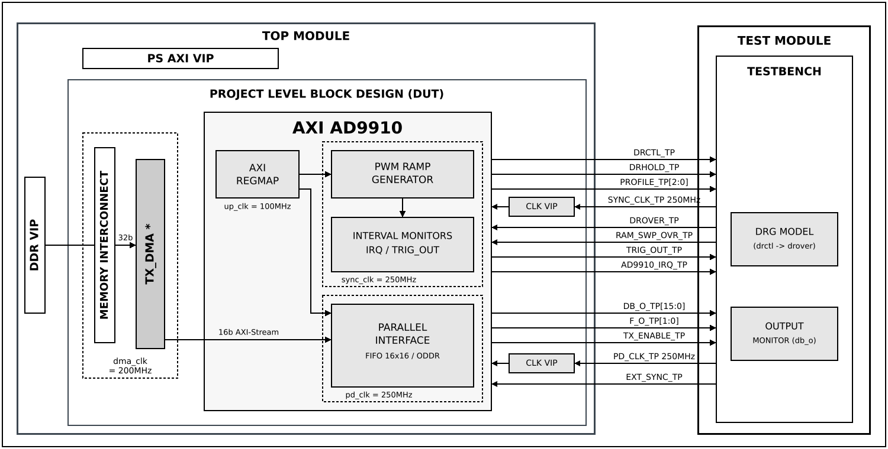

.. _ad9910:

AD9910
================================================================================

Overview
-------------------------------------------------------------------------------

The purpose of this testbench is to validate the ``axi_ad9910`` IP core, the
FPGA-side controller for the AD9910 Direct Digital Synthesizer (DDS), as used
by the :git-hdl:`projects/admfm8000_evalz` reference design.

The IP has two independent functions, and the testbench has one configuration
for each:

-  **Digital Ramp Generator (DRG) control** — ``drctl`` is generated as an
   open-loop PWM waveform from two programmed sync_clk cycle counts,
   ``DRCTL_PERIOD`` and ``DRCTL_WIDTH``, with optional start delay, burst
   grouping, stop modes, interval monitors and interrupts. ``drover`` is a
   status input only; it feeds the interrupt and trigger logic and drives no
   state machine.
-  **Parallel data interface** — 16-bit samples are streamed from DDR by a DMA
   over AXI-Stream, through the IP's asynchronous FIFO, and out on
   ``db_o[15:0]``/``tx_enable`` at a programmable update rate or on an external
   trigger. ``f_o[1:0]`` is driven statically from a register.

The entire HDL documentation can be found here
:external+hdl:ref:`ADMFM8000-EVALZ HDL project <admfm8000_evalz>`.

Block design
-------------------------------------------------------------------------------

The testbench block design includes the ``axi_ad9910`` IP core along with VIPs
used for clocking, reset, PS and DDR simulations. The ``sync_clk`` and
``pd_clk`` signals are generated directly in the testbench at 250 MHz, standing
in for the clock outputs of the AD9910 device, and reach the IP through
pass-through clock VIPs. The IP is instantiated with ``MEASURE_CLKS_EN=1``, so
the sync_clk and pd_clk monitor registers are available.

The block design depends on the ``MODE`` parameter:

-  **DRG** — the AXI-Stream input of ``axi_ad9910`` is tied off and no DMA is
   instantiated.
-  **PAR_IF** — a TX ``axi_dmac`` reads samples from the DDR VIP over AXI-MM
   and drives the ``axi_ad9910`` AXI-Stream input.

In both modes the DDS control and data outputs (``drctl``, ``drhold``,
``profile``, ``db_o``, ``f_o``, ``tx_enable``, ``trig_out`` and the IP
interrupt) are brought out of the block design and observed directly by the
test program, which also drives the ``drover``, ``ram_swp_ovr`` and
``ext_sync`` inputs.

Block diagram
~~~~~~~~~~~~~~~~~~~~~~~~~~~~~~~~~~~~~~~~~~~~~~~~~~~~~~~~~~~~~~~~~~~~~~~~~~~~~~~

The data path and clock domains are depicted in the below diagram:

.. admonition:: Legend
   :class: note

   - ``*`` instantiated only in PAR_IF mode (``cfg2_par_if``)

Configuration parameters and modes
~~~~~~~~~~~~~~~~~~~~~~~~~~~~~~~~~~~~~~~~~~~~~~~~~~~~~~~~~~~~~~~~~~~~~~~~~~~~~~~

The following parameters of this project can be configured:

-  MODE: Defines which function of the ``axi_ad9910`` IP is under test.
   Options: DRG - Digital Ramp Generator control, PAR_IF - Parallel data
   interface
-  tx_dma_cfg: The ``axi_dmac`` configuration, used only in PAR_IF mode. The
   DMA reads 32-bit words from DDR and emits 16-bit AXI-Stream beats
   (``DMA_DATA_WIDTH_SRC 32``, ``DMA_DATA_WIDTH_DEST 16``), matching the
   16-bit ``s_axis`` input of the IP.

Configuration files
^^^^^^^^^^^^^^^^^^^^^^^^^^^^^^^^^^^^^^^^^^^^^^^^^^^^^^^^^^^^^^^^^^^^^^^^^^^^^^^^

The following configuration files are available:

+---------------+------------+
| Configuration | Parameters |
| mode          +------------+
|               | MODE       |
+===============+============+
| cfg1_drg      | DRG        |
+---------------+------------+
| cfg2_par_if   | PAR_IF     |
+---------------+------------+

Tests
^^^^^^^^^^^^^^^^^^^^^^^^^^^^^^^^^^^^^^^^^^^^^^^^^^^^^^^^^^^^^^^^^^^^^^^^^^^^^^^^

The following test program files are available:

=================== ===================================================
Test program        Usage
=================== ===================================================
test_program_drg    Tests the DRG control function (PWM ramp generator,
                    bursts, stop modes, interval monitors, interrupts).
test_program_par_if Tests the parallel data interface (DMA to ``db_o``).
=================== ===================================================

Available configurations & tests combinations
^^^^^^^^^^^^^^^^^^^^^^^^^^^^^^^^^^^^^^^^^^^^^^^^^^^^^^^^^^^^^^^^^^^^^^^^^^^^^^^^

Each test program must be paired with the configuration of the same mode:

============= =================== ==========================================
Configuration Test                Build command
============= =================== ==========================================
cfg1_drg      test_program_drg    make CFG=cfg1_drg TST=test_program_drg
cfg2_par_if   test_program_par_if make CFG=cfg2_par_if TST=test_program_par_if
============= =================== ==========================================

.. error::

    Mixing a wrong pair of CFG and TST is not supported. The PAR_IF test
    program relies on the TX DMA, which only the PAR_IF configuration
    instantiates. Please use the matching mode.

CPU/Memory interconnect addresses
~~~~~~~~~~~~~~~~~~~~~~~~~~~~~~~~~~~~~~~~~~~~~~~~~~~~~~~~~~~~~~~~~~~~~~~~~~~~~~~

Below are the CPU/Memory interconnect addresses used in this project:

============  ===========
Instance      Address
============  ===========
axi_intc      0x4120_0000
axi_ad9910    0x44A0_0000
tx_dma *      0x44A3_0000
ddr_axi_vip   0x8000_0000
============  ===========

.. admonition:: Legend
   :class: note

   - ``*`` instantiated only in PAR_IF mode (``cfg2_par_if``)

Interrupts
~~~~~~~~~~~~~~~~~~~~~~~~~~~~~~~~~~~~~~~~~~~~~~~~~~~~~~~~~~~~~~~~~~~~~~~~~~~~~~~

Below are the Programmable Logic interrupts used in this project:

===============  ===
Instance name    HDL
===============  ===
tx_dma *         13
===============  ===

.. admonition:: Legend
   :class: note

   - ``*`` instantiated only in PAR_IF mode (``cfg2_par_if``)

The ``axi_ad9910`` interrupt is not routed to the interrupt controller. It is
brought out of the block design as ``ad9910_irq`` and checked directly by the
test program.

Test stimulus
-------------------------------------------------------------------------------

Both test programs set the logger to ``ADI_VERBOSITY_NONE``, so a passing run
prints only the randomization state, ``==== ALL TESTS PASSED ====`` and
``Testbench done!``. Errors are always printed. When a check fails, the final
summary names the failing test cases, e.g.
``==== SOME TESTS FAILED ==== (failing: TC14)``. To see the per-test progress
messages, raise the verbosity to ``ADI_VERBOSITY_LOW`` in the test program.

All ``axi_ad9910`` register access goes through the ``ad9910_api`` driver, so
neither test program contains register offsets or field positions.

Environment bringup
~~~~~~~~~~~~~~~~~~~~~~~~~~~~~~~~~~~~~~~~~~~~~~~~~~~~~~~~~~~~~~~~~~~~~~~~~~~~~~~

The steps of the environment bringup, common to both test programs, are:

* Print the randomization state, so that a failing run can be reproduced
* Create the test harness environment
* Start the environment
* Assert the system reset
* Extend the simulation watchdog (3 ms for DRG, 5 ms for PAR_IF)

Stop the environment
~~~~~~~~~~~~~~~~~~~~~~~~~~~~~~~~~~~~~~~~~~~~~~~~~~~~~~~~~~~~~~~~~~~~~~~~~~~~~~~

The steps of stopping the environment, common to both test programs, are:

* Stop the test harness environment
* Report the overall pass/fail status and the failing test cases, if any

test_program_drg
-------------------------------------------------------------------------------

Because ``drctl`` is produced by deterministic counters, the duty-cycle checks
assert exact sync_clk cycle counts with no tolerance: a programmed period of
``P`` and width of ``W`` must measure exactly ``P`` sync_clk cycles rising edge
to rising edge, and exactly ``W`` sync_clk cycles high. Most tests use a base
duty cycle of ``P=1000``, ``W=400`` (4 µs at 40%), sized so the waveforms stay
readable.

The only exception is any interval timed from an AXI register write. The IP's
up_clk to sync_clk control transfer starts only once per 64 up_clk cycles, so a
write can wait up to 160 sync_clk cycles at the crossing. Such checks allow that
much tolerance.

DRG model
~~~~~~~~~~~~~~~~~~~~~~~~~~~~~~~~~~~~~~~~~~~~~~~~~~~~~~~~~~~~~~~~~~~~~~~~~~~~~~~

The test program includes a behavioral model of the AD9910 digital ramp
generator that runs throughout the suite. It is a level-driven integrator:
while ``drctl`` is high the ramp counter steps up, while it is low the counter
steps down, and ``drover`` is asserted whenever the counter sits at a limit.
The DUT reads none of the model's state. The model exists to supply a realistic
``drover`` for the interrupt tests, to detect programming errors, and to show in
the waveform the ramp that each duty-cycle configuration produces.

The following parameters are fixed in the model:

-  DRG_LOWER_LIMIT: 1000 (ramp lower boundary)
-  DRG_UPPER_LIMIT: 5000 (ramp upper boundary)
-  DRG_STEP_SIZE: 20 (increment/decrement per sync_clk cycle)
-  DRG_RAMP_CYCLES: 200 (sync_clk cycles for one full limit-to-limit ramp)

The model supports two ramp shapes. The shape is selected in the AD9910 itself
over SPI, not by this IP, so the test tells the model which one to emulate:

-  ``DRG_DWELL`` — the ramp parks at a limit until ``drctl`` changes level.
   This is the AD9910's reset configuration and the suite's default.
-  ``DRG_SAWTOOTH`` — emulates no-dwell high: on reaching the upper limit the
   counter reloads the lower limit and ramps up again, while the downward
   direction still dwells. Used only in TC4 and in part of TC12.

With the completion checker armed, the model flags any ramp that has not reached
its limit when ``drctl`` changes level. That means the programmed interval was
shorter than ``DRG_RAMP_CYCLES``. The checker is armed only in TC12, because
other tests program short intervals on purpose.

Register sanity (TC1)
~~~~~~~~~~~~~~~~~~~~~~~~~~~~~~~~~~~~~~~~~~~~~~~~~~~~~~~~~~~~~~~~~~~~~~~~~~~~~~~

* Run the API sanity test: verify VERSION against its reset value and
  write/read back the SCRATCH register
* Read and log the ID and DEVICE_INFO registers
* Write a distinct pattern to each DRG register (DRCTL_PERIOD, DRCTL_WIDTH,
  BST_DELAY, RAMP_BURSTS, BURST_DELAY, MONITOR_MAX_PERIOD and the four
  IRQ/trigger interval match registers), then read each back and compare
* Clear all of them back to zero

Reset release (TC2)
~~~~~~~~~~~~~~~~~~~~~~~~~~~~~~~~~~~~~~~~~~~~~~~~~~~~~~~~~~~~~~~~~~~~~~~~~~~~~~~

* Clear RESET_CTRL. The core comes out of reset held, so software must release
  it
* Read and log SYNC_CLK_CNT. The clock monitor only captures once per 65536
  up_clk cycles (~655 µs), so its value is checked later, in TC16
* Enable the DRG model in ``DRG_DWELL`` shape, with the completion checker off

Simple mode (TC3)
~~~~~~~~~~~~~~~~~~~~~~~~~~~~~~~~~~~~~~~~~~~~~~~~~~~~~~~~~~~~~~~~~~~~~~~~~~~~~~~

With ``drctl_toggle_en`` cleared the PWM generator is bypassed:

* Set ``drctl_init=1`` and verify ``drctl`` goes high
* Set ``drctl_init=0`` and verify ``drctl`` goes low

PWM basic operation (TC4)
~~~~~~~~~~~~~~~~~~~~~~~~~~~~~~~~~~~~~~~~~~~~~~~~~~~~~~~~~~~~~~~~~~~~~~~~~~~~~~~

* Switch the DRG model to ``DRG_SAWTOOTH``
* Program ``P=1000``, ``W=400`` and measure 6 consecutive duty cycles
* Verify every high time is exactly 400 and every period exactly 1000 sync_clk
  cycles
* Switch the DRG model back to ``DRG_DWELL``

Duty-cycle sweep (TC5)
~~~~~~~~~~~~~~~~~~~~~~~~~~~~~~~~~~~~~~~~~~~~~~~~~~~~~~~~~~~~~~~~~~~~~~~~~~~~~~~

Every point is measured over 4 duty cycles and checked exactly:

* Duty sweep at ``P=1000``: ``W`` = 1, 50, 200, 400, 500, 600, 800, 950, 990.
  ``W=1`` covers the single-cycle width boundary in the RTL
* Period sweep at 50% duty: ``P`` = 100, 250, 500, 1000, 2000, 4000
* Live reconfiguration: write ``P=800``, ``W=200`` without first clearing toggle
  mode, and verify the output converges on the new waveform

Width and period edge cases (TC6)
~~~~~~~~~~~~~~~~~~~~~~~~~~~~~~~~~~~~~~~~~~~~~~~~~~~~~~~~~~~~~~~~~~~~~~~~~~~~~~~

Each case exercises a distinct branch of the RTL:

* ``W=0``: verify ``drctl`` stays low for 3 periods
* ``W=P``: verify ``drctl`` stays high for 3 periods
* ``W>P`` (``W=1.5P``): verify ``drctl`` stays high for 3 periods
* ``P=1``: verify ``drctl`` toggles every sync_clk cycle (1 cycle high, period
  of 2) and that ``W`` is ignored

Start delay (TC7)
~~~~~~~~~~~~~~~~~~~~~~~~~~~~~~~~~~~~~~~~~~~~~~~~~~~~~~~~~~~~~~~~~~~~~~~~~~~~~~~

* Measure the time from enabling the PWM to the first ``drctl`` rising edge,
  with BST_DELAY set to 500 and then to 2500 sync_clk cycles
* Verify the difference between the two is 2000 sync_clk cycles, within the
  160 sync_clk cycle control-transfer tolerance. Taking the difference cancels
  the fixed register-write overhead

.. note::

   A BST_DELAY value written while the ramp is stopped is only latched at the
   next period boundary, so the first restart after the write still uses the
   old value. Each measurement therefore runs a priming period with the new
   value before the timed stop/start.

Burst grouping (TC8)
~~~~~~~~~~~~~~~~~~~~~~~~~~~~~~~~~~~~~~~~~~~~~~~~~~~~~~~~~~~~~~~~~~~~~~~~~~~~~~~

With ``RAMP_BURSTS=2`` and the base duty cycle, BURST_DELAY is swept over 500,
1000, 2000 and 4000 sync_clk cycles. For each value, 6 rising-edge gaps are
measured and the test checks that:

* every high time is still exactly ``W=400``
* the gap inside a burst is exactly one period (1000)
* exactly 3 gaps are burst boundaries
* the extra boundary overhead beyond ``P + BURST_DELAY`` is at most 16 sync_clk
  cycles

It then checks that the boundary overhead is the same at all four delays. A
constant offset shows the delay is added, not scaled.

Stop modes (TC9)
~~~~~~~~~~~~~~~~~~~~~~~~~~~~~~~~~~~~~~~~~~~~~~~~~~~~~~~~~~~~~~~~~~~~~~~~~~~~~~~

* ``RAMP_CFG=2`` (stop after period): let the one permitted period run, then
  verify ``drctl`` stays low for 2 periods. Writing ``RAMP_CFG=0`` must restart
  the ramp
* ``RAMP_CFG=1`` (stop after burst) with ``RAMP_BURSTS=3``: let the burst run,
  then verify ``drctl`` stays low for 2 periods. Writing ``RAMP_CFG=0`` must
  restart the ramp with the programmed period

DRHOLD passthrough (TC10)
~~~~~~~~~~~~~~~~~~~~~~~~~~~~~~~~~~~~~~~~~~~~~~~~~~~~~~~~~~~~~~~~~~~~~~~~~~~~~~~

* Set and clear the DRHOLD bit, and verify the ``drhold`` output follows it

Profile output (TC11)
~~~~~~~~~~~~~~~~~~~~~~~~~~~~~~~~~~~~~~~~~~~~~~~~~~~~~~~~~~~~~~~~~~~~~~~~~~~~~~~

* Write all 8 values to the PROFILE register and verify each appears on
  ``profile[2:0]``

Ramp model and programming checker (TC12)
~~~~~~~~~~~~~~~~~~~~~~~~~~~~~~~~~~~~~~~~~~~~~~~~~~~~~~~~~~~~~~~~~~~~~~~~~~~~~~~

* ``DRG_DWELL`` with the completion checker armed, ``P=1000``, ``W=500``: both
  intervals are longer than a full ramp, so verify there are no truncations and
  at least 6 ``drover`` rising edges over 4 periods (8 expected)
* ``DRG_DWELL``, ``W=150``: shorter than a full ramp, so verify that truncated
  up-ramps are detected
* ``DRG_SAWTOOTH``, ``P=1000``, ``W=400``: verify at least 3 retraces over
  2 periods (4 expected), then stop the PWM and verify the ramp comes to rest
  at the lower limit
* Switch the DRG model back to ``DRG_DWELL``

trig_out interval timing (TC13)
~~~~~~~~~~~~~~~~~~~~~~~~~~~~~~~~~~~~~~~~~~~~~~~~~~~~~~~~~~~~~~~~~~~~~~~~~~~~~~~

The interval monitor loads MONITOR_MAX_PERIOD and counts down, pulsing
``trig_out`` when the counter equals the start or stop match value. In
max-period mode, with ``MONITOR_MAX_PERIOD=1000``:

* For start/stop match pairs 900/800, 800/400 and 500/100, verify two
  ``trig_out`` pulses whose spacing is exactly ``START - STOP`` sync_clk cycles
* With both match values 0, verify no ``trig_out`` pulse over 4000 sync_clk
  cycles

Interval monitor source selection (TC14)
~~~~~~~~~~~~~~~~~~~~~~~~~~~~~~~~~~~~~~~~~~~~~~~~~~~~~~~~~~~~~~~~~~~~~~~~~~~~~~~

The monitor source selects which event reloads the reference counter: every
period (0), every burst delay (1), or once per start (2, max-period). With
``P=500``, ``RAMP_BURSTS=4`` and a start pulse only, ``trig_out`` pulses are
counted over 20 periods in each mode, and the test checks that:

* max-period mode produces 1 to 3 pulses
* period and burst-delay modes both produce pulses
* period mode produces more pulses than burst-delay mode

.. warning::

   TC14 currently fails. In period and burst-delay modes the reference
   counter is loaded but never decremented, so it never reaches the match value
   and no pulse is produced. Only max-period mode works. The same logic drives
   the interval interrupts, which are affected in the same way. This is an
   ``axi_ad9910`` RTL issue, not a testbench issue, and TC14 is expected to pass
   once it is fixed.

IRQ mask, table and write-1-to-clear (TC15)
~~~~~~~~~~~~~~~~~~~~~~~~~~~~~~~~~~~~~~~~~~~~~~~~~~~~~~~~~~~~~~~~~~~~~~~~~~~~~~~

* With IRQ_MASK cleared, pulse ``ram_swp_ovr`` and verify the interrupt output
  stays low while IRQ_TABLE latches the event
* Unmask the latched source and verify the interrupt output goes high
* Write 1 to the IRQ_TABLE bit and verify both the latch and the interrupt clear
* Run 10 duty cycles with ``RAMP_BURSTS=2`` and verify ``bursts_complete`` is
  latched in IRQ_TABLE. Internal ``end_period``/``bursts_complete`` pulses are
  counted alongside, so a failure shows whether the event was never generated
  or was generated but not latched
* Start the ramp, clear IRQ_TABLE, and verify the ``drover`` bit latches from
  the model's ramp within 3 periods. Clearing after the start ensures the latch
  comes from the ramp, not from the setup

Clock monitors (TC16)
~~~~~~~~~~~~~~~~~~~~~~~~~~~~~~~~~~~~~~~~~~~~~~~~~~~~~~~~~~~~~~~~~~~~~~~~~~~~~~~

This test runs last, once the first 65536-up_clk monitor window has elapsed:

* Read SYNC_CLK_CNT and PD_CLK_COUNT and verify both report a running clock

test_program_par_if
-------------------------------------------------------------------------------

The IP has no transfer-status register, so every transfer is verified by an
output monitor. It captures ``db_o[15:0]`` on each pd_clk cycle where
``tx_enable`` is high, one entry per emitted word, and the captures are compared
sample-for-sample against the samples written to DDR.

A few properties of the data path that the tests rely on:

-  The transfer engine emits one 16-bit word per trigger.
-  PAR_UPDATE_RATE is a period divider: with a value of ``R`` a word is emitted
   every ``R+1`` pd_clk cycles, so ``R=0`` is the fastest setting (one word per
   pd_clk). It is ignored in external-trigger mode.
-  The DMA unpacks each 32-bit DDR word into two 16-bit beats, low half first.
-  Between transfers the test waits for ``tx_enable`` to stay low for longer
   than one emission period. This drains any residual FIFO content, so each
   capture starts from an empty FIFO.

After the environment bringup, the core reset is released by clearing
RESET_CTRL.

Register sanity (TC1)
~~~~~~~~~~~~~~~~~~~~~~~~~~~~~~~~~~~~~~~~~~~~~~~~~~~~~~~~~~~~~~~~~~~~~~~~~~~~~~~

* Run the API sanity test: verify VERSION against its reset value and
  write/read back the SCRATCH register
* Verify CONFIG reports ``MEASURE_CLKS_EN=1``
* Write/read back PAR_UPDATE_RATE, F_CFG and the ``enable_p_if`` bit of
  UPDATE_CTRL

Single transfer and width mapping (TC2)
~~~~~~~~~~~~~~~~~~~~~~~~~~~~~~~~~~~~~~~~~~~~~~~~~~~~~~~~~~~~~~~~~~~~~~~~~~~~~~~

* Write one 32-bit DDR word holding two known samples and transfer it
* Verify both samples appear in order, which pins down the 32-bit to 16-bit
  width and ordering that every later test relies on

Multi-word stream (TC3)
~~~~~~~~~~~~~~~~~~~~~~~~~~~~~~~~~~~~~~~~~~~~~~~~~~~~~~~~~~~~~~~~~~~~~~~~~~~~~~~

* Transfer 6 distinct samples and verify they appear in order

Continuous streaming (TC4)
~~~~~~~~~~~~~~~~~~~~~~~~~~~~~~~~~~~~~~~~~~~~~~~~~~~~~~~~~~~~~~~~~~~~~~~~~~~~~~~

* Transfer 32 sequential samples at a fast update rate and verify they all
  appear in order

Backpressure (TC5)
~~~~~~~~~~~~~~~~~~~~~~~~~~~~~~~~~~~~~~~~~~~~~~~~~~~~~~~~~~~~~~~~~~~~~~~~~~~~~~~

* Transfer 64 samples, four times the 16-entry FIFO depth, at a slow update
  rate, so the FIFO fills and backpressures the DMA
* Verify no sample is lost or reordered

Update-rate change (TC6)
~~~~~~~~~~~~~~~~~~~~~~~~~~~~~~~~~~~~~~~~~~~~~~~~~~~~~~~~~~~~~~~~~~~~~~~~~~~~~~~

* Time a full 128-sample transfer at update rate 200 and then at 20
* Verify the faster rate completes the transfer more than twice as quickly

External trigger (TC7)
~~~~~~~~~~~~~~~~~~~~~~~~~~~~~~~~~~~~~~~~~~~~~~~~~~~~~~~~~~~~~~~~~~~~~~~~~~~~~~~

* Select external-trigger mode, load 4 samples into the FIFO and verify
  nothing is emitted before any trigger
* For each sample, re-arm the external sync through EXT_TRIG_CFG (arming is
  edge-sensitive, so the arm bit is cleared and set again), pulse ``ext_sync``,
  and verify exactly one new word is emitted
* Verify all 4 samples appear in order

F_CFG to f_o (TC8)
~~~~~~~~~~~~~~~~~~~~~~~~~~~~~~~~~~~~~~~~~~~~~~~~~~~~~~~~~~~~~~~~~~~~~~~~~~~~~~~

* Write all 4 values to F_CFG and verify each appears on ``f_o[1:0]``

Ramp data integrity (TC9)
~~~~~~~~~~~~~~~~~~~~~~~~~~~~~~~~~~~~~~~~~~~~~~~~~~~~~~~~~~~~~~~~~~~~~~~~~~~~~~~

* Stream a 256-sample 16-bit sawtooth-up, triangle and sawtooth-down ramp at
  the fastest update rate
* Verify each ramp sample-for-sample

Building the testbench
-------------------------------------------------------------------------------

The testbench is built upon ADI's generic HDL reference design framework.
ADI does not distribute compiled files of these projects so they must be built
from the sources available :git-hdl:`here </>` and :git-testbenches:`here </>`,
with the specified hierarchy described :ref:`build_tb set_up_tb_repo`.
To get the source you must
`clone <https://git-scm.com/book/en/v2/Git-Basics-Getting-a-Git-Repository>`__
the HDL repository, and then build the project as follows:.

**Linux/Cygwin/WSL**

*Example 1*

Build all the possible combinations of tests and configurations, using only the
command line.

.. shell::
   :showuser:

   $cd testbenches/project/ad9910
   $make

*Example 2*

Build all the possible combinations of tests and configurations, using the
Vivado GUI. This command will launch Vivado, will run the simulation and display
the waveforms.

.. shell::
   :showuser:

   $cd testbenches/project/ad9910
   $make MODE=gui

*Example 3*

Build a particular combination of test and configuration, using the Vivado GUI.
This command will launch Vivado, will run the simulation and display the
waveforms.

.. shell::
   :showuser:

   $cd testbenches/project/ad9910
   $make CFG=cfg1_drg TST=test_program_drg MODE=gui

*Example 4*

Build the parallel data interface test:

.. shell::
   :showuser:

   $cd testbenches/project/ad9910
   $make CFG=cfg2_par_if TST=test_program_par_if MODE=gui

The built projects can be found in the ``runs`` folder, where each configuration
specific build has it's own folder named after the configuration file's name.
Example: if the following command was run for a single configuration in the
clean folder (no runs folder available):

``make CFG=cfg1_drg``

Then the subfolder under ``runs`` name will be:

``cfg1_drg``

Resources
-------------------------------------------------------------------------------

HDL related dependencies forming the DUT
~~~~~~~~~~~~~~~~~~~~~~~~~~~~~~~~~~~~~~~~~~~~~~~~~~~~~~~~~~~~~~~~~~~~~~~~~~~~~~~

.. list-table::
   :widths: 30 45 25
   :header-rows: 1

   * - IP name
     - Source code link
     - Documentation link
   * - AXI_AD9910
     - :git-hdl:`library/axi_ad9910`
     - :external+hdl:ref:`axi_ad9910`
   * - AXI_DMAC *
     - :git-hdl:`library/axi_dmac`
     - :external+hdl:ref:`axi_dmac`

.. admonition:: Legend
   :class: note

   - ``*`` instantiated only in PAR_IF mode (``cfg2_par_if``)

Testbenches related dependencies
~~~~~~~~~~~~~~~~~~~~~~~~~~~~~~~~~~~~~~~~~~~~~~~~~~~~~~~~~~~~~~~~~~~~~~~~~~~~~~~

.. include:: ../../common/dependency_common.rst

Testbench specific dependencies:

.. list-table::
   :widths: 30 45 25
   :header-rows: 1

   * - SV dependency name
     - Source code link
     - Documentation link
   * - ADI_REGMAP_AD9910_PKG
     - :git-testbenches:`library/regmaps/adi_regmap_ad9910_pkg.sv`
     - ---
   * - ADI_REGMAP_COMMON_PKG
     - :git-testbenches:`library/regmaps/adi_regmap_common_pkg.sv`
     - ---
   * - ADI_REGMAP_DMAC_PKG *
     - :git-testbenches:`library/regmaps/adi_regmap_dmac_pkg.sv`
     - ---
   * - ADI_REGMAP_PKG
     - :git-testbenches:`library/regmaps/adi_regmap_pkg.sv`
     - ---
   * - AD9910_API
     - :git-testbenches:`library/drivers/ad9910_api_pkg.sv`
     - ---
   * - DMA_TRANS *
     - :git-testbenches:`library/drivers/dmac/dma_trans.sv`
     - ---
   * - DMAC_API *
     - :git-testbenches:`library/drivers/dmac/dmac_api.sv`
     - ---
   * - AXI_VIP_PKG
     - ---
     - :xilinx:`AXI Verification IP (VIP) <products/intellectual-property/axi-vip.html>`

.. admonition:: Legend
   :class: note

   - ``*`` used only by ``test_program_par_if``

.. include:: ../../../common/more_information.rst

.. include:: ../../../common/support.rst
