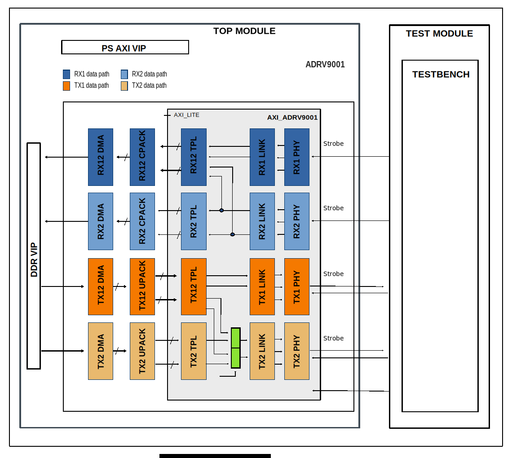

.. _adrv9001:

ADRV9001
================================================================================

Overview
-------------------------------------------------------------------------------

The purpose of this testbench is to validate the serial interface functionality
of the :git-hdl:`projects/adrv9001` reference design.

The entire HDL documentation can be found here
:external+hdl:ref:`ADRV9001 HDL project <adrv9001>`.

Block design
-------------------------------------------------------------------------------

The testbench block design includes part of the ADRV9001 HDL reference design,
along with VIPs used for clocking, reset, PS and DDR simulations.

Block diagram
~~~~~~~~~~~~~~~~~~~~~~~~~~~~~~~~~~~~~~~~~~~~~~~~~~~~~~~~~~~~~~~~~~~~~~~~~~~~~~~

The data path and clock domains are depicted in the below diagram:

Configuration parameters and modes
~~~~~~~~~~~~~~~~~~~~~~~~~~~~~~~~~~~~~~~~~~~~~~~~~~~~~~~~~~~~~~~~~~~~~~~~~~~~~~~

The following parameters of this project can be configured:

-  CMOS_LVDS_N: Defines the physical interface type:
   Options: 0 - LVDS, 1 - CMOS
-  SDR_DDR_N: Select interface type:
   Options: 0 - DDR, 1 - SDR
-  SINGLE_LANE: Defines the single lane mode:
   Options: 0 - Multiple Lanes (2/4), 1 - Single Lane
-  USE_RX_CLK_FOR_T: Select the clock to drive the TX SSI interface:
   Options: 0 - TX1 dedicated clock, 1 - RX SSI clock
-  SYMB_OP: Select symbol data format mode:
   Options: 0 - Disable, 1 - Enable
-  SYMB_8_16B: Select number of bits for symbol format mode:
   Options: 0 - 16 bits, 1 - 8 bits
-  DDS_DISABLE: By setting this parameter you can remove the dual tone DDS logic
   from the Tx channels. This will reduce resource utilization significantly,
   but will lose the ability to generate a test tone:
   Options: 0 - Enable DDS, 1 - Disable DDS                   
   
Configuration files
^^^^^^^^^^^^^^^^^^^^^^^^^^^^^^^^^^^^^^^^^^^^^^^^^^^^^^^^^^^^^^^^^^^^^^^^^^^^^^^^

The following configuration files are available:

   +--------------------------------+-----------------------------------------------------------------------------------------------+
   | Configuration mode             | Parameters                                                                                    |
   |                                +-------------+-----------+-------------+------------------+---------+------------+-------------+
   |                                | CMOS_LVDS_N | SDR_DDR_N | SINGLE_LANE | USE_RX_CLK_FOR_T | SYMB_OP | SYMB_8_16B | DDS_DISABLE |
   +================================+=============+===========+=============+==================+=========+============+=============+
   | cfg1_CMOS_SDR_1Lanes           | 1           | 1         | 1           | 0                | 0       | 0          | 0           |
   +--------------------------------+-------------+-----------+-------------+------------------+---------+------------+-------------+
   | cfg2_CMOS_DDR_1Lanes           | 1           | 0         | 1           | 0                | 0       | 0          | 0           |
   +--------------------------------+-------------+-----------+-------------+------------------+---------+------------+-------------+
   | cfg4_CMOS_SDR_4Lanes           | 1           | 1         | 0           | 0                | 0       | 0          | 0           |
   +--------------------------------+-------------+-----------+-------------+------------------+---------+------------+-------------+
   | cfg5_CMOS_DDR_4Lanes           | 1           | 0         | 0           | 0                | 0       | 0          | 0           |
   +--------------------------------+-------------+-----------+-------------+------------------+---------+------------+-------------+
   | cfg6_LVDS_DDR_1Lanes           | 0           | 0         | 1           | 0                | 0       | 0          | 0           |
   +--------------------------------+-------------+-----------+-------------+------------------+---------+------------+-------------+
   | cfg7_LVDS_DDR_2Lanes           | 0           | 0         | 0           | 0                | 0       | 0          | 0           |
   +--------------------------------+-------------+-----------+-------------+------------------+---------+------------+-------------+
   | cfg7_LVDS_DDR_2Lanes_noDDS     | 0           | 0         | 0           | 0                | 0       | 0          | 1           |
   +--------------------------------+-------------+-----------+-------------+------------------+---------+------------+-------------+
   | cfg8_CMOS_SDR_1Lanes_SYMB_8b   | 1           | 1         | 1           | 0                | 1       | 1          | 0           |
   +--------------------------------+-------------+-----------+-------------+------------------+---------+------------+-------------+
   | cfg9_CMOS_DDR_1Lanes_SYMB_8b   | 1           | 0         | 1           | 0                | 1       | 1          | 0           |
   +--------------------------------+-------------+-----------+-------------+------------------+---------+------------+-------------+
   | cfg10_CMOS_SDR_1LANES_SYMB_16b | 1           | 1         | 1           | 0                | 1       | 0          | 0           |
   +--------------------------------+-------------+-----------+-------------+------------------+---------+------------+-------------+
   | cfg11_CMOS_DDR_1Lanes_SYMB_16b | 1           | 0         | 1           | 0                | 1       | 0          | 0           |
   +--------------------------------+-------------+-----------+-------------+------------------+---------+------------+-------------+

Tests
^^^^^^^^^^^^^^^^^^^^^^^^^^^^^^^^^^^^^^^^^^^^^^^^^^^^^^^^^^^^^^^^^^^^^^^^^^^^^^^^

The following test program file is available:

============ ========================================
Test program Usage
============ ========================================
test_program Tests the adrv9001 project capabilities.
============ ========================================

Available configurations & tests combinations
^^^^^^^^^^^^^^^^^^^^^^^^^^^^^^^^^^^^^^^^^^^^^^^^^^^^^^^^^^^^^^^^^^^^^^^^^^^^^^^^

The test program is compatible with the above mentioned configurations.

CPU/Memory interconnect addresses
~~~~~~~~~~~~~~~~~~~~~~~~~~~~~~~~~~~~~~~~~~~~~~~~~~~~~~~~~~~~~~~~~~~~~~~~~~~~~~~

Below are the CPU/Memory interconnect addresses used in this project:

=========================  ===========
Instance                   Address
=========================  ===========
axi_intc                   0x4120_0000
axi_adrv9001               0x44A0_0000
axi_adrv9001_rx1_dma       0x44A3_0000
axi_adrv9001_rx2_dma       0x44A4_0000
axi_adrv9001_tx1_dma       0x44A5_0000
axi_adrv9001_tx2_dma       0x44A6_0000
axi_ad9361_dac_dma         0x7C42_0000
ddr_axi_vip                0x8000_0000
=========================  ===========

Interrupts
~~~~~~~~~~~~~~~~~~~~~~~~~~~~~~~~~~~~~~~~~~~~~~~~~~~~~~~~~~~~~~~~~~~~~~~~~~~~~~~

Below are the Programmable Logic interrupts used in this project:

====================  ===
Instance name         HDL
====================  ===
axi_adrv9001_rx1_dma  13
axi_adrv9001_rx2_dma  12
axi_adrv9001_tx2_dma  10
axi_adrv9001_tx1_dma  9
====================  ===

Test stimulus
-------------------------------------------------------------------------------

The test program is structured into several tests as follows:

Environment bringup
~~~~~~~~~~~~~~~~~~~~~~~~~~~~~~~~~~~~~~~~~~~~~~~~~~~~~~~~~~~~~~~~~~~~~~~~~~~~~~~

The steps of the environment bringup are:

* Create the environment
* Start the environment
* Start the clocks
* Assert the resets

Sanity test
~~~~~~~~~~~~~~~~~~~~~~~~~~~~~~~~~~~~~~~~~~~~~~~~~~~~~~~~~~~~~~~~~~~~~~~~~~~~~~~

This test is used to check the RX and TX DMAs sanity.

R2T2 test
~~~~~~~~~~~~~~~~~~~~~~~~~~~~~~~~~~~~~~~~~~~~~~~~~~~~~~~~~~~~~~~~~~~~~~~~~~~~~~~

This test is used for the R2T2 configuration and comprises the following steps:

PN test
^^^^^^^^^^^^^^^^^^^^^^^^^^^^^^^^^^^^^^^^^^^^^^^^^^^^^^^^^^^^^^^^^^^^^^^^^^^^^^^

The PN test verifies the PN data.

The steps of this test are:

* PN Test Skipped in 8 bits symbol mode, otherwise test for:
    * NIBBLE_RAMP
    * FULL_RAMP
    * PN7
    * PN15

DDS test
^^^^^^^^^^^^^^^^^^^^^^^^^^^^^^^^^^^^^^^^^^^^^^^^^^^^^^^^^^^^^^^^^^^^^^^^^^^^^^^

The DDS test verifies the DDS path, if DDS is enabled.

The steps of this test are:

* Link setup
* Select DDS as source
* Enable normal data path for RX1
* Configure tone amplitude and frequency
* Enable RX channels, enable sign extension
* Sync DAC channels
* Link down

DMA test
^^^^^^^^^^^^^^^^^^^^^^^^^^^^^^^^^^^^^^^^^^^^^^^^^^^^^^^^^^^^^^^^^^^^^^^^^^^^^^^

The DMA test verifies the DMA path, if DMA is enabled.

The steps of this test are:

* Init test data
* Clear destination region
* Configure TX DMA
* Select DMA as source
* Enable normal data path for RX1
* Enable Rx channel, enable sign extension
* Sync DAC channels
* Link setup
* Configure RX DMA
* Transfer start
* Clear interrupt
* Check captured data from DDR against incremental pattern based on first sample

Independent R1T1 test
~~~~~~~~~~~~~~~~~~~~~~~~~~~~~~~~~~~~~~~~~~~~~~~~~~~~~~~~~~~~~~~~~~~~~~~~~~~~~~~

This test is used for the R1T1 configuration and comprises the following steps:

* Enable normal data path for RX2

DMA test procedure for Rx2/Tx2 independent pairs
^^^^^^^^^^^^^^^^^^^^^^^^^^^^^^^^^^^^^^^^^^^^^^^^^^^^^^^^^^^^^^^^^^^^^^^^^^^^^^^

The steps of this test are:

* Init test data
* Clear destination region
* Configure TX DMA
* Select DMA as source
* Enable Rx channel, enable sign extension
* Sync DAC channels
* Link setup
* Configure RX DMA
* Transfer start
* Clear interrupt
* Check captured data from DDR against incremental pattern based on first sample

Test internal loopback DAC2->ADC2
~~~~~~~~~~~~~~~~~~~~~~~~~~~~~~~~~~~~~~~~~~~~~~~~~~~~~~~~~~~~~~~~~~~~~~~~~~~~~~~

* Enable internal loopback
* DMA test procedure for Rx2/Tx2 independent pairs

Stop the environment
~~~~~~~~~~~~~~~~~~~~~~~~~~~~~~~~~~~~~~~~~~~~~~~~~~~~~~~~~~~~~~~~~~~~~~~~~~~~~~~

* Stop the clocks

Building the testbench
-------------------------------------------------------------------------------

The testbench is built upon ADI's generic HDL reference design framework.
ADI does not distribute compiled files of these projects so they must be built
from the sources available :git-hdl:`here </>` and :git-testbenches:`here </>`,
with the specified hierarchy described :ref:`build_tb set_up_tb_repo`.
To get the source you must
`clone <https://git-scm.com/book/en/v2/Git-Basics-Getting-a-Git-Repository>`__
the HDL repository, and then build the project as follows:.

**Linux/Cygwin/WSL**

*Example 1*

Build all the possible combinations of tests and configurations, using only the
command line.

.. shell::
   :showuser:

   $cd testbenches/project/adrv9001
   $make

*Example 2*

Build all the possible combinations of tests and configurations, using the
Vivado GUI. This command will launch Vivado, will run the simulation and display
the waveforms.

.. shell::
   :showuser:

   $cd testbenches/project/adrv9001
   $make MODE=gui

*Example 3*

Build a particular combination of test and configuration, using the Vivado GUI.
This command will launch Vivado, will run the simulation and display the
waveforms.

.. shell::
   :showuser:

   $cd testbenches/project/adrv9001
   $make MODE=gui CFG=cfg1_CMOS_SDR_1Lanes TST=test_program

The built projects can be found in the ``runs`` folder, where each configuration
specific build has it's own folder named after the configuration file's name.
Example: if the following command was run for a single configuration in the
clean folder (no runs folder available):

``make CFG=cfg1_CMOS_SDR_1Lanes``

Then the subfolder under ``runs`` name will be:

``cfg1_CMOS_SDR_1Lanes``

Resources
-------------------------------------------------------------------------------

HDL related dependencies forming the DUT
~~~~~~~~~~~~~~~~~~~~~~~~~~~~~~~~~~~~~~~~~~~~~~~~~~~~~~~~~~~~~~~~~~~~~~~~~~~~~~~

.. list-table::
   :widths: 30 45 25
   :header-rows: 1

   * - IP name
     - Source code link
     - Documentation link
   * - AXI_ADRV9001
     - :git-hdl:`library/axi_adrv9001`
     - :external+hdl:ref:`axi_adrv9001`
   * - AXI_DMAC
     - :git-hdl:`library/axi_dmac`
     - :external+hdl:ref:`axi_dmac`
   * - AXI_SYSID
     - :git-hdl:`library/axi_sysid`
     - :external+hdl:ref:`axi_sysid`
   * - SYSID_ROM
     - :git-hdl:`library/sysid_rom`
     - :external+hdl:ref:`axi_sysid`
   * - UTIL_CPACK2
     - :git-hdl:`library/util_pack/util_cpack2`
     - :external+hdl:ref:`util_cpack2`
   * - UTIL_UPACK2
     - :git-hdl:`library/util_pack/util_upack2`
     - :external+hdl:ref:`util_upack2`
   * - UTIL_TDD_SYNC
     - :git-hdl:`library/util_tdd_sync`
     - ---

Testbenches related dependencies
~~~~~~~~~~~~~~~~~~~~~~~~~~~~~~~~~~~~~~~~~~~~~~~~~~~~~~~~~~~~~~~~~~~~~~~~~~~~~~~

.. include:: ../../common/dependency_common.rst

Testbench specific dependencies:

.. list-table::
   :widths: 30 45 25
   :header-rows: 1

   * - SV dependency name
     - Source code link
     - Documentation link
   * - ADC_API
     - :git-testbenches:`library/drivers/adc_api_pkg.sv`
     - ---
   * - COMMON_API
     - :git-testbenches:`library/drivers/common_api_pkg.sv`
     - ---
   * - DAC_API
     - :git-testbenches:`library/drivers/dac_api_pkg.sv`
     - ---
   * - DMAC_API
     - :git-testbenches:`library/drivers/dmac/dmac_api.sv`
     - ---

.. include:: ../../../common/more_information.rst

.. include:: ../../../common/support.rst
