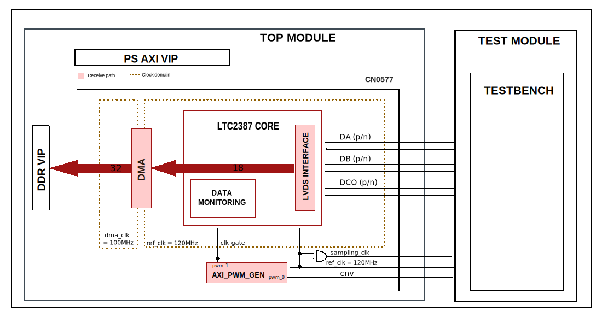
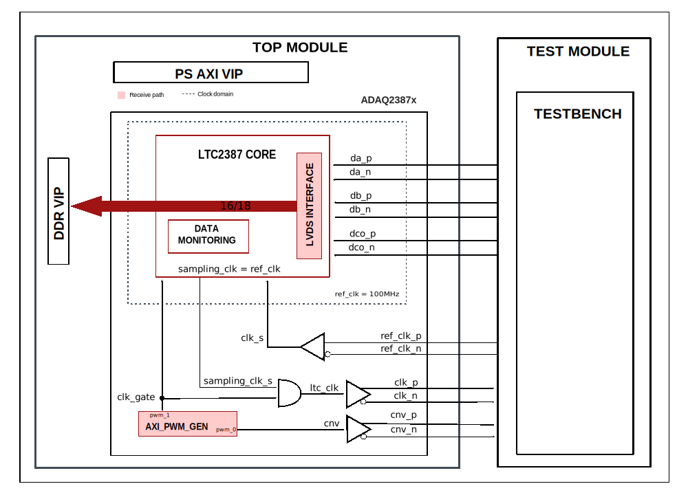
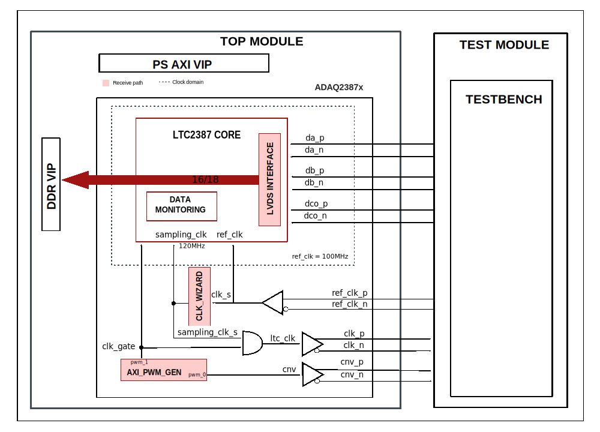

.. _cn0577_adaq2387x:

CN0577/ADAQ2387X
================================================================================

Overview
-------------------------------------------------------------------------------

The purpose of this testbench is to validate the of the
:git-hdl:`projects/cn0577` and :git-hdl:`projects/adaq23875` reference designs.

The entire HDL documentation can be found here
:external+hdl:ref:`CN0577 HDL project <cn0577>` and here
:external+hdl:ref:`ADAQ2387X HDL project <adaq23875>`.

Block design
-------------------------------------------------------------------------------

The testbench block design includes part of the CN0577/ADAQ2387X HDL reference
designs, along with VIPs used for clocking, reset, PS and DDR simulations.

Block diagrams
~~~~~~~~~~~~~~~~~~~~~~~~~~~~~~~~~~~~~~~~~~~~~~~~~~~~~~~~~~~~~~~~~~~~~~~~~~~~~~~

The data path and clock domains are depicted in the below diagrams:

CN0577 Testbench block diagram
^^^^^^^^^^^^^^^^^^^^^^^^^^^^^^^^^^^^^^^^^^^^^^^^^^^^^^^^^^^^^^^^^^^^^^^^^^^^^^^

ADAQ2387X Testbench block diagrams
^^^^^^^^^^^^^^^^^^^^^^^^^^^^^^^^^^^^^^^^^^^^^^^^^^^^^^^^^^^^^^^^^^^^^^^^^^^^^^^

Configuration parameters and modes
~~~~~~~~~~~~~~~~~~~~~~~~~~~~~~~~~~~~~~~~~~~~~~~~~~~~~~~~~~~~~~~~~~~~~~~~~~~~~~~

The following parameter of this project that can be configured:

-  TWOLANES: defines the device's number of data lanes:
   Options: 0 - One lane, 1 - Two lanes
-  ADC_RES: defines the device's resolution in bits:
   Options: 16, 18
-  USE_MMCM: defines the ref clk value in MHz:
   Options: 0 - 100MHz, 1 - 120MHz
-  CN0577_ADAQ2387X_N: selects the HDL project
   Options: 0 - ADAQ2387X, 1 - CN0577

.. important::

   The **ADC_RES** and **USE_MMCM** parameters only apply to the ADAQ2387X
   design. When the CN0577 design is selected, the ADC resolution is always
   18 bits, and the reference clock is always 120 MHz (USE_MMCM = 0). These
   parameters are not present in the CN0577 HDL. They exist only to keep the
   testbench interface consistent across both designs.

Configuration files
^^^^^^^^^^^^^^^^^^^^^^^^^^^^^^^^^^^^^^^^^^^^^^^^^^^^^^^^^^^^^^^^^^^^^^^^^^^^^^^^

The following configuration files are available:

   +--------------------------+----------------------------------------------------+
   | Configuration mode       | Parameters                                         |
   |                          +----------+---------+----------+--------------------+
   |                          | TWOLANES | ADC_RES | USE_MMCM | CN0577_ADAQ2387X_N |
   +==========================+==========+=========+==========+====================+
   | cfg_adaq2387x_1lane_16b  | 0        | 16      | 0        | 0                  |
   +--------------------------+----------+---------+----------+--------------------+
   | cfg_adaq2387x_1lane_18b  | 0        | 18      | 0        | 0                  |
   +--------------------------+----------+---------+----------+--------------------+
   | cfg_adaq2387x_2lanes_16b | 1        | 16      | 0        | 0                  |
   +--------------------------+----------+---------+----------+--------------------+
   | cfg_adaq2387x_2lanes_18b | 1        | 18      | 0        | 0                  |
   +--------------------------+----------+---------+----------+--------------------+
   | cfg_cn0577_1lane         | 0        | 18      | 0        | 1                  |
   +--------------------------+----------+---------+----------+--------------------+
   | cfg_cn0577_2lanes        | 1        | 18      | 0        | 1                  |
   +--------------------------+----------+---------+----------+--------------------+

Tests
^^^^^^^^^^^^^^^^^^^^^^^^^^^^^^^^^^^^^^^^^^^^^^^^^^^^^^^^^^^^^^^^^^^^^^^^^^^^^^^^

The following test program files are available:

============  ===============================================
Test program  Usage
============  ===============================================
test_program  Tests the cn0577/adaq2387x design capabilities.
============  ===============================================

Available configurations & tests combinations
^^^^^^^^^^^^^^^^^^^^^^^^^^^^^^^^^^^^^^^^^^^^^^^^^^^^^^^^^^^^^^^^^^^^^^^^^^^^^^^^

The above test program is compatible with all the configurations.

CPU/Memory interconnect addresses
~~~~~~~~~~~~~~~~~~~~~~~~~~~~~~~~~~~~~~~~~~~~~~~~~~~~~~~~~~~~~~~~~~~~~~~~~~~~~~~

Below are the CPU/Memory interconnect addresses used in this project:

========================  ===========
Instance                  Address
========================  ===========
axi_intc                  0x4120_0000
axi_ltc2387               0x44A0_0000
axi_ltc2387_dma           0x44A3_0000
axi_pwm_gen               0x44A6_0000
ddr_axi_vip               0x8000_0000
========================  ===========

Interrupts
~~~~~~~~~~~~~~~~~~~~~~~~~~~~~~~~~~~~~~~~~~~~~~~~~~~~~~~~~~~~~~~~~~~~~~~~~~~~~~~

Below are the Programmable Logic interrupts used in this project:

===============  ===
Instance name    HDL
===============  ===
axi_ltc2387_dma  13
===============  ===

Test stimulus
-------------------------------------------------------------------------------

Parallel test program
~~~~~~~~~~~~~~~~~~~~~~~~~~~~~~~~~~~~~~~~~~~~~~~~~~~~~~~~~~~~~~~~~~~~~~~~~~~~~~~

The test program is structured into several tests as follows:

Environment bringup
^^^^^^^^^^^^^^^^^^^^^^^^^^^^^^^^^^^^^^^^^^^^^^^^^^^^^^^^^^^^^^^^^^^^^^^^^^^^^^^

The steps of the environment bringup are:

* Create the environment
* Start the environment
* Start the clocks
* Assert the resets

Sanity tests
^^^^^^^^^^^^^^^^^^^^^^^^^^^^^^^^^^^^^^^^^^^^^^^^^^^^^^^^^^^^^^^^^^^^^^^^^^^^^^^

This set of sanity tests for the common ADC API, axi_dmac and axi_pwm_gen
IPs verifies the *version* and *scratch* registers.

Data acquisition test
^^^^^^^^^^^^^^^^^^^^^^^^^^^^^^^^^^^^^^^^^^^^^^^^^^^^^^^^^^^^^^^^^^^^^^^^^^^^^^^

* Enable all ADC channels
* Configure the PWM generator (axi_pwmgen)
* Configure the DMA
* Configure the axi_ltc2387 IP
* Submit a DMA transfer
* Stop the PWM generator
* Configure axi_ltc2387 IP

  * Bring ADC common core out of reset
  * Load configuration register 0x21 of the ADC with a static data setup value
  * Read back ADC_CONFIG_WR to verify the staged configuration
  * Trigger a write request pulse by setting bit 0 of ADC_CONFIG_CTRL to 1
  * Read last config result
  * Clear the control register to the idle (no RD/WR request)
  * Read back ADC_CONFIG_CTRL to verify that the control interface has returned
    to its default (idle) state after clearing the request bit
  * Clear the ADC model’s configuration write register (ADC_CONFIG_WR) to exit
    the register mode programming sequence.
  * Trigger a new write request pulse by setting bit 0 of ADC_CONFIG_CTRL to 1
  * Clear the control register to the idle (no RD/WR request)
  * Set the HDL common control register (COMMON_CONTROL_3): disable CRC
    checking and apply the default project-specific control flags
    (custom_control = 0x100) to enter the HDL configuration mode

* Capture and compare the data

Stop the environment
^^^^^^^^^^^^^^^^^^^^^^^^^^^^^^^^^^^^^^^^^^^^^^^^^^^^^^^^^^^^^^^^^^^^^^^^^^^^^^^

* Stop the clocks

Building the testbench
-------------------------------------------------------------------------------

The testbench is built upon ADI's generic HDL reference design framework.
ADI does not distribute compiled files of these projects so they must be built
from the sources available :git-hdl:`here </>` and :git-testbenches:`here </>`,
with the specified hierarchy described :ref:`build_tb set_up_tb_repo`.
To get the source you must
`clone <https://git-scm.com/book/en/v2/Git-Basics-Getting-a-Git-Repository>`__
the HDL repository, and then build the project as follows:.

**Linux/Cygwin/WSL**

*Example 1*

Build all the possible combinations of tests and configurations, using only the
command line.

.. shell::
   :showuser:

   $cd testbenches/project/cn0577_adaq2387x
   $make

*Example 2*

Build all the possible combinations of tests and configurations, using the
Vivado GUI. This command will launch Vivado, will run the simulation and display
the waveforms.

.. shell::
   :showuser:

   $cd testbenches/project/cn0577_adaq2387x
   $make MODE=gui

*Example 3*

Build a particular combination of test and configuration, using the Vivado GUI.
This command will launch Vivado, will run the simulation and display the
waveforms.

.. shell::
   :showuser:

   $cd testbenches/project/cn0577_adaq2387x
   $make MODE=gui CFG=cfg_adaq2387x_2lanes_18b TST=test_program

The built projects can be found in the ``runs`` folder, where each configuration
specific build has it's own folder named after the configuration file's name.
Example: if the following command was run for a single configuration in the
clean folder (no runs folder available):

``make CFG=cfg_adaq2387x_2lanes_18b``

Then the subfolder under ``runs`` name will be:

``cfg_adaq2387x_2lanes_18b``

Resources
-------------------------------------------------------------------------------

HDL related dependencies forming the DUT
~~~~~~~~~~~~~~~~~~~~~~~~~~~~~~~~~~~~~~~~~~~~~~~~~~~~~~~~~~~~~~~~~~~~~~~~~~~~~~~

.. list-table::
   :widths: 30 45 25
   :header-rows: 1

   * - IP name
     - Source code link
     - Documentation link
   * - AXI_LTC2387
     - :git-hdl:`library/axi_ltc2387`
     - :external+hdl:ref:`axi_ltc2387`
   * - AXI_DMAC
     - :git-hdl:`library/axi_dmac`
     - :external+hdl:ref:`axi_dmac`
   * - AXI_PWM_GEN
     - :git-hdl:`library/axi_pwm_gen`
     - :external+hdl:ref:`axi_pwm_gen`

Testbenches related dependencies
~~~~~~~~~~~~~~~~~~~~~~~~~~~~~~~~~~~~~~~~~~~~~~~~~~~~~~~~~~~~~~~~~~~~~~~~~~~~~~~

.. include:: ../../common/dependency_common.rst

Testbench specific dependencies:

.. list-table::
   :widths: 30 45 25
   :header-rows: 1

   * - SV dependency name
     - Source code link
     - Documentation link
   * - ADC_API_PKG
     - :git-testbenches:`library/drivers/adc_api_pkg.sv`
     - ---
   * - AXI_VIP_PKG
     - ---
     - :ref:`xilinx_axi_vip`
   * - COMMON_API_PKG
     - :git-testbenches:`library/drivers/common_api_pkg.sv`
     - ---
   * - DMA_TRANS
     - :git-testbenches:`library/drivers/dmac/dma_trans.sv`
     - ---
   * - DMAC_API
     - :git-testbenches:`library/drivers/dmac/dmac_api.sv`
     - :ref:`dmac`
   * - PWM_GEN_API_PKG
     - :git-testbenches:`library/drivers/pwm_gen_api_pkg.sv`
     - ---

.. include:: ../../../common/more_information.rst

.. include:: ../../../common/support.rst
