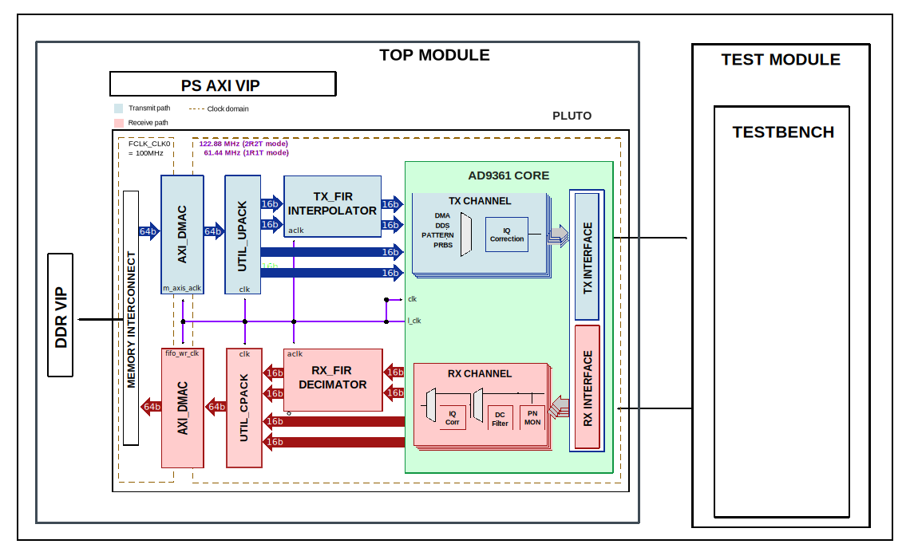

.. _pluto:

PLUTO
================================================================================

Overview
-------------------------------------------------------------------------------

The purpose of this testbench is to validate the functionality of the
:git-hdl:`projects/pluto` reference design.

The entire HDL documentation can be found here
:external+hdl:ref:`PLUTO HDL project <pluto>`.

Block design
-------------------------------------------------------------------------------

The testbench block design includes part of the PLUTO HDL reference design,
along with VIPs used for clocking, reset, PS and DDR simulations.

Block diagram
~~~~~~~~~~~~~~~~~~~~~~~~~~~~~~~~~~~~~~~~~~~~~~~~~~~~~~~~~~~~~~~~~~~~~~~~~~~~~~~

The data path and clock domains are depicted in the below diagram:

Configuration parameters and modes
~~~~~~~~~~~~~~~~~~~~~~~~~~~~~~~~~~~~~~~~~~~~~~~~~~~~~~~~~~~~~~~~~~~~~~~~~~~~~~~

There are no project parameters that can be configured in the testbench
configuration files.

Build parameters
^^^^^^^^^^^^^^^^^^^^^^^^^^^^^^^^^^^^^^^^^^^^^^^^^^^^^^^^^^^^^^^^^^^^^^^^^^^^^^^^

There are no build parameters for this testbench.

Configuration files
^^^^^^^^^^^^^^^^^^^^^^^^^^^^^^^^^^^^^^^^^^^^^^^^^^^^^^^^^^^^^^^^^^^^^^^^^^^^^^^^

The following configuration file is available:

   +-----------------------+--------------------------+
   | Configuration mode    | Parameters               |
   |                       +--------------------------+
   |                       | ---                      |
   +=======================+==========================+
   | cfg1                  | ---                      |
   +-----------------------+--------------------------+

Tests
^^^^^^^^^^^^^^^^^^^^^^^^^^^^^^^^^^^^^^^^^^^^^^^^^^^^^^^^^^^^^^^^^^^^^^^^^^^^^^^^

The following test program file is available:

============ ========================================
Test program Usage
============ ========================================
test_program Tests the pluto project capabilities.
============ ========================================

Available configurations & tests combinations
^^^^^^^^^^^^^^^^^^^^^^^^^^^^^^^^^^^^^^^^^^^^^^^^^^^^^^^^^^^^^^^^^^^^^^^^^^^^^^^^

The test program is compatible with the above mentioned configuration.

CPU/Memory interconnect addresses
~~~~~~~~~~~~~~~~~~~~~~~~~~~~~~~~~~~~~~~~~~~~~~~~~~~~~~~~~~~~~~~~~~~~~~~~~~~~~~~

Below are the CPU/Memory interconnect addresses used in this project:

=========================  ===========
Instance                   Address
=========================  ===========
axi_intc                   0x4120_0000
axi_ad9361                 0x7902_0000
axi_ad9361_adc_dma         0x7C40_0000
axi_ad9361_dac_dma         0x7C42_0000
axi_tdd_0                  0x7C44_0000
=========================  ===========

Interrupts
~~~~~~~~~~~~~~~~~~~~~~~~~~~~~~~~~~~~~~~~~~~~~~~~~~~~~~~~~~~~~~~~~~~~~~~~~~~~~~~

Below are the Programmable Logic interrupts used in this project:

==================  ===
Instance name       HDL
==================  ===
axi_ad9361_adc_dma  13
axi_ad9361_dac_dma  12
==================  ===

Test stimulus
-------------------------------------------------------------------------------

The test program is structured into several tests as follows:

Environment bringup
~~~~~~~~~~~~~~~~~~~~~~~~~~~~~~~~~~~~~~~~~~~~~~~~~~~~~~~~~~~~~~~~~~~~~~~~~~~~~~~

The steps of the environment bringup are:

* Create the environment
* Start the environment
* Start the clocks
* Assert the resets

Sanity test
~~~~~~~~~~~~~~~~~~~~~~~~~~~~~~~~~~~~~~~~~~~~~~~~~~~~~~~~~~~~~~~~~~~~~~~~~~~~~~~

This test is used to check the ADC version and DAC version.

PN test
~~~~~~~~~~~~~~~~~~~~~~~~~~~~~~~~~~~~~~~~~~~~~~~~~~~~~~~~~~~~~~~~~~~~~~~~~~~~~~~

The PN test verifies the PN data.

The steps of this test are:

* Link setup
    * Configure RX and TX interfaces
    * Pull RX and TX out of reset
* Enable test data for TX1 and RX1
* Sync DAC channels
* Sync ADC channels
* Allow initial OOS to propagate
* Clear PN OOS and PN ERR
* Check PN OOS and PN ERR flags

DDS test
~~~~~~~~~~~~~~~~~~~~~~~~~~~~~~~~~~~~~~~~~~~~~~~~~~~~~~~~~~~~~~~~~~~~~~~~~~~~~~~

The DDS test verifies the DDS path.

The steps of this test are:

* Link setup
* Select DDS as source
* Enable normal data path for RX1
* Configure tone amplitude and frequency
* Enable RX channels, enable sign extension
* Sync DAC channels
* Sync ADC channels
* Link down
    * Put RX and TX in reset

DMA test
~~~~~~~~~~~~~~~~~~~~~~~~~~~~~~~~~~~~~~~~~~~~~~~~~~~~~~~~~~~~~~~~~~~~~~~~~~~~~~~

The DMA test verifies the DMA path.

The steps of this test are:

* Write data to DDR
* Configure the TX DMA
* Select DMA as source
* Enable normal data path for RX1
* Enable RX channel, enable sign extension
* Sync DAC channels
* Sync ADC channels
* Link setup
* Configure RX DMA
* Check captured data from DDR
* Check captured data against incremental pattern based on first sample

TDD test
~~~~~~~~~~~~~~~~~~~~~~~~~~~~~~~~~~~~~~~~~~~~~~~~~~~~~~~~~~~~~~~~~~~~~~~~~~~~~~~

The TDD test verifies the TDD procedure.

.. note::

   This test is used only for the 2R2T mode.

The steps of this test are:

* Write data to DDR
* Link setup
* Configure the TX and RX channels
* Select DMA as source
* Enable normal data path for RX
* Enable RX channel, enable sign extension
* Sync DAC channels
* Sync ADC channels
* Configure the TX and RX DMA
* Configure the TDD for the phaser synchronization
    * Configure the TDD for the application
    * Submit the DMA transfer and wait for the TDD sync
    * Send the external sync signal
    * The first RX transfer is submitted between the first two TDD pulses
* Check cyclic data
    * After each RX DMA end of transfer, check the captured data and issue a new
      transfer
* Link down

Stop the environment
~~~~~~~~~~~~~~~~~~~~~~~~~~~~~~~~~~~~~~~~~~~~~~~~~~~~~~~~~~~~~~~~~~~~~~~~~~~~~~~

* Stop the clocks

Building the testbench
-------------------------------------------------------------------------------

The testbench is built upon ADI's generic HDL reference design framework.
ADI does not distribute compiled files of these projects so they must be built
from the sources available :git-hdl:`here </>` and :git-testbenches:`here </>`,
with the specified hierarchy described :ref:`build_tb set_up_tb_repo`.
To get the source you must
`clone <https://git-scm.com/book/en/v2/Git-Basics-Getting-a-Git-Repository>`__
the HDL repository, and then build the project as follows:.

**Linux/Cygwin/WSL**

*Example 1*

Build all the possible combinations of tests and configurations, using only the
command line.

.. shell::
   :showuser:

   $cd testbenches/project/pluto
   $make

*Example 2*

Build all the possible combinations of tests and configurations, using the
Vivado GUI. This command will launch Vivado, will run the simulation and display
the waveforms.

.. shell::
   :showuser:

   $cd testbenches/project/pluto
   $make MODE=gui

*Example 3*

Build a particular combination of test and configuration, using the Vivado GUI.
This command will launch Vivado, will run the simulation and display the
waveforms.

.. shell::
   :showuser:

   $cd testbenches/project/pluto
   $make MODE=gui CFG=cfg1 TST=test_program

The built projects can be found in the ``runs`` folder, where each configuration
specific build has it's own folder named after the configuration file's name.
Example: if the following command was run for a single configuration in the
clean folder (no runs folder available):

``make CFG=cfg1``

Then the subfolder under ``runs`` name will be:

``cfg1``

Resources
-------------------------------------------------------------------------------

HDL related dependencies forming the DUT
~~~~~~~~~~~~~~~~~~~~~~~~~~~~~~~~~~~~~~~~~~~~~~~~~~~~~~~~~~~~~~~~~~~~~~~~~~~~~~~

.. list-table::
   :widths: 30 45 25
   :header-rows: 1

   * - IP name
     - Source code link
     - Documentation link
   * - AXI_AD9361
     - :git-hdl:`library/axi_ad9361`
     - :external+hdl:ref:`axi_ad9361`
   * - AXI_DMAC
     - :git-hdl:`library/axi_dmac`
     - :external+hdl:ref:`axi_dmac`
   * - AXI_TDD
     - :git-hdl:`library/axi_tdd`
     - :external+hdl:ref:`axi_tdd`
   * - UTIL_CPACK2
     - :git-hdl:`library/util_pack/util_cpack2`
     - :external+hdl:ref:`util_cpack2`
   * - UTIL_UPACK2
     - :git-hdl:`library/util_pack/util_upack2`
     - :external+hdl:ref:`util_upack2`

Testbenches related dependencies
~~~~~~~~~~~~~~~~~~~~~~~~~~~~~~~~~~~~~~~~~~~~~~~~~~~~~~~~~~~~~~~~~~~~~~~~~~~~~~~

.. include:: ../../common/dependency_common.rst

Testbench specific dependencies:

.. list-table::
   :widths: 30 45 25
   :header-rows: 1

   * - SV dependency name
     - Source code link
     - Documentation link
   * - ADI_REGMAP_DMAC_PKG
     - :git-testbenches:`library/regmaps/adi_regmap_dmac_pkg.sv`
     - ---
   * - ADI_REGMAP_PKG
     - :git-testbenches:`library/regmaps/adi_regmap_pkg.sv`
     - ---
   * - ADI_REGMAP_ADC_PKG
     - :git-testbenches:`library/regmaps/adi_regmap_adc_pkg.sv`
     - ---
   * - ADI_REGMAP_COMMON_PKG
     - :git-testbenches:`library/regmaps/adi_regmap_common_pkg.sv`
     - ---
   * - ADI_REGMAP_DAC_PKG
     - :git-testbenches:`library/regmaps/adi_regmap_dac_pkg.sv`
     - ---
   * - ADI_REGMAP_TDD_GEN_PKG
     - :git-testbenches:`library/regmaps/adi_regmap_tdd_gen_pkg.sv`
     - ---
   * - DMA_TRANS
     - :git-testbenches:`library/drivers/dmac/dma_trans.sv`
     - ---
   * - DMAC_API
     - :git-testbenches:`library/drivers/dmac/dmac_api.sv`
     - ---

.. include:: ../../../common/more_information.rst

.. include:: ../../../common/support.rst
