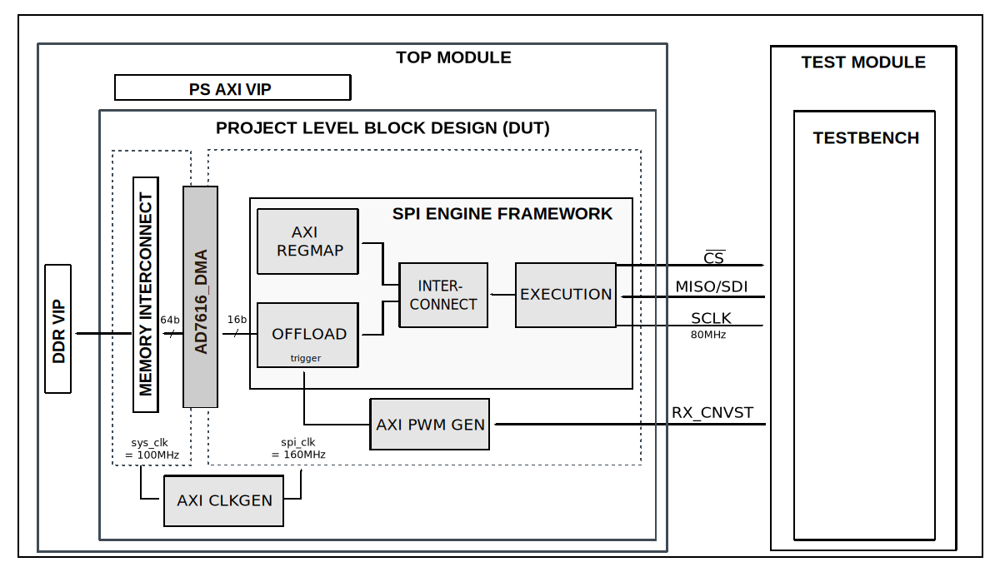

:orphan:

.. _project_based_template:

Project based test bench template
================================================================================

Overview
-------------------------------------------------------------------------------

Block design
-------------------------------------------------------------------------------

Block diagram
~~~~~~~~~~~~~~~~~~~~~~~~~~~~~~~~~~~~~~~~~~~~~~~~~~~~~~~~~~~~~~~~~~~~~~~~~~~~~~~

..
   MUST: Use SVG format for the diagram

..
   TIP: Block diagrams should contain subtitles only if there are at least two
   different diagrams

Configuration parameters and modes
~~~~~~~~~~~~~~~~~~~~~~~~~~~~~~~~~~~~~~~~~~~~~~~~~~~~~~~~~~~~~~~~~~~~~~~~~~~~~~~

..
   MENTION IF ANY MODES ARE AVAILABLE FOR CONFIGURATION

Build parameters
^^^^^^^^^^^^^^^^^^^^^^^^^^^^^^^^^^^^^^^^^^^^^^^^^^^^^^^^^^^^^^^^^^^^^^^^^^^^^^^^

The following are the parameters of this project that can be configured:

-  CLK_MODE: defines clocking mode of the device's digital interface:
   Options: 0 - SPI mode, 1 - Echo-clock or Master clock mode
-  NUM_OF_SDI: defines the number of MOSI lines of the SPI interface:
   Options: 1 - Interleaved mode, 2 - 1 lane per channel,
   4 - 2 lanes per channel, 8 - 4 lanes per channel
-  CAPTURE_ZONE: defines the capture zone of the next sample.
   There are two capture zones: 1 - from negative edge of the BUSY line
   until the next CNV positive edge -20ns, 2 - from the next consecutive CNV
   positive edge +20ns until the second next consecutive CNV positive edge -20ns
-  DDR_EN: defines the type of data transfer. In echo and master clock mode
   the SDI lines can have Single or Double Data Rates.
   Options: 0 - MISO runs on SDR, 1 - MISO runs on DDR.

Configuration files
^^^^^^^^^^^^^^^^^^^^^^^^^^^^^^^^^^^^^^^^^^^^^^^^^^^^^^^^^^^^^^^^^^^^^^^^^^^^^^^^

..
   MENTION IF ANY CONFIGURATION FILES ARE AVAILABLE FOR TESTS

The following are available configurations for the test bench:

   +-----------------------+-----------------------------------------------+
   | Configuration mode    | Parameters                                    |
   |                       +----------+------------+--------------+--------+
   |                       | CLK_MODE | NUM_OF_SDI | CAPTURE_ZONE | DDR_EN |
   +=======================+==========+============+==============+========+
   | cfg_cm0_sdi2_cz1_ddr0 | 0        | 2          | 1            | 0      |
   +-----------------------+----------+------------+--------------+--------+
   | cfg_cm0_sdi2_cz2_ddr0 | 0        | 2          | 2            | 0      |
   +-----------------------+----------+------------+--------------+--------+
   | cfg_cm0_sdi4_cz2_ddr0 | 0        | 4          | 2            | 0      |
   +-----------------------+----------+------------+--------------+--------+
   | cfg_cm0_sdi8_cz2_ddr0 | 0        | 8          | 2            | 0      |
   +-----------------------+----------+------------+--------------+--------+
   | cfg_cm1_sdi1_cz2_ddr0 | 1        | 1          | 2            | 0      |
   +-----------------------+----------+------------+--------------+--------+
   | cfg_cm1_sdi2_cz2_ddr0 | 1        | 2          | 2            | 0      |
   +-----------------------+----------+------------+--------------+--------+
   | cfg_cm1_sdi2_cz2_ddr1 | 1        | 2          | 2            | 1      |
   +-----------------------+----------+------------+--------------+--------+
   | cfg_cm1_sdi4_cz2_ddr0 | 1        | 4          | 2            | 0      |
   +-----------------------+----------+------------+--------------+--------+
   | cfg_cm1_sdi4_cz2_ddr1 | 1        | 4          | 2            | 1      |
   +-----------------------+----------+------------+--------------+--------+
   | cfg_cm1_sdi8_cz2_ddr0 | 1        | 8          | 2            | 0      |
   +-----------------------+----------+------------+--------------+--------+
   | cfg_cm1_sdi8_cz2_ddr1 | 1        | 8          | 2            | 1      |
   +-----------------------+----------+------------+--------------+--------+

Tests
^^^^^^^^^^^^^^^^^^^^^^^^^^^^^^^^^^^^^^^^^^^^^^^^^^^^^^^^^^^^^^^^^^^^^^^^^^^^^^^^

..
   MENTION IF ANY MODES ARE AVAILABLE FOR TESTS

The following test program files are available:

=============== ==========================================
Test program    Usage
=============== ==========================================
test_program_si Tests the parallel interface capabilities.
test_program_pi Tests the serial interface capabilities.
=============== ==========================================

Available configurations & tests combinations
^^^^^^^^^^^^^^^^^^^^^^^^^^^^^^^^^^^^^^^^^^^^^^^^^^^^^^^^^^^^^^^^^^^^^^^^^^^^^^^^

============= =============== ===================================
Configuration Test            Build command
============= =============== ===================================
cfg_si        test_program_si make CFG=cfg_si TST=test_program_si
cfg_pi        test_program_pi make CFG=cfg_pi TST=test_program_pi
============= =============== ===================================

.. warning::

    Mixing a wrong pair of CFG and TST will result in a building errror.
    Please checkout the proposed combinations before running a custom test.

Clock scheme
~~~~~~~~~~~~~~~~~~~~~~~~~~~~~~~~~~~~~~~~~~~~~~~~~~~~~~~~~~~~~~~~~~~~~~~~~~~~~~~

CPU/Memory interconnects addresses
~~~~~~~~~~~~~~~~~~~~~~~~~~~~~~~~~~~~~~~~~~~~~~~~~~~~~~~~~~~~~~~~~~~~~~~~~~~~~~~

Interrupts
~~~~~~~~~~~~~~~~~~~~~~~~~~~~~~~~~~~~~~~~~~~~~~~~~~~~~~~~~~~~~~~~~~~~~~~~~~~~~~~

Building the test bench
-------------------------------------------------------------------------------

The testbench is built upon ADI's generic HDL reference design framework.
ADI does not distribute compiled files of these projects so they must be built
from the sources available :git-hdl:`here </>` and :git-testbenches:`here </>`,
with the specified hierarchy described :ref:`build_tb set_up_tb_repo`.
To get the source you must
`clone <https://git-scm.com/book/en/v2/Git-Basics-Getting-a-Git-Repository>`__
the HDL repository, and then build the project as follows:.

**Linux/Cygwin/WSL**

*Example 1*

Build all the possible combinations of tests and configurations, using only the
command line.

.. shell::
   :showuser:

   $cd testbenches/ad7616
   $make

*Example 2*

Build all the possible combinations of tests and configurations, using the
Vivado GUI. This command will launch Vivado, will run the simulation and display
the waveforms.

.. shell::
   :showuser:

   $cd testbenches/ad7616
   $make MODE=gui

*Example 3*

Build a particular combination of test and configuration, using the Vivado GUI.
This command will launch Vivado, will run the simulation and display the
waveforms.

.. shell::
   :showuser:

   $cd testbenches/ad7616
   $make MODE=gui CFG=cfg_pi TST=test_program_pi

The built projects can be found in the ``runs`` folder, where each configuration specific
build has it's own folder named after the configuration file's name.
Example: if the following command was run for a single configuration in the clean folder
(no runs folder available):

``make CFG=cfg_pi``

Then the subfolder under ``runs`` name will be:

``cfg_pi``

Test stimulus
-------------------------------------------------------------------------------

Resources
-------------------------------------------------------------------------------

.. include:: ../../common/more_information.rst

.. include:: ../../common/support.rst
